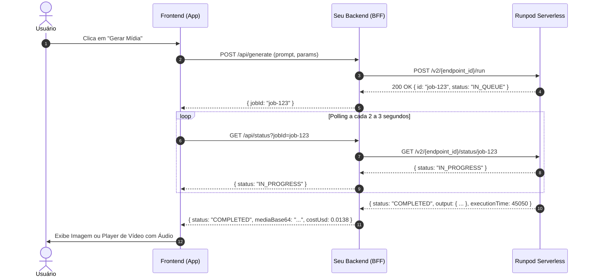

# 🚀 Guia de Integração Frontend & Backend - Endpoints de IA (Runpod Serverless)

Este documento contém todas as instruções técnicas, status operacional verificado em produção, payloads detalhados de cada nó do ComfyUI, fluxo de comunicação assíncrona, tratamento de mídia (vídeo com áudio e imagem) e fórmulas de cálculo de custo unitário.

---

## 📌 Sumário
1. [Status Operacional dos 4 Endpoints](#1-status-operacional-dos-4-endpoints)
2. [Boas Práticas de Arquitetura e Segurança](#2-boas-práticas-de-arquitetura-e-segurança)
3. [Ciclo de Vida da Requisição (Fluxo Assíncrono)](#3-ciclo-de-vida-da-requisição-fluxo-assíncrono)
4. [Especificação dos Endpoints e Payloads](#4-especificação-dos-endpoints-e-payloads)
   - 4.1 [Krea-2 Turbo (Text-to-Image)](#41-krea-2-turbo-text-to-image)
   - 4.2 [FastVideo FastH3 Image-to-Video com Áudio (i2v)](#42-fastvideo-fasth3-image-to-video-com-áudio-i2v)
   - 4.3 [FastVideo FastH3 Text-to-Video com Áudio (t2v)](#43-fastvideo-fasth3-text-to-video-com-áudio-t2v)
   - 4.4 [LTX-2.5 Image-to-Video com Áudio (i2v)](#44-ltx-25-image-to-video-com-áudio-i2v)
5. [Injeção Dinâmica de LoRAs e Parâmetros](#5-injeção-dinâmica-de-loras-e-parâmetros)
6. [Tratamento e Exibição de Mídia no Frontend](#6-tratamento-e-exibição-de-mídia-no-frontend)
7. [Tabela de Custos e Fórmulas de Faturamento](#7-tabela-de-custos-e-fórmulas-de-faturamento)
8. [Exemplo Completo de Integração (TypeScript / React Hook)](#8-exemplo-completo-de-integração-typescript--react-hook)
9. [Como Testar Rapidamente via Scripts](#9-como-testar-rapidamente-via-scripts)

---

## 1. Status Operacional dos 4 Endpoints

Todos os endpoints utilizam GPUs **NVIDIA GeForce RTX 4090 (24 GB VRAM)** com **Network Volumes persistentes** em datacenter `US-TX-3`.

| Endpoint | ID no Runpod | Modalidade | Status Verificado | Tempo Médio GPU | Custo Médio Unitário |
| :--- | :---: | :---: | :---: | :---: | :---: |
| **Krea-2 Turbo** | `9zxmy6gcet7j0g` | Imagem (T2I) | 🟢 **100% Operacional** | **~7.5 s** (warm) | **$0.0023 USD (~R$ 0,013)** |
| **FastH3 i2v** | `5oveynpkl0scu3` | Vídeo + Áudio (I2V) | 🟢 **100% Operacional** | **~45.0 s** | **$0.0138 USD (~R$ 0,077)** |
| **FastH3 t2v (480p)** | `4a2r6rg0c4ehky` | Vídeo + Áudio (T2V) | 🟢 **100% Operacional** | **~45.0 s** | **$0.0138 USD (~R$ 0,077)** |
| **FastH3 t2v (720p HD)** | `4a2r6rg0c4ehky` | Vídeo + Áudio (T2V) | 🟢 **100% Operacional** | **~108.0 s** | **$0.0330 USD (~R$ 0,185)** |
| **LTX-2.5 i2v (720p)** | `zrhzl1ydzr50n8` | Vídeo HD (I2V) | 🟢 **100% Operacional** | **~218.0 s** | **$0.0668 USD (~R$ 0,374)** |

> [!NOTE]
> **Status e Diagnóstico do LTX-2.5 (`zrhzl1ydzr50n8`):**
> O modelo LTX-2.5 INT8 Distilled (transformer de 22B + text encoder Gemma-4 12B) opera com **total estabilidade em GPU de 24 GB VRAM (RTX 4090 / `ADA_24`)**, consumindo **16.8 GB de VRAM** e mantendo ~7 GB livres via offload dinâmico (AIMDO). Os pesos (~39.7 GB) estão persistidos no Network Volume de **80 GB** em `US-TX-3`. Testado com geração real de vídeo 1280x704 @ 24fps (5.04s, codec H.264).

---

## 2. Boas Práticas de Arquitetura e Segurança

> [!CAUTION]
> **NUNCA exponha a `RUNPOD_API_KEY` diretamente no código do Frontend!**
> A chave dá acesso administrativo irrestrito à sua conta e faturamento Runpod.

### Arquitetura de Comunicação Recomendada:
```
[ Frontend (Web / Mobile / React / Vue) ]
              │  (1. POST /api/generate com parâmetros amigáveis)
              ▼
[ Seu Backend / BFF (Next.js / Node.js / Python) ] ── (Injeta RUNPOD_API_KEY)
              │  (2. POST https://api.runpod.ai/v2/{endpoint_id}/run)
              ▼
[ Runpod Serverless Cluster (RTX 4090) ]
```

1. O cliente Web/App envia apenas parâmetros de alto nível: `prompt`, `imageFile` (se for i2v), `seed`, `aspectRatio`.
2. O seu servidor Backend monta a estrutura JSON do ComfyUI, aplica as validações necessárias e envia a requisição ao Runpod.
3. O Backend retorna o `jobId` e o Frontend realiza o polling periódico da rota intermediária.

---

## 3. Ciclo de Vida da Requisição (Fluxo Assíncrono)



### Endpoints da API HTTP do Runpod:
- **Submeter Job Assíncrono:** `POST https://api.runpod.ai/v2/{ENDPOINT_ID}/run`
- **Submeter Job Síncrono (bloqueante):** `POST https://api.runpod.ai/v2/{ENDPOINT_ID}/runsync`
- **Consultar Status:** `GET https://api.runpod.ai/v2/{ENDPOINT_ID}/status/{JOB_ID}`
- **Cancelar Execução:** `POST https://api.runpod.ai/v2/{ENDPOINT_ID}/cancel/{JOB_ID}`
- **Health Check do Endpoint:** `GET https://api.runpod.ai/v2/{ENDPOINT_ID}/health`
- **Limpar Fila Travada:** `POST https://api.runpod.ai/v2/{ENDPOINT_ID}/purge-queue`

### Headers Obrigatórios:
```http
Authorization: Bearer <RUNPOD_API_KEY>
Content-Type: application/json
```

---

## 4. Especificação dos Endpoints e Payloads

### 4.1 Krea-2 Turbo (Text-to-Image)
- **Endpoint ID:** `9zxmy6gcet7j0g`
- **Tipo de Saída:** Imagem PNG (1024x1024 padrão)
- **Tempo Médio:** **~7.5s** (warm) | ~30s (cold start)
- **Nós Editáveis no Workflow:**
  - `prompt`: Nó `"52"` -> `inputs.text`
  - `negative_prompt`: Nó `"63"` -> `inputs.text`
  - `seed`: Nó `"61"` -> `inputs.seed`
  - `steps`: Nó `"61"` -> `inputs.steps` (Padrão: `8` para Turbo)
  - `resolução`: Nó `"73"` -> `inputs.width` e `inputs.height`

#### Payload Mínimo de Envio:
```json
{
  "input": {
    "workflow": {
      "29": {
        "class_type": "SaveImage",
        "inputs": {
          "filename_prefix": "Krea2_turbo",
          "images": ["54", 0]
        }
      },
      "52": {
        "class_type": "CLIPTextEncode",
        "inputs": {
          "text": "A futuristic cyberpunk portrait of a person with neon glowing accents, highly detailed, photorealistic, 8k",
          "clip": ["56", 0]
        }
      },
      "54": {
        "class_type": "VAEDecode",
        "inputs": {
          "samples": ["61", 0],
          "vae": ["57", 0]
        }
      },
      "55": {
        "class_type": "UNETLoader",
        "inputs": {
          "unet_name": "krea2_turbo_fp8_scaled.safetensors",
          "weight_dtype": "default"
        }
      },
      "56": {
        "class_type": "CLIPLoader",
        "inputs": {
          "clip_name": "qwen3vl_4b_fp8_scaled.safetensors",
          "type": "krea2",
          "device": "default"
        }
      },
      "57": {
        "class_type": "VAELoader",
        "inputs": {
          "vae_name": "qwen_image_vae.safetensors"
        }
      },
      "61": {
        "class_type": "KSampler",
        "inputs": {
          "seed": 42819201,
          "steps": 8,
          "cfg": 1,
          "sampler_name": "euler",
          "scheduler": "simple",
          "denoise": 1,
          "model": ["55", 0],
          "positive": ["52", 0],
          "negative": ["63", 0],
          "latent_image": ["73", 0]
        }
      },
      "63": {
        "class_type": "CLIPTextEncode",
        "inputs": {
          "text": "blurry, low quality, distorted, deformed, bad anatomy",
          "clip": ["56", 0]
        }
      },
      "73": {
        "class_type": "EmptyLatentImage",
        "inputs": {
          "width": 1024,
          "height": 1024,
          "batch_size": 1
        }
      }
    }
  }
}
```

---

### 4.2 FastVideo FastH3 Image-to-Video com Áudio (i2v)
- **Endpoint ID:** `5oveynpkl0scu3`
- **Tipo de Saída:** Vídeo MP4 com trilha de áudio sincronizada nativa
- **Requer Imagem de Entrada:** Sim, injetada no array `input.images`
- **Tempo Médio:** **~25s (2s de vídeo) a ~128s (6s de vídeo)** *(Veja [BENCHMARK_FASTH3_I2V.md](file:///C:/dev/dockerkriativa/BENCHMARK_FASTH3_I2V.md))*
- **Nós Editáveis no Workflow:**
  - `imagem`: Array `input.images` com objeto `{"name": "input_frame.png", "image": "data:image/png;base64,..."}`
  - `prompt`: Nó `"104"` -> `inputs.prompt` (descreve o movimento e o efeito sonoro desejado)
  - `seed`: Nó `"15"` -> `inputs.noise_seed`
  - `duration`: Nó `"111"` -> `inputs.value` (Duração em segundos, ex: `2.0` para 2s ou `6.0` para ~6.6s)

#### Payload de Envio (Single Frame):
```json
{
  "input": {
    "images": [
      {
        "name": "input_frame.png",
        "image": "data:image/png;base64,iVBORw0KGgoAAAANSUhEUgAA..."
      }
    ],
    "workflow": {
      "104": {
        "inputs": {
          "prompt": "Cinematic camera push-in, dynamic movement, glowing cybernetic details, atmospheric synth sound effects, 8k"
        }
      },
      "15": {
        "inputs": {
          "noise_seed": 77192834
        }
      },
      "111": {
        "inputs": {
          "value": 2.0
        }
      }
    }
  }
}
```

#### Modo First Frame + Last Frame (Interpolação Entre 2 Imagens):
Para criar transições guiadas onde o vídeo começa em uma imagem e termina na outra:
```json
{
  "input": {
    "images": [
      { "name": "first_frame.png", "image": "data:image/png;base64,..." },
      { "name": "last_frame.png", "image": "data:image/png;base64,..." }
    ],
    "workflow": {
      "136": {
        "class_type": "LoadImage",
        "inputs": { "image": "first_frame.png" }
      },
      "137": {
        "class_type": "LoadImage",
        "inputs": { "image": "last_frame.png" }
      },
      "104": {
        "class_type": "MiniMaxH3ImageToVideo",
        "inputs": {
          "first_frame": ["136", 0],
          "last_frame": ["137", 0],
          "prompt": "Smooth morphing cinematic transition from the first subject into the second subject, ambient cinematic soundtrack, 8k"
        }
      }
    }
  }
}
```

---

### 4.3 FastVideo FastH3 Text-to-Video com Áudio (t2v)
- **Endpoint ID:** `4a2r6rg0c4ehky`
- **Tipo de Saída:** Vídeo MP4 com áudio e música gerados a partir do texto
- **Requer Imagem:** Não
- **Tempo Médio:** **~45s** (Modo Rápido 480p) | **~108s** (Modo HD 720p)
- **Nós Editáveis no Workflow:**
  - `prompt`: Nó `"104"` -> `inputs.prompt` (descreve a cena visual e elementos sonoros/musicais)
  - `seed`: Nó `"15"` -> `inputs.noise_seed`
  - `resolução`: Nó `"104"` -> `inputs.width` e `inputs.height`
    - **Fast 480p (Recomendado para preview rápido):** `"width": 848`, `"height": 480`
    - **HD 720p (Qualidade superior):** `"width": 1344`, `"height": 768`
  - `duration`: Nó `"111"` -> `inputs.value` (Duração em segundos, padrão: `3.0`)

#### Payload de Envio:
```json
{
  "input": {
    "workflow": {
      "104": {
        "inputs": {
          "prompt": "A majestic eagle soaring over snow-capped mountain peaks at golden hour sunrise, orchestral score with soaring brass, 8k resolution, cinematic lighting",
          "width": 848,
          "height": 480
        }
      },
      "15": {
        "inputs": {
          "noise_seed": 529610654
        }
      },
      "111": {
        "inputs": {
          "value": 3.0
        }
      }
    }
  }
}
```

---

### 4.4 LTX-2.5 Image-to-Video (i2v - 720p HD)
- **Endpoint ID:** `zrhzl1ydzr50n8`
- **Tipo de Saída:** Vídeo MP4 espacialmente upscalado em 2 estágios (1280x704 @ 24fps, H.264)
- **Tempo Médio:** **~218s** (RTX 4090 24GB)
- **Custo Médio:** **$0.0668 USD (~R$ 0,374)** por geração
- **Consumo de VRAM:** ~16.8 GB (com AIMDO offload ativo)
- **Nós Editáveis no Workflow:**
  - `imagem`: Array `input.images` com `"name": "input_frame.png"` (alimenta o Nó `"395"`)
  - `prompt`: Nó `"376"` -> `inputs.value` (descrição detalhada da movimentação e iluminação)
  - `seed`: Nó `"339"` -> `inputs.noise_seed`
  - `negative_prompt`: Nó `"373"` -> `inputs.text`
  - `duração`: Nó `"362"` -> `inputs.value` (segundos, padrão: `5`)
  - `frame_rate`: Nó `"361"` -> `inputs.value` (fps, padrão: `24`)

#### Payload de Envio:
```json
{
  "input": {
    "images": [
      {
        "name": "input_frame.png",
        "image": "data:image/png;base64,iVBORw0KGgoAAAANSUhEUgAA..."
      }
    ],
    "workflow": {
      "376": {
        "inputs": {
          "value": "Cinematic camera push-in, glowing futuristic cybernetic armor, steam rising, atmospheric cinematic lighting, 8k"
        }
      },
      "339": {
        "inputs": {
          "noise_seed": 42819284
        }
      },
      "362": {
        "inputs": {
          "value": 5
        }
      }
    }
  }
}
```

---

## 5. Injeção Dinâmica de LoRAs e Parâmetros

Para modelos que utilizam LoRAs customizados armazenados no Network Volume (`/runpod-volume/models/loras/`):

1. Adicione o nó `"200"` (`LoraLoader`):
```json
"200": {
  "class_type": "LoraLoader",
  "inputs": {
    "lora_name": "anime_aesthetic_v1.safetensors",
    "strength_model": 0.85,
    "strength_clip": 0.80,
    "model": ["143", 0],
    "clip": ["13", 0]
  }
}
```
2. Redirecione os nós consumidores:
   - Nó `"16"` (`BasicGuider`): `"model": ["200", 0]`
   - Nó `"9"` (`BasicScheduler`): `"model": ["200", 0]`
   - Nó `"104"` (`MiniMaxH3...`): `"clip": ["200", 1]`

---

## 6. Tratamento e Exibição de Mídia no Frontend

> [!IMPORTANT]
> **Atenção à Extração de Mídia:**
> O worker do ComfyUI no Runpod pode retornar arquivos de vídeo tanto no array **`output.videos`** quanto no array **`output.images`** com extensão `.mp4`. O código do Frontend deve inspecionar ambos os campos.

### 6.1 Algoritmo Universal de Extração de Mídia:
```typescript
function extractMediaFromOutput(output: any): { url: string; isVideo: boolean; filename: string } | null {
  if (!output) return null;

  const items = output.videos || output.images || [];
  if (items.length === 0) return null;

  const first = items[0];
  const rawData: string = first.data || first.video || first.image || '';
  const filename: string = first.filename || '';

  const isVideo = filename.endsWith('.mp4') || rawData.includes('video/mp4');

  let dataUri = rawData;
  if (!rawData.startsWith('data:')) {
    dataUri = isVideo
      ? `data:video/mp4;base64,${rawData}`
      : `data:image/png;base64,${rawData}`;
  }

  return { url: dataUri, isVideo, filename };
}
```

### 6.2 Componente de Visualização (React + Tailwind CSS):
```tsx
import React from 'react';

interface MediaViewerProps {
  mediaUrl: string;
  isVideo: boolean;
  filename?: string;
}

export function MediaViewer({ mediaUrl, isVideo, filename = 'resultado' }: MediaViewerProps) {
  return (
    <div className="flex flex-col items-center gap-4 rounded-xl border border-neutral-800 bg-neutral-900 p-4 shadow-2xl">
      {isVideo ? (
        <video
          src={mediaUrl}
          controls
          autoPlay
          loop
          playsInline
          className="w-full max-w-2xl rounded-lg shadow-md"
        />
      ) : (
        
      )}
      <a
        href={mediaUrl}
        download={filename}
        className="rounded-lg bg-emerald-600 px-5 py-2.5 font-medium text-white transition hover:bg-emerald-500 shadow"
      >
        Baixar Arquivo ({isVideo ? 'MP4 com Áudio' : 'PNG Alta Definição'})
      </a>
    </div>
  );
}
```

---

## 7. Tabela de Custos e Fórmulas de Faturamento

### 7.1 Fórmula de Custo de Execução no Runpod:
O Runpod cobra exatamente por milissegundo de GPU RTX 4090 utilizada ($1.10/hora):

$$\text{Custo USD} = \left(\frac{\text{executionTime (ms)}}{1000}\right) \times \left(\frac{\$1.10}{3600}\right)$$

Ou simplificado por segundo de GPU:
$$\text{Custo USD} = \text{Segundos de GPU} \times 0.0003056$$

$$\text{Custo BRL} = \text{Custo USD} \times \text{Cotação Dólar (ex: 5.60)}$$

---

### 7.2 Tabela de Custos Unitários e Margem Sugerida:

| Operação | Tempo Médio | Custo Bruto (USD) | Custo Bruto (BRL) | Sugestão Preço Venda | Margem Bruta |
| :--- | :---: | :---: | :---: | :---: | :---: |
| **Imagem Krea-2 Turbo** | **7.5 s** | **$0.0023** | **R$ 0,013** | **R$ 0,10** (1 Crédito) | **~87%** |
| **Vídeo FastH3 i2v (c/ áudio)** | **45.0 s** | **$0.0138** | **R$ 0,077** | **R$ 0,50** (5 Créditos) | **~84%** |
| **Vídeo FastH3 t2v 480p (c/ áudio)** | **45.0 s** | **$0.0138** | **R$ 0,077** | **R$ 0,50** (5 Créditos) | **~84%** |
| **Vídeo FastH3 t2v 720p HD** | **108.0 s** | **$0.0330** | **R$ 0,185** | **R$ 1,20** (12 Créditos) | **~84%** |
| **Vídeo LTX-2.5 i2v 720p HD** | **218.0 s** | **$0.0668** | **R$ 0,374** | **R$ 2,50** (25 Créditos) | **~85%** |

---

## 8. Exemplo Completo de Integração (TypeScript / React Hook)

```typescript
import { useState, useCallback } from 'react';

interface GenerateOptions {
  endpointId: string;
  workflow: Record<string, any>;
  images?: Array<{ name: string; image: string }>;
}

interface GenerateResult {
  mediaUrl: string;
  isVideo: boolean;
  filename: string;
  executionSeconds: number;
  costUsd: number;
  costBrl: number;
}

export function useRunpodGenerator() {
  const [loading, setLoading] = useState(false);
  const [progressStatus, setProgressStatus] = useState<string>('');
  const [error, setError] = useState<string | null>(null);

  const generate = useCallback(async (options: GenerateOptions): Promise<GenerateResult> => {
    setLoading(true);
    setError(null);
    setProgressStatus('Enviando requisição para a fila do Runpod...');

    try {
      // 1. Chamar rota segura no seu backend (que injeta RUNPOD_API_KEY)
      const res = await fetch('/api/runpod/run', {
        method: 'POST',
        headers: { 'Content-Type': 'application/json' },
        body: JSON.stringify({
          endpointId: options.endpointId,
          input: {
            workflow: options.workflow,
            images: options.images
          }
        })
      });

      if (!res.ok) throw new Error(`Falha ao submeter job: ${res.statusText}`);
      const jobData = await res.json();
      const jobId = jobData.id;

      // 2. Polling de status a cada 2.5 segundos
      let status = jobData.status;
      let finalResponse: any = null;

      while (status === 'IN_QUEUE' || status === 'IN_PROGRESS') {
        await new Promise((r) => setTimeout(r, 2500));

        const statusRes = await fetch(`/api/runpod/status?endpointId=${options.endpointId}&jobId=${jobId}`);
        finalResponse = await statusRes.json();
        status = finalResponse.status;

        if (status === 'IN_QUEUE') {
          setProgressStatus('Aguardando alocação da GPU RTX 4090 na fila...');
        } else if (status === 'IN_PROGRESS') {
          setProgressStatus('Gerando tensores e decodificando mídia com áudio...');
        }
      }

      if (status !== 'COMPLETED') {
        throw new Error(finalResponse?.error || `Processamento terminou com status: ${status}`);
      }

      // 3. Extrair mídia (vídeo ou imagem)
      const out = finalResponse.output || {};
      const list = out.videos || out.images || [];
      if (list.length === 0) throw new Error('Nenhuma mídia retornada pelo worker.');

      const item = list[0];
      const raw = item.data || item.video || item.image;
      const filename = item.filename || 'media_output';
      const isVideo = filename.endsWith('.mp4') || raw.includes('video/mp4');

      const mediaUrl = raw.startsWith('data:')
        ? raw
        : `data:${isVideo ? 'video/mp4' : 'image/png'};base64,${raw}`;

      // 4. Calcular custo real
      const execSeconds = (finalResponse.executionTime || 0) / 1000;
      const costUsd = execSeconds * (1.10 / 3600);
      const costBrl = costUsd * 5.60;

      setProgressStatus('Concluído com sucesso!');
      return {
        mediaUrl,
        isVideo,
        filename,
        executionSeconds: Math.round(execSeconds * 10) / 10,
        costUsd: Math.round(costUsd * 100000) / 100000,
        costBrl: Math.round(costBrl * 1000) / 1000
      };
    } catch (err: any) {
      setError(err.message || 'Erro inesperado durante a geração.');
      throw err;
    } finally {
      setLoading(false);
    }
  }, []);

  return { generate, loading, progressStatus, error };
}
```

---

## 9. Como Testar Rapidamente via Scripts

O repositório já inclui scripts automatizados em PowerShell e Python prontos para rodar no terminal:

```powershell
# 1. Testar Krea-2 Turbo (Geração de Imagem):
.\test_endpoint.ps1 -Prompt "A majestic ancient samurai in the rain, 8k"

# 2. Testar FastH3 t2v (Geração de Vídeo a partir de Texto com Áudio):
.\test_fasth3_t2v.ps1 -Prompt "A golden dragon soaring over mountain peaks at sunset"

# 3. Testar FastH3 i2v (Geração de Vídeo a partir de Imagem com Áudio):
.\test_fasth3_i2v.ps1 -Prompt "Dynamic camera push-in, cinematic movement, 8k"

# 4. Testar LTX-2.5 i2v (Geração de Vídeo HD 720p 24fps):
python test_ltx_live.py

# 5. Verificar a saúde de todos os 4 endpoints em tempo real:
python check_all_endpoints.py
```
