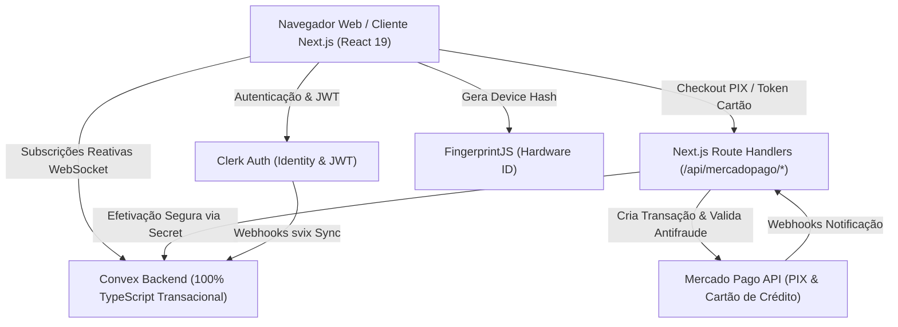
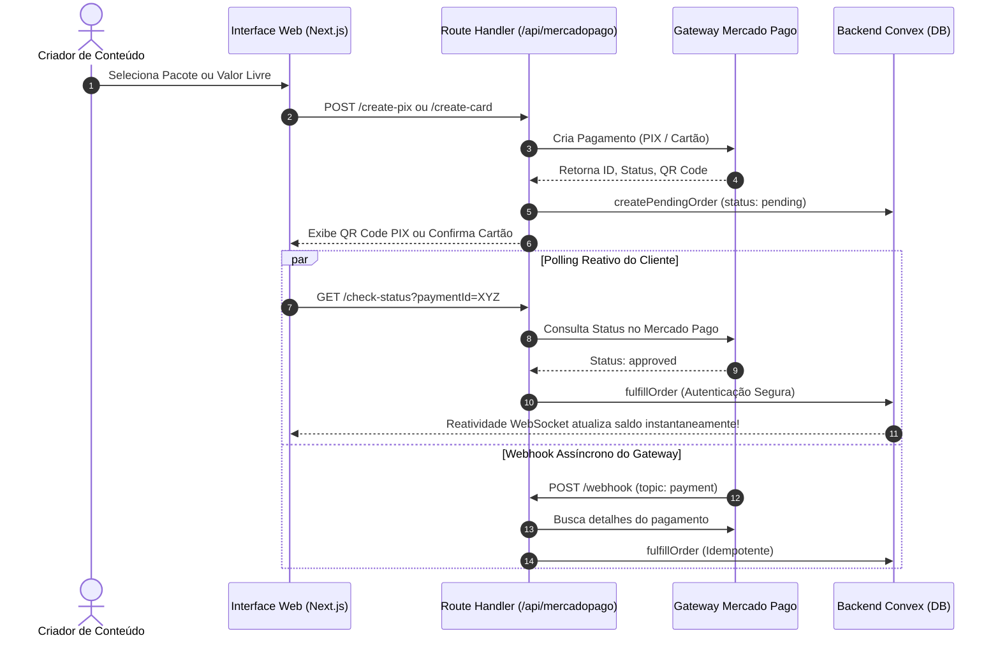

# MASTER SPECIFICATION — KRIATIVA.APP
> **Status:** ATIVO & HOMOLOGADO EM PRODUÇÃO (MÓDULOS 10, 11, 12, 13 E 14 HOMOLOGADOS)  
> **Versão da Spec:** 2.15.0  
> **Data da Última Atualização:** 2026-10-10  
> **Classificação:** Documentação Técnica Arquitetural Master  
> **Ambiente:** Next.js 16 (Turbopack) | Convex 1.46 | Clerk Auth | Mercado Pago SDK v2 | Tailwind CSS v4

---

## 1. Visão Geral do Produto & Arquitetura Global

### 1.1 O que é o Kriativa.app
O **Kriativa.app** é um estúdio web de última geração para geração, direção e composição de vídeo generativo e movimento cinematográfico com Inteligência Artificial. Projetado com estética de alto impacto (*Solar Cinema*), a plataforma oferece controle de câmera 3D, lentes anamórficas virtuais, consistência temporal de atores e renderização de alta fidelidade via motores de nós de processamento gráfico baseados em ComfyUI.

### 1.2 Princípios Arquiteturais Cardeais
1. **Fonte Única da Verdade Reativa (Convex Reactive DB):** Todas as entidades do sistema (usuários, saldos, transações, feature flags, telemetria) são atualizadas em tempo real via WebSockets. Não há polling desnecessário no banco de dados.
2. **Livro-Razão Imutável de Tesouraria (Double-Entry Ledger):** Nenhum crédito é adicionado ou debitado sem uma entrada atômica e correspondente no livro-razão (`creditTransactions`). Saldos de créditos pagos e créditos de bônus são rigorosamente segregados.
3. **Defesa em Profundidade Antifraude (Multi-Layer Anti-Abuse):** Proteção integral de cotas gratuitas contra abusos por e-mails descartáveis, truques de alias (`+tag` e pontos do Gmail) e identificação de hardware/navegador (*Device Fingerprinting*).
4. **Governança por Feature Flags em Tempo Real:** Toda funcionalidade crítica (PIX, Cartão, Auto Top-up, Bônus Diário, Renderização, Modo Manutenção) é envolvida por guardas de validação no servidor (`assertFeatureFlag`) e sincronizada no cliente de forma instantânea.
5. **Observabilidade Unificada:** O painel administrativo centraliza métricas financeiras (taxa de aprovação, faturamento PIX/Cartão), saúde operacional e logs de auditoria em tempo real.
6. **Zero Mocks & 100% Funcional:** Todos os fluxos conectam-se diretamente às APIs reais de autenticação (Clerk), banco de dados transacional (Convex) e gateway financeiro (Mercado Pago).

---

## 2. Stack Tecnológica & Dependências

| Camada | Tecnologia | Versão | Propósito |
| :--- | :--- | :--- | :--- |
| **Framework Web** | Next.js (App Router) | 16.3.6 | Server Components, Route Handlers, Turbopack |
| **Biblioteca de UI** | React / React DOM | 19.2.8 | Renderização concorrente, hooks modernos de UI |
| **Backend & Banco de Dados** | Convex | 1.46.0 | Banco ACID em tempo real, Queries reativas, Mutations transacionais |
| **Autenticação** | Clerk NextJS / UI | 7.9.7 / 1.36.0 | Gestão de sessões, login social, JWTs, Webhook svix |
| **Gateway de Pagamento** | Mercado Pago SDK | 3.6.1 | Pagamentos PIX (QR Code & Copia-e-Cola), Cartão com Tokenização |
| **Estilização** | Tailwind CSS / PostCSS | 4.x | Design System utilitário de alta performance |
| **Componentes Base** | Radix UI / Base UI / Shadcn | v4.21 | Primitivas acessíveis de interface |
| **Ícones** | Lucide React | 1.48.0 | Iconografia consistente de design |
| **Antifraude & Identidade** | FingerprintJS / Disposable Domains | 5.2.0 / 1.0.62 | Identificação de dispositivo e filtragem de domínios descartáveis |
| **Segurança Webhook** | Svix | 2.5.0 | Verificação criptográfica de assinaturas de webhook |
| **AI Orchestration & Streaming** | Vercel AI SDK (`ai`, `@ai-sdk/openai`, `@ai-sdk/react`) | v4.x | Streaming de tokens, Data Stream Protocol, Tool Calling e hooks reativos |

---

## 3. Design System: *Solar Cinema*

O design visual da plataforma segue a diretriz **Solar Cinema**, inspirada em estúdios de cinema modernos e consoles de pós-produção:
- **Base de Cores Primárias:**
  - Obsidian Profundo: `#050506` (Fundo primário da aplicação)
  - Dark Slate / Console: `#08090C` e `#0C0D12` (Cards, Sidebars e Superfícies Elevadas)
  - Bordas de Contraste: `rgba(255, 255, 255, 0.08)` a `rgba(255, 255, 255, 0.12)`
- **Cores de Destaque (Acentuações):**
  - **Solar Orange:** `#FF5500` (Botões de ação primária, seleções ativas, badges VIP, brilhos de foco)
  - **Neon Cyan:** `#00E5FF` (Indicadores de telemetria, nós de fluxo, status operacional)
  - **Emerald Green:** `#10B981` (Confirmações de pagamento, status aprovado, contas ativas)
  - **Amber Warning:** `#F59E0B` (Alertas de saldo mínimo, avisos de sistema)
  - **Rose Destructive:** `#F43F5E` (Erros, rejeições, cancelamentos, suspensões)
- **Tipografia:**
  - *Headings:* Inter / System UI com peso extra-bold e tracking justo.
  - *Monospace:* JetBrains Mono / Geist Mono para valores monetários, chaves de API, saldos e logs de observabilidade.
- **Micro-interações:** Transições suaves de 200ms, efeitos de glassmorphism com backdrop blur, e feedback tátil em botões.

---

## 4. Modelo de Dados Convex (Schema Completo)

O banco de dados relacional e transacional é estruturado em 12 tabelas principais em [`convex/schema.ts`](file:///C:/dev/trinnsaas/convex/schema.ts):

### 4.1 `users`
Espelho reativo de identidade sincronizado via webhooks Clerk e mutações de segurança.
- `clerkId` (string, indexado por `by_clerkId`): Identificador único no provedor Clerk.
- `email` (string, indexado por `by_email`): E-mail fornecido pelo usuário.
- `canonicalEmail` (opcional, string, indexado por `by_canonicalEmail`): E-mail canônico normalizado sem aliases.
- `name` (opcional, string): Nome completo do criador.
- `imageUrl` (opcional, string): URL pública do avatar.
- `avatarStorageId` (opcional, id("_storage")): ID do arquivo no armazenamento seguro do Convex.
- `tokenIdentifier` (opcional, string, indexado por `by_tokenIdentifier`): JWT subject.
- `role` (opcional, "admin" | "moderator" | "user", indexado por `by_role`): Papel RBAC.
- `status` (opcional, "active" | "suspended" | "pending", indexado por `by_status`): Estado da conta.
- `customCredits` (opcional, number): Cache consolidado do saldo total.
- `notes` (opcional, string): Anotações administrativas.

### 4.2 `tasks`
Gerenciamento de tarefas, rascunhos e execuções no estúdio.
- `text` (string): Descrição ou prompt do trabalho.
- `isCompleted` (boolean): Flag de conclusão.
- `userId` (opcional, string, indexado por `by_userId`): Isolamento obrigatório por criador.

### 4.3 `freePlanClaims`
Registro e trava antifraude de cota gratuita (desativada por padrão).
- `userId` (string, indexado por `by_userId`): ID Clerk do usuário.
- `email` (string): E-mail utilizado.
- `canonicalEmail` (string, indexado por `by_canonicalEmail`): E-mail após sanitização de aliases.
- `deviceId` (string, indexado por `by_deviceId`): Hash único de hardware do navegador.
- `status` ("active" | "blocked" | "flagged", indexado por `by_status`): Status da concessão.
- `reason` (opcional, string): Motivo detalhado em caso de bloqueio.
- `claimedAt` (number): Timestamp de ativação.
- `tier` (string): Tier da concessão ("free").
- `creditsRemaining` (number): Saldo restante da cota.
- `creditsTotal` (number): Total inicial concedido (ex: 50).

### 4.4 `abuseLogs`
Auditoria forense de tentativas de invasão e criação de contas fraudulentas.
- `userId` (opcional, string, indexado por `by_userId`).
- `email` (string): E-mail informado.
- `canonicalEmail` (string, indexado por `by_canonicalEmail`).
- `deviceId` (string, indexado por `by_deviceId`).
- `type` ("disposable_email" | "duplicate_canonical_email" | "duplicate_device" | "rate_limit_exceeded").
- `details` (string): Diagnóstico técnico do bloqueio.
- `timestamp` (number, indexado por `by_timestamp`).

### 4.5 `workflowPricing`
Tabela dinâmica de precificação de pipelines de renderização ComfyUI.
- `slug` (string, indexado por `by_slug`): Chave única (ex: `krea2_turbo`, `fasth3_i2v`, `fasth3_t2v_720p`, `ltx25_i2v`).
- `name` (string): Nome descritivo da esteira de render.
- `description` (string): Especificações de saída e taxa de quadros.
- `gpuType` ("80gb" | "48gb"): Perfil da capacidade de infraestrutura de render.
- `gpuRatePerSecond` (number): Custo estimado por segundo da máquina.
- `estimatedSeconds` (number): Tempo médio de execução do pipeline em segundos.
- `creditsCharged` (number): Quantidade de créditos cobrados do usuário (recalculado dinamicamente pela margem).
- `targetMarginPct` (opcional, number): Margem de lucro alvo estipulada pelo administrador (ex: 85 para 85%).
- `category` (string): Categoria funcional (`video_generation`, `image_generation`, `upscaling`).
- `isActive` (boolean, indexado por `by_isActive`): Disponibilidade no console.
- `sortOrder` (number, indexado por `by_sortOrder`): Posição de ordenação.
- `updatedAt` (number): Timestamp da última alteração.

### 4.6 `creditPackages`
Pacotes de créditos pré-configurados para compra em BRL e USD.
- `slug` (string, indexado por `by_slug`): Identificador (ex: `starter`, `creator`, `director`, `cinema-master`).
- `name` (string): Nome comercial.
- `creditsBase` (number): Créditos padrão adquiridos.
- `creditsBonus` (number): Créditos bônus de incentivo.
- `priceBrl` (number): Valor em Reais (R$).
- `priceUsd` (number): Valor de referência internacional ($).
- `badge` (opcional, string): Destaque promocional ("Mais Popular", "Melhor Custo-Benefício").
- `isPopular` (boolean): Flag de realce estético.
- `isActive` (boolean, indexado por `by_isActive`): Status comercial.
- `sortOrder` (number, indexado por `by_sortOrder`).
- `features` (array de strings): Vantagens incluídas no pacote.
- `updatedAt` (number).

### 4.7 `creditBalances`
Balanço consolidado de cada criador com segregação de tipos de crédito.
- `userId` (string, indexado por `by_userId`): ID Clerk do usuário.
- `paidCredits` (number): Créditos comprados via PIX ou Cartão (sem expiração).
- `bonusCredits` (number): Créditos de boas-vindas, bônus diários e cortesias de admin.
- `totalCredits` (number): Soma exata (`paidCredits + bonusCredits`).
- `minBalanceEligible` (boolean, indexado por `by_minBalanceEligible`): Flag de elegibilidade ao bônus diário (modelo OpenRouter).
- `lastDailyBonusAt` (opcional, number): Timestamp do último resgate de bônus.
- `autoTopUpEnabled` (opcional, boolean): Estado da recarga automática inteligente.
- `autoTopUpThreshold` (opcional, number): Gatilho de saldo mínimo (ex: 20 créditos).
- `autoTopUpAmountBrl` (opcional, number): Valor em BRL da recarga automática (ex: R$ 50,00).
- `autoTopUpCardLast4` (opcional, string): Últimos 4 dígitos do cartão vinculado.
- `autoTopUpCardBrand` (opcional, string): Bandeira do cartão vinculado.
- `updatedAt` (number).

### 4.8 `creditTransactions`
Livro-razão (Ledger) imutável de todas as movimentações financeiras de créditos.
- `userId` (string, indexado por `by_userId`): Usuário associado.
- `amount` (number): Delta da transação (positivo para crédito, negativo para débito).
- `balanceAfter` (number): Saldo consolidado imediatamente após a operação.
- `creditType` ("paid" | "bonus" | "mixed"): Natureza dos créditos afetados.
- `type` ("purchase" | "bonus_granted" | "generation_spend" | "admin_adjustment" | "refund", indexado por `by_type`).
- `description` (string): Descrição detalhada da movimentação para o extrato.
- `adminNotes` (opcional, string): Justificativa obrigatória em ajustes manuais de admin.
- `workflowSlug` (opcional, string): Workflow executado em caso de consumo.
- `gpuSeconds` (opcional, number): Tempo de processamento consumido.
- `timestamp` (number, indexado por `by_timestamp`).

### 4.9 `systemPricingSettings`
Parâmetros globais de precificação, câmbio e infraestrutura.
- `key` (string, indexado por `by_key`): Chave singleton (`global_pricing_config`).
- `usdToBrlRate` (number): Taxa de câmbio USD -> BRL (ex: 5.80).
- `fixedGpu48gbMonthlyUsd` (number): Custo fixo mensal de nó de render intermediário.
- `fixedGpu80gbMonthlyUsd` (number): Custo fixo mensal de nó de render avançado.
- `minBalanceForDailyBonus` (number): Saldo mínimo exigido para resgatar bônus diário (ex: 20 créditos).
- `dailyBonusCredits` (number): Quantidade base de créditos diários concedidos (ex: 5).
- `minCustomDepositBrl` (opcional, number): Depósito livre mínimo (ex: R$ 5,00).
- `customCreditPriceBrl` (opcional, number): Preço base por crédito em valor livre (ex: R$ 0,25).
- `allowCustomDeposit` (opcional, boolean): Flag de liberação de recarga livre.
- `updatedAt` (number).

### 4.10 `creditOrders`
Ordens de compra e cobranças processadas via Mercado Pago.
- `userId` (string, indexado por `by_userId`): ID do criador.
- `userEmail` (string): E-mail do pagador.
- `userName` (opcional, string): Nome do pagador.
- `amountBrl` (number): Valor financeiro em Reais.
- `creditsBase` (number): Créditos padrão do pedido.
- `creditsBonus` (number): Bônus creditados.
- `creditsTotal` (number): Total de créditos a creditar após compensação.
- `packageSlug` (opcional, string): Identificador do pacote ou `custom_deposit`.
- `paymentMethod` ("pix" | "credit_card"): Meio de pagamento selecionado.
- `status` ("pending" | "approved" | "rejected" | "cancelled" | "refunded", indexado por `by_status`).
- `mpPaymentId` (opcional, string, indexado por `by_mpPaymentId`): ID da transação no Mercado Pago.
- `qrCode` (opcional, string): Código PIX Copia-e-Cola.
- `qrCodeBase64` (opcional, string): Imagem em base64 do QR Code para exibição direta.
- `ticketUrl` (opcional, string): URL externa de comprovante / boleto.
- `cardLast4` (opcional, string): Quatro últimos dígitos do cartão utilizado.
- `cardBrand` (opcional, string): Bandeira detectada.
- `installments` (opcional, number): Parcelas selecionadas (1 a 12x).
- `paymentResponse` (opcional, string): Payload bruto serializado para auditoria.
- `paidAt` (opcional, number): Timestamp de confirmação de pagamento.
- `updatedAt` (number).

### 4.11 `featureFlags`
Controle granular e reativo de ativação/desativação de recursos.
- `key` (string, indexado por `by_key`): Chave canônica da flag (ex: `payments_pix`, `auto_topup`, `maintenance_mode`).
- `name` (string): Nome legível da funcionalidade.
- `description` (string): Descrição de impacto da ativação/desativação.
- `category` ("payments" | "credits" | "studio" | "system", indexado por `by_category`).
- `enabled` (boolean): Estado da funcionalidade.
- `updatedAt` (number): Timestamp da alteração.
- `updatedBy` (opcional, string): Responsável pela alteração.

### 4.12 `systemLogs`
Log de auditoria e telemetria de eventos para observabilidade contínua.
- `level` ("info" | "warn" | "error", indexado por `by_level`).
- `category` (string, indexado por `by_category`): Domínio funcional (`payments`, `credits`, `security`, `feature_flags`, `system`).
- `message` (string): Mensagem contextual do evento.
- `details` (opcional, string): Payload JSON serializado com stack trace ou metadados da transação.
- `userId` (opcional, string): Identificador do usuário relacionado.
- `timestamp` (number, indexado por `by_timestamp`).

### 4.13 `projects`
Contêiner canônico de projetos cinematográficos e âncoras de consistência.
- `userId` (string, indexado por `by_userId`): ID Clerk do criador.
- `name` (string): Nome da obra ou campanha.
- `slug` (string): Identificador legível para URL.
- `description` (string): Logline ou sinopse da história.
- `coverImageUrl` (opcional, string): Imagem de capa panorâmica.
- `category` ("film" | "series" | "advertising" | "game" | "social_media" | "experimental").
- `aspectRatio` ("16:9" | "2.39:1" | "9:16" | "1:1"): Proporção de tela canônica da obra.
- `stylePreset` (opcional, string): Estilo de renderização padronizado.
- `colorPalette` (opcional, array de strings): Paleta de códigos hexadecimais do filme.
- `filmGrain` (opcional, string): Emulação de textura de película.
- `isPinned` (boolean, indexado por `by_userId_pinned`): Fixação no topo.
- `status` ("in_development" | "in_production" | "post_production" | "completed" | "archived", indexado por `by_userId_status`).
- `assetCounts` (object): Contadores atômicos de imagens, vídeos, áudios, roteiros e conversas.
- `createdAt` (number), `updatedAt` (number, indexado por `by_userId_updatedAt`).

### 4.14 `projectAssets`
Acervo indexado de mídias, tomadas e artefatos de produção do projeto.
- `projectId` (id("projects"), indexado por `by_projectId`): Projeto proprietário.
- `userId` (string, indexado por `by_userId`): ID Clerk do criador.
- `type` ("image" | "video" | "audio" | "script" | "workflow_code", indexado por `by_projectId_type`).
- `title` (string): Nome da tomada ou asset.
- `url` (string): Link direto do arquivo no Convex Storage ou CDN.
- `storageId` (opcional, id("_storage")): ID do arquivo no armazenamento seguro.
- `thumbnailUrl` (opcional, string): Miniatura WebP para carregamento rápido.
- `prompt` (opcional, string): Prompt exato utilizado no render.
- `negativePrompt` (opcional, string): Prompt negativo.
- `seed` (opcional, number): Semente matemática para reprodutibilidade estrita.
- `modelUsed` (opcional, string): Motor de renderização empregado.
- `durationSeconds` (opcional, number): Duração em segundos.
- `resolution` (opcional, string): Resolução espacial da mídia.
- `aspectRatio` (opcional, string): Enquadramento óptico.
- `tags` (array de strings): Metadados de busca e categorização.
- `isFavorite` (boolean): Flag de destaque.
- `sceneNumber` (opcional, number, indexado por `by_projectId_scene`): Posição no storyboard/roteiro.
- `characterName` (opcional, string): Ator virtual associado.
- `metadataJson` (opcional, string): Parâmetros técnicos avançados.
- `createdAt` (number).

### 4.15 `aiConversations`
Sessões e conversas do estúdio criativo (Kriativa Muse).
- `userId` (string, indexado por `by_userId`): ID Clerk do criador.
- `title` (string): Título da conversa ou roteiro.
- `folderId` (opcional, string): Agrupamento por pastas/projetos.
- `isPinned` (boolean, indexado por `by_userId_pinned`): Fixação no topo.
- `systemPromptPreset` (opcional, string): Persona ativa (`general`, `director`, `screenwriter`, etc.).
- `activeModel` (string): Identificador do modelo ativo na sessão.
- `provider` (string): Provedor (`openrouter`, `runpod`, `hybrid_fallback`).
- `totalTokensUsed` (number), `totalCreditsCharged` (number).
- `lastMessageAt` (number, indexado por `by_userId_lastMessage`), `createdAt` (number), `updatedAt` (number).

### 4.16 `aiMessages`
Mensagens individuais com suporte a streaming, raciocínio e mídias geradas.
- `conversationId` (id("aiConversations"), indexado por `by_conversationId`): Sessão associada.
- `userId` (string, indexado por `by_userId`): Autor da mensagem.
- `role` ("user" | "assistant" | "system"): Papel conversacional.
- `content` (string): Texto gerado ou prompt do criador.
- `thoughtProcess` (opcional, string): Cadeia de raciocínio lógico (Thinking Process).
- `attachments` (opcional, array de objetos): Arquivos, fotos, PDFs e códigos com `storageId`, `url`, `extractedText`.
- `creditsCost` (opcional, number): Custo em créditos debitado.
- `tokensPrompt` (opcional, number), `tokensCompletion` (opcional, number).
- `modelUsed` (opcional, string), `providerUsed` (opcional, string).
- `timestamp` (number, indexado por `by_conversation_timestamp`).

### 4.17 `aiProviderSettings`
Configurações globais de provedores de IA gerenciáveis pelo administrador.
- `key` (string, indexado por `by_key`): Chave mestre `global_ai_config`.
- `activeProvider` ("openrouter" | "runpod" | "hybrid_fallback"): Rota de execução prioritária.
- `defaultModelText` (string), `defaultModelReasoning` (string), `defaultModelVision` (string).
- `runpodEndpointUrl` (opcional, string): URL do endpoint OpenAI-compatible no RunPod.
- `runpodModelName` (opcional, string): Modelo padrão no nó vLLM.
- `runpodDisplayName` (opcional, string): Rótulo amigável no estúdio.
- `tokensPerCreditStandard` (number), `tokensPerCreditReasoning` (number).
- `imageCreditCost` (number), `videoCreditCost` (number), `audioCreditCost` (number).
- `maxContextTokens` (number), `updatedAt` (number), `updatedBy` (opcional, string).

### 4.18 `customAiModels`
Catálogo unificado de modelos de IA gerenciáveis pelo Administrador com precificação em USD e cálculo de créditos.
- `modelId` (string, indexado por `by_modelId`): Slug/identificador (ex: `qwen/qwen3.8-max-prime`, `anthropic/claude-3.7-sonnet`).
- `displayName` (string): Nome amigável exibido no chat.
- `provider` ("openrouter" | "runpod", indexado por `by_provider`): Provedor de inferência.
- `category` (string): Categoria temática (`general`, `reasoning`, `speed`, `creative`, `dedicated`).
- `badge` (opcional, string): Destaque na interface.
- `supportsReasoning` (boolean): Flag de suporte à cadeia de pensamento (*thinking chain*).
- `isEnabled` (boolean, indexado por `by_isEnabled`): Disponibilidade imediata para os criadores no chat.
- `sortOrder` (number): Ordem de exibição no seletor.
- `inputPricePerMillionUsd` (opcional, number): Preço em USD por 1M tokens de entrada.
- `outputPricePerMillionUsd` (opcional, number): Preço em USD por 1M tokens de saída.
- `cachedPricePerMillionUsd` (opcional, number): Preço em USD por 1M tokens em cache.
- `creditsPerMillionInput` (opcional, number): Créditos calculados automaticamente por 1M tokens de entrada.
- `creditsPerMillionOutput` (opcional, number): Créditos calculados automaticamente por 1M tokens de saída.
- `creditsPerMillionCached` (opcional, number): Créditos calculados automaticamente por 1M tokens em cache.
- `updatedAt` (number).

### 4.19 `lorebookEntries`
Bíblia de Produção e consistência visual/narrativa de longo prazo.
- `userId` (string, indexado por `by_userId`), `conversationId` (opcional, id("aiConversations")).
- `category` ("character" | "location" | "style_rules" | "lore").
- `name` (string), `description` (string), `visualPromptAnchor` (opcional, string), `referenceImageUrl` (opcional, string).
- `isActive` (boolean), `updatedAt` (number).

### 4.20 `canvasArtifacts`
Artefatos interativos do Split Canvas (roteiros cinematográficos, shaders e documentos).
- `conversationId` (id("aiConversations")), `userId` (string).
- `title` (string), `type` ("screenplay" | "code_shader" | "storyboard_table" | "markdown_doc").
- `content` (string), `version` (number), `isPinned` (boolean), `updatedAt` (number).

### 4.21 `studioGenerations`
Registro e telemetria de gerações de imagem e vídeo executadas no Kriativa Studio Hub.
- `userId` (string, indexado por `by_userId`), `projectId` (opcional, string, indexado por `by_projectId`).
- `type` ("image" | "video", indexado por `by_userId_type`), `mode` ("text_to_image" | "image_to_video" | "text_to_video" | "image_to_video_morph"), `uiModeUsed` ("express" | "pro").
- `engine` ("krea2_turbo" | "fasth3_i2v" | "fasth3_t2v_480p" | "fasth3_t2v_720p" | "ltx25_i2v"), `endpointId` (string), `runpodJobId` (opcional, string).
- `status` ("queued" | "processing" | "completed" | "failed" | "cancelled", indexado por `by_status`).
- `prompt` (string), `negativePrompt` (opcional, string), `audioPrompt` (opcional, string), `seed` (number).
- `aspectRatio` (string), `width` (number), `height` (number), `durationSeconds` (opcional, number), `fps` (opcional, number), `steps` (opcional, number), `cfgScale` (opcional, number).
- `inputImageStorageId` (opcional, id("_storage")), `inputImageUrl` (opcional, string), `lastFrameStorageId` (opcional, id("_storage")), `lastFrameUrl` (opcional, string).
- `outputStorageId` (opcional, id("_storage")), `outputUrl` (opcional, string), `outputFilename` (opcional, string), `hasAudioTrack` (boolean).
- `creditsCharged` (number), `executionTimeMs` (opcional, number), `costUsd` (opcional, number), `costBrl` (opcional, number).
- `createdAt` (number, indexado por `by_createdAt`), `completedAt` (opcional, number).

### 4.22 `studioScripts`
Armazenamento e versionamento de roteiros e decupagem técnica de cenas cinematográficas (formato Master Scene).
- `userId` (string, indexado por `by_userId`): ID Clerk do autor.
- `projectId` (opcional, id("studioProjects"), indexado por `by_projectId`): Projeto ao qual o roteiro está vinculado.
- `title` (string): Nome do roteiro / episódio.
- `description` (opcional, string): Sinopse ou notas de direção.
- `scenes` (array de objetos): Cenas decupadas contendo `id`, `sceneNumber`, `header` (cabeçalho de cena), `visualPrompt` (direção visual), `audioCues` (pistas sonoras) e `cameraMovement` (movimento de câmera).
- `createdAt` (number), `updatedAt` (number).

---

## 5. Módulos Implementados & Homologados

### Módulo 1: Autenticação, Identidade & RBAC
- **Provedor:** Clerk com integração híbrida via Webhook Svix e fallbacks do cliente.
- **Sincronização:** O endpoint [`convex/http.ts`](file:///C:/dev/trinnsaas/convex/http.ts) recebe eventos `user.created`, `user.updated` e `user.deleted` validados criptograficamente pelo Svix, executando `internal.users.upsertFromClerk` e `internal.users.deleteFromClerk`.
- **RBAC Estrito:** A função [`requireAdmin`](file:///C:/dev/trinnsaas/convex/admin.ts#L27) bloqueia qualquer chamada não autorizada no servidor. As roles disponíveis são `admin`, `moderator` e `user`.
- **Upload Seguro de Avatar:** O storage do Convex recebe avatares com validação de tipo MIME restrita (apenas JPEG, PNG, WebP e GIF — bloqueando arquivos SVG com potencial XSS) e tamanho máximo de 5MB.
- **Exclusão em Cascata:** Ao excluir uma conta, todas as tarefas, claims, logs de abuso e arquivos de armazenamento são expurgados de forma atômica.

### Módulo 2: Sistema Antifraude em Múltiplas Camadas
- **Objetivo:** Proteger cotas de créditos promocionais contra abuso sistemático por scripts ou fazendas de contas.
- **Normalização de E-mail (`normalizeEmail`):**
  - Converte provedores derivados (`googlemail.com` -> `gmail.com`).
  - Remove truques de pontos no Gmail (`j.o.a.o` -> `joao`).
  - Remove tags de alias de subendereçamento (`+teste`, `+bot`).
- **Bloqueio de E-mails Descartáveis:** Lista com mais de 120 domínios conhecidos e expressão regular dinâmica para provedores efêmeros.
- **Device Fingerprinting:** Executado via `@fingerprintjs/fingerprintjs` no frontend com fallback persistente em `localStorage`.
- **Auditoria de Tentativas:** Qualquer violação é gravada em `abuseLogs` e a conta é marcada como `blocked`.

### Módulo 3: Motor Dinâmico de Precificação, Tempos de Execução & Governança de Margem
- **Engenharia de Unit Economics por Workflow:**
  - Cada workflow possui tempo estimado de execução (`estimatedSeconds`), mesmo quando compartilham a mesma arquitetura de modelo (ex: FastH3 i2v ~45s vs FastH3 t2v 720p HD ~108s).
  - O custo contábil de infraestrutura por execução é dado por:
    $$\text{Custo Real}_{\text{BRL}} = \text{estimatedSeconds} \times \text{gpuRatePerSecond} \times \text{usdToBrlRate}$$
  - A receita alvo necessária para garantir a margem de lucro $M\%$ estipulada pelo administrador é:
    $$\text{Receita Alvo}_{\text{BRL}} = \frac{\text{Custo Real}_{\text{BRL}}}{1 - (M / 100)}$$
  - A cobrança em créditos é calibrada pelo valor unitário médio do crédito:
    $$\text{creditsCharged} = \max\left(1, \left\lceil \frac{\text{Receita Alvo}_{\text{BRL}}}{\text{creditValueBRL}} \right\rceil\right)$$
  - O arredondamento superior garante que a margem real de lucro seja rigorosamente $\ge M\%$, blindando o fluxo de caixa da empresa.
- **Governança Administrativa em Tempo Real (/dashboard/admin/pricing):**
  - **Ajuste de Margem Individual:** O administrador pode alterar a margem alvo de qualquer workflow individualmente (`updateWorkflowMargin`), com recálculo instantâneo dos créditos exigidos.
  - **Ajuste de Margem Global em Lote:** O administrador pode estipular uma margem unificada para todos os workflows (`bulkUpdateWorkflowsMargin`), atualizando todo o catálogo em uma única operação atômica.
  - **Recálculo Bidirecional:** No modal de edição, alterar o tempo de execução recalcula os créditos pela margem; alterar a margem recalcula os créditos; e ajustar manualmente os créditos recalcula a margem real.
  - **Integração Reativa:** Todas as alterações são sincronizadas via WebSocket para o dock do estúdio (`/dashboard/studio`) e auditadas em `systemLogs`.

### Módulo 4: Tesouraria, Créditos & Livro-Razão (Ledger)
- **Créditos Pagos vs. Créditos Bônus:**
  - `paidCredits`: Adquiridos via Mercado Pago, possuem prioridade e nunca expiram.
  - `bonusCredits`: Concedidos via campanhas, bônus diário ou ajustes manuais.
- **Consumo Atômico:** Débitos ocorrem em transações ACID, gravando a entrada correspondente em `creditTransactions`.
- **Ajustes de Auditoria:** Administradores podem creditar ou debitar valores com justificativa textual obrigatória.

### Módulo 5: Gateway de Pagamento Mercado Pago
- **Integração Real:** Conexão com SDK v2 oficial (`mercadopago@^3.6.1`).
- **PIX Instantâneo (`/api/mercadopago/create-pix`):**
  - Gera cobrança bancária com QR Code em imagem base64 e código Copia-e-Cola.
  - O frontend inicia pooling automático reativo a cada 3 segundos via `/api/mercadopago/check-status`.
- **Cartão de Crédito (`/api/mercadopago/create-card`):**
  - Criptografia de dados via `mpCardToken` no servidor ou frontend.
  - Validação estrita de CPF para conformidade bancária e antifraude.
  - Parcelamento de 1 a 12 vezes com detecção automática da bandeira.
- **Webhook Resiliente (`/api/mercadopago/webhook`):**
  - Recebe notificações assíncronas do Mercado Pago e executa a liquidação idempotente via `api.credits.fulfillOrder`.

### Módulo 6: Auto Top-up & Programa de Fidelidade (Estúdio Ativo)
- **Recarga Automática:** Permite configurar um limiar mínimo de créditos (ex: 20) e um valor de recarga em BRL (mínimo R$ 5,00). Exige vinculação prévia de cartão de crédito.
- **Bônus Diário:** Criadores que mantêm saldo qualificado (estilo OpenRouter) têm direito a resgatar créditos gratuitos a cada 24 horas:
  - Usuários padrão elegíveis: **+5 créditos/dia**.
  - Usuários VIP com Auto Top-up ativo: **+10 créditos/dia**.

### Módulo 7: Infraestrutura de Feature Flags em Tempo Real
- **Flags Padrão Homologadas:**
  - `payments_pix`: Habilita ou desativa recargas via PIX.
  - `payments_card`: Habilita ou desativa recargas via Cartão.
  - `auto_topup`: Ativação do módulo de recarga automática.
  - `daily_bonus`: Liberação do resgate de bônus diário de fidelidade.
  - `custom_recharge`: Permite depósitos em valor livre a partir de R$ 5,00.
  - `welcome_bonus`: Ativação de concessão de cota de boas-vindas para novas contas (desativada por padrão).
  - `video_generation`: Renderização e execução de tarefas de estúdio.
  - `maintenance_mode`: Modo de manutenção geral do sistema.
  - `chat_enabled`: Ativação global do estúdio conversacional Kriativa Muse.
  - `chat_provider_openrouter`: Habilita gateway OpenRouter para modelos de terceiros.
  - `chat_provider_runpod`: Habilita instâncias dedicadas de processamento no RunPod (vLLM).
  - `chat_file_upload`: Habilita ingestão e análise de arquivos, fotos e documentos no chat.
  - `chat_image_generation`: Habilita ferramentas de geração de arte conceitual no chat.
  - `chat_video_generation`: Habilita ferramentas de disparo de render de vídeo no chat.
  - `chat_audio_generation`: Habilita geração de áudio e síntese de voz no chat.
  - `chat_canvas_artifacts`: Habilita Split Canvas Mode e editor de artefatos de código/roteiro.
  - `chat_lorebook_memory`: Habilita Bíblia de Produção e consistência visual de personagens.
  - `chat_unlimited_admins`: Concede gratuidade total e ilimitada no chat para administradores.
- **Validação no Servidor:** A função `assertFeatureFlag(ctx, "flag_key")` aborta qualquer mutação caso a flag correspondente esteja desligada (exceto para administradores em modo de manutenção).
- **Consumo no Cliente:** Hook `useFeatureFlags()`, `useFeatureFlag()` e componente declarativo `<FeatureGate flag="..." />`.

### Módulo 8: Observabilidade, Telemetria & Incidentes
- **Dashboard Central (`/dashboard/admin/observability`):**
  - **Status de Saúde Global:** `OPERACIONAL`, `DEGRADADO` ou `MANUTENÇÃO`.
  - **Métricas Financeiras:** Total faturado em BRL, contagem de pedidos, taxa de aprovação percentual, distribuição PIX vs. Cartão.
  - **Economia de Créditos:** Créditos totais em circulação, divisão pagos/bônus, estúdios com Auto Top-up ativo e usuários elegíveis a bônus.
  - **Explorador de Logs:** Visualização paginada e filtrada por severidade (`info`, `warn`, `error`) e categoria com tempo relativo em português.

### Módulo 9: Gestão de Tarefas & Estúdio
- Tarefas isoladas por criador via índice `by_userId`.
- Validação automática de créditos disponíveis e status de conta antes da criação de tarefas.
- Interface reativa com feedback de conclusão instantâneo.

### Módulo 10: Chat Multimodal de IA Criativa (Kriativa Muse) [ATIVO & IMPLEMENTADO]
- **Especificação Técnica Dedicada:** Ver [`specs/features/ai-multimodal-chat.md`](file:///C:/dev/trinnsaas/specs/features/ai-multimodal-chat.md).
- **Console Conversacional Full-Viewport & Histórico Persistente:** Layout 100% exclusivo com botão de retorno ao dashboard (`/dashboard`), sidebar própria de sessões criativas, agrupamento por pastas, fixação de chats (Pins), histórico cronológico com busca instantânea, restauração sem perdas via `key={conversationId}` e suporte a branching de conversas.
- **Assistente Multi-Propósito de Alta Capacidade:** Atua tanto como copiloto cinematográfico quanto como assistente geral de excelência (programação avançada, análise lógica, redação, matemática, roteirização e consultoria criativa).
- **Pesquisa na Web em Tempo Real (Web Search):** Toggle no dock de prompt ativando o motor `:online` no OpenRouter, conferindo acesso à internet em tempo real com citações diretas de fontes.
- **Transcrição e Envio por Áudio (Voice-to-Text):** Reconhecimento de voz em tempo real diretamente no dock de prompt via Web Speech API (`pt-BR`), com indicador animado de microfone e transcrição instantânea na caixa de texto.
- **Menu Contextual de Seleção Flutuante:** Permite selecionar qualquer trecho na resposta da IA e disparar ações rápidas: *Citar no Prompt*, *Reescrever Trecho*, *Explicar* ou *Copiar*.
- **Renderização Rica de Markdown:** Suporte a negrito verdadeiro (`**`), listas estilizadas, tabelas, blockquotes elegantes com barra lateral, cards de imagens e caixas de código com destaque de sintaxe e botão direto "Abrir no Split Canvas".
- **Split Canvas Mode (Artifacts Claude-like):** Painel lateral desacoplável com abas *Visualizar* (renderização interativa) e *Código* (editor de texto/código em tempo real com contagem de linhas), cópia rápida, download e persistência atômica no Convex.
- **Bíblia de Produção (Lorebook):** Painel de memória persistente para personagens, cenários e diretrizes ópticas com busca por palavras-chave, filtros de categoria e injeção com 1 clique (`+ Citar`) no prompt dock.
- **Roteamento Dinâmico de Provedores & Gestão de Modelos no Admin:** Controle administrativo em `/dashboard/admin/ai-settings` para alternar entre OpenRouter e RunPod (com personalização do nome de exibição), ligar/desligar modelos individualmente, cadastrar novos modelos ou remover existentes.
- **Feedbacks Visuais Ricos & Slider de Raciocínio:** Estados animados de ciclo de vida (`connecting`, `thinking` com cronômetro de reflexão e accordion retrátil da cadeia de pensamento, `streaming` contínuo com autoscroll inteligente, `generating_media`, botão `Parar Geração` e seletor de modelos no dock).
- **Resiliência a Timeouts da Hospedagem Vercel:** Vercel AI SDK (`streamText`) com streaming imediato SSE (TTFB < 800ms), `maxDuration = 300` para execução Serverless longa, injeção de pulsos de heartbeat keep-alive durante a fase silenciosa de raciocínio, e delegação assíncrona de gerações pesadas via WebSockets reativos do Convex.
- **Exclusão com Modais & Zero Alerts Nativos:** Exclusão de mensagens individuais e de sessões completas com modais de confirmação elegantes no design Solar Cinema, substituindo integralmente diálogos nativos do navegador (`alert()` / `confirm()`).
- **Resiliência e Persistência Confiável:** Mutação `saveAssistantMessage` com autorização transparente servidor-a-servidor via `secret` e `userId`, sincronização sem flickering (`showActiveResponse`) e reconstrução de contexto no Route Handler a partir de `aiMessages`.
- **Dedução de Créditos & Uso Ilimitado:** Estimativa de custo em tempo real antes do envio, débito atômico proporcional com política de zero cobrança em caso de erros e isenção total (0 créditos) para administradores e criadores VIP com a flag `unlimitedAiChat: true`.
- **Entrada Multimodal & RAG Semântico:** Ingestão de imagens (`Ctrl+V`, drag-and-drop e upload), textos longos, PDFs, roteiros (FDX/Fountain) e livros volumosos (EPUB/PDF) com fatiamento semântico estruturado e Prompt Caching.
- **Governança Estrita por Feature Flags (Backend & Frontend):** Proteção ponta a ponta com `assertFeatureFlag(ctx, "chat_enabled")` nas mutações essenciais (`createConversation`, `saveUserMessage`, `saveAssistantMessage`, `fulfillOrDeductCredits`), filtragem dinâmica por provedor (`chat_provider_openrouter`, `chat_provider_runpod`) em `listAvailableModels`, bloqueio no upload (`chat_file_upload`), canvas (`chat_canvas_artifacts`) e lorebook (`chat_lorebook_memory`), além de guarda na API Route `/api/chat/stream`, componente `<FeatureGate />` e badge de pausa na navegação.

### Módulo 11: Gestão de Projetos & Consistency Vault [PLANEJAMENTO]
- **Especificação Técnica Dedicada:** Ver [`specs/features/studio-projects-consistency-vault.md`](file:///C:/dev/trinnsaas/specs/features/studio-projects-consistency-vault.md).
- **Ambiente Canônico de Produção:** Projetos cinematográficos inteligentes que funcionam como o contêiner central para todas as gerações de imagens, vídeos, áudios, roteiros e conversas de chat vinculadas.
- **Os 4 Pilares da Consistência Criativa:**
  - *Consistência de Atores Virtuais:* Ficha técnica com referências faciais, semente travada (seed lock) e âncora canônica de prompt.
  - *Identidade Óptica & LUT:* Lente anamórfica emulada, granulação de película (35mm) e paleta cromática fixa.
  - *Bíblia de Universo / Lorebook:* Regras de mundo e locações que alimentam o *Kriativa Muse*.
  - *Reprodutibilidade Técnica:* Rastreamento forense de sementes, prompts, modelos e metadados de cada asset.
- **Vault de Mídias em 7 Abas:** Visão Geral/Moodboard, Atores & Estilo, Vídeos (com player cinemático em loop), Imagens (lightbox e comparador), Áudios (waveform players), Roteiros (Master Scene) e Chats Vinculados.
- **Exportação do Production Pack (.zip):** Compilação estruturada de todos os vídeos MP4 por cena, imagens PNG, áudios e `metadata.json` para entrega profissional.

### Módulo 12: Ambiente Integrado de Geração de Imagem & Vídeo (Kriativa Studio Generation Hub) [HOMOLOGADO EM ESPECIFICAÇÃO - V2.0 PROFIT SHIELD]
- **Especificações Técnicas Dedicadas:** Ver [`specs/features/studio-media-generation-environment.md`](file:///C:/dev/trinnsaas/specs/features/studio-media-generation-environment.md) e [`specs/features/studio-cinema-workspace-higgsfield.md`](file:///C:/dev/trinnsaas/specs/features/studio-cinema-workspace-higgsfield.md).
- **Workspace Dedicado de Produção (Higgsfield Cinema Studio):** Layout imersivo full-viewport com sidebar própria do estúdio, contêiner de projetos multimodais (vídeos, imagens, áudios, músicas e roteiros), dock flutuante central de criação e sistema de consistência com `@menções`.
- **Arquitetura de Revelação Progressiva (Dual-Persona):**
  - *Modo Diretor Ágil (Iniciante):* Fricção zero, assistente inteligente de expansão de prompt por IA, seletores visuais de proporção de tela (16:9, 9:16, 1:1, 2.39:1 CinemaScope), cartões de estilo fotográfico curados e estimativa transparente de créditos sem termos de hardware.
  - *Modo Estúdio Pro (Avançado):* Acesso integral à mesa de controle técnico com semente travada (*seed lock*), sliders de passos (*steps*), CFG scale, agendadores (*Euler*, etc.), prompt negativo detalhado, injeção e dosagem de LoRAs (Model / CLIP strength), morphing de 2 quadros (*First Frame + Last Frame*) e inspetor de nós ComfyUI.
  - *Sincronização Perfeita de Estado:* A alternância entre os modos Ágil e Pro preserva 100% dos dados e parâmetros configurados sem qualquer perda.
- **Feed Contínuo de Produção da Sessão (Session Production Grid):**
  - Todas as criações recentes da sessão e do projeto ativo são exibidas em uma grade contínua e dinâmica, permitindo ao criador visualizar simultaneamente múltiplos takes, variações e mídias geradas.
  - Filtros instantâneos por tipo de mídia: `Todas`, `Vídeos` (com contador dedicado) e `Imagens` (com contador dedicado).
  - Card de Renderização em Andamento integrado à grade com pulso dinâmico, progresso de tensores em tempo real e botão para cancelamento com estorno.
  - Cada card conta com reprodutor de vídeo nativo, badges cinemáticas (duração, proporção, áudio sincronizado e motor), ações imediatas de Animar I2V, Remixar prompt para o dock, Copiar prompt com feedback visual e Download direto do arquivo master.
  - O botão de minimizar console (`isDockMinimized`) recolhe o dock flutuante para a barra inferior, expandindo o grid em até 5 colunas para ampla inspeção visual.
- **Escudo de Lucro & Precificação Dinâmica Baseada no Cold Start Médio Real:**
  - O custo de créditos foi calibrado e blindado contra o tempo médio de alocação de pods e carregamento de modelos/checkpoints sob **Cold Start** no RunPod Serverless:
    - *Krea-2 Turbo (T2I):* ~18s-20s cold start médio (**2 créditos** | Margem: >80%).
    - *FastH3 i2v / 480p (c/ Áudio):* 3s = **6 créditos** (~45s-55s); 5s = **8 créditos** (~65s-75s); 10s = **14 créditos** (~100s-110s); 15s = **20 créditos** (~130s-140s).
    - *FastH3 t2v 720p HD:* 3s = **14 créditos** (~75s-85s); 5s = **18 créditos** (~95s-105s); 10s = **26 créditos** (~150s-160s); 15s = **34 créditos** (~200s-210s).
    - *LTX-2.5 Distilled HD:* Transformer de 22B: 5s = **30 créditos** (~200s-220s); 10s = **42 créditos** (~270s-290s); 15s = **55 créditos** (~350s-370s).
  - Trava de validação mandatória no servidor via `calculateRequiredCredits(engine, duration, batch)` garantindo que nenhuma requisição seja executada com créditos abaixo do piso de custo seguro.
- **Trava de Proteção de Caixa (Paid Credit Gate):**
  - Exige ao menos 1 crédito pago ativo (`paidCredits >= 1`) para disparar renders no motor pesado LTX-2.5 ou vídeos > 3s, impedindo que contas gratuitas drenem o caixa da empresa com bônus de boas-vindas.
  - Usuários com créditos gratuitos podem usufruir de até 50 imagens Krea-2 Turbo ou vídeos curtos de 2s.
- **Governança Granular por 8 Feature Flags:**
  - `studio_generation_hub` (Master), `studio_engine_krea2`, `studio_engine_fasth3_i2v`, `studio_engine_fasth3_t2v`, `studio_engine_ltx25`, `studio_pro_mode`, `studio_morph_transitions`, `studio_allow_bonus_credits_video`.
- **Controle Total do Administrador (`/dashboard/admin/pricing`):**
  - Gestão e calibração de créditos por workflow em tempo real, monitoramento de margens brutas, botão de limpeza emergencial de fila no RunPod (*Purge Queue*) e interruptor individual por motor.
- **Arquitetura 100% Reativa Convex (Zero Polling HTTP no Browser):**
  - Mutação atômica com reserva em escrow ➔ Convex Action executa o disparo ao RunPod com a chave segura de servidor ➔ Atualizações de progresso no Convex DB ➔ WebSocket entrega o vídeo final sem perda mesmo se o criador fechar o navegador durante os 3.6 minutos de render do LTX-2.5.
- **Sanitização Contra OOM:** Redimensionamento e compressão automática de fotos de entrada no cliente antes do envio ao ComfyUI, eliminando falhas de memória.
- **Persistência Permanente no Convex Storage & Cofre de Mídias Salvas (Media Vault):**
  - Armazenamento em nuvem de cada render concluído (MP4 com áudio nativo e PNG HD) via `generateUploadUrl(secret)` e `outputStorageId`, desacoplando da limitação de 1MB de documentos de banco.
  - Resolução dinâmica de URLs perpétuas (`ctx.storage.getUrl(gen.outputStorageId)`), eliminando links expirados ou obsoletos.
  - Navegação fluida integrada entre **Estúdio de Criação** e **Cofre de Mídias Salvas** (`/dashboard/studio`).
  - Gestão visual completa: filtros rápidos (Todas, Imagens, Vídeos com Áudio), busca instantânea por prompt/motor, download com 1 clique, player cinematográfico expandido (Theater Modal com ficha técnica e cópia de semente), animação direta de imagem para vídeo (I2V), reutilização de parâmetros de cena e exclusão em cascata (expurgando storage e DB).
- **Compatibilidade Vercel Serverless & Prevenção do Limite de 1MB do Convex:**
  - Otimização prévia no cliente (`compressImageFile`) que reduz imagens de até 15MB para ~150KB-250KB JPEG a 1280px com múltiplos de 16px, eliminando erros de OOM no ComfyUI.
  - Upload direto para o Convex File Storage (`POST uploadUrl`) do browser, transmitindo apenas `inputImageStorageId` ao Convex e evitando o erro `Value is too large (1.53 MiB > 1 MiB)`.
  - Rotas Next.js configuradas com `export const runtime = "nodejs"` e `export const maxDuration = 60`, consumindo payloads minúsculos (<2KB) com tempo de resposta < 600ms (100% imune a timeouts e limite de 4.5MB da Vercel).
- **Dedução Incondicional de Créditos no Escrow:**
  - `createGeneration` debita obrigatoriamente a cota correspondente em `creditBalances` e gera lançamento negativo em `creditTransactions`, com estorno atômico em `refundGeneration` / `cancelGeneration` em caso de cancelamento ou falha.
- **Conformidade Estrita com a Regra 4 de Hardware:** Nenhuma menção a GPU, VRAM ou clusters brutos na interface; uso exclusivo de terminologia cinemática (motores de renderização, instâncias de estúdio ativo).

---

## 6. Referência de Rotas e Endpoints da Aplicação

### 6.1 Rotas de Interface (Páginas Next.js)
- `/`: Landing page de apresentação com console de simulação cinemática e vitrine de vídeo.
- `/sign-in` e `/sign-up`: Telas de autenticação gerenciadas pelo Clerk com estilo customizado.
- `/dashboard`: Visão geral do estúdio, métricas de cota, banner antifraude e atalhos rápidos.
- `/dashboard/studio`: Console integrado de geração de imagem e vídeo (Kriativa Studio Generation Hub com Modo Ágil e Pro).
- `/dashboard/projects`: Galeria de projetos do estúdio com capas cinemáticas, contadores e filtros de status.
- `/dashboard/projects/[projectId]`: Painel interno de projeto com 7 abas de curadoria, consistência de atores e assets.
- `/chat` e `/chat/[conversationId]`: Console multimodal full-viewport do Kriativa Muse com Split Canvas, Bíblia de Produção e sidebar exclusiva de histórico.
- `/dashboard/chat`: Redirecionamento instantâneo para o ambiente imersivo do `/chat`.
- `/dashboard/tasks`: Gerenciador de tarefas e rascunhos de vídeo.
- `/dashboard/credits`: Console completo de créditos, pacotes de recarga, pagamento PIX/Cartão, Auto Top-up e extrato.
- `/dashboard/profile`: Perfil do criador com alteração de nome, gestão de avatar e exclusão de conta em cascata.
- `/dashboard/admin`: Painel de membros, RBAC e cotas (acesso restrito a administradores).
- `/dashboard/admin/ai-settings`: Orquestrador de IA, roteamento OpenRouter vs RunPod e precificação de tokens.
- `/dashboard/admin/pricing`: Simulador de custos, margens e configuração de workflows.
- `/dashboard/admin/credits`: Gestão de pacotes comerciais, auditoria de usuários e ajustes manuais de saldo.
- `/dashboard/admin/flags`: Console em tempo real de ativação/desativação de Feature Flags.
- `/dashboard/admin/observability`: Centro de comando de saúde operacional, métricas de faturamento e telemetria de eventos.

### 6.2 Route Handlers de API (Next.js)
- `POST /api/chat/stream`: Streaming de alta fidelidade via Vercel AI SDK com Vercel Serverless resilience (`maxDuration = 300`), raciocínio, injeção de Lorebook e liquidação atômica de créditos.
- `POST /api/studio/generate`: Despacho seguro de requisições de geração de imagem e vídeo para os 4 endpoints do RunPod, retenção de créditos e injeção de segredos.
- `GET /api/studio/status`: Consulta de status intermediário dos jobs de renderização (polling seguro sem expor RUNPOD_API_KEY).
- `POST /api/studio/cancel`: Cancelamento de job em andamento com estorno automático de créditos no Convex.
- `POST /api/mercadopago/create-pix`: Cria cobrança PIX no Mercado Pago e gera QR Code.
- `POST /api/mercadopago/create-card`: Valida token do cartão, CPF e efetua transação bancária.
- `GET /api/mercadopago/check-status`: Consulta status no Mercado Pago e aciona a efetivação no Convex.
- `POST /api/mercadopago/webhook`: Receptor assíncrono de notificações de pagamento do Mercado Pago.

### 6.3 Funções de Backend Convex
- **`convex/studioGenerations.ts`:**
  - `listMyGenerations` / `getGeneration` (queries reativas com estado de renderização em tempo real)
  - `createGeneration` (mutation de reserva de créditos e criação do registro inicial em estado `queued`)
  - `updateGenerationStatus` (mutation de transição de estado: `processing`, `completed` ou `failed`)
  - `completeGeneration` (mutation de persistência final de storageId, custos reais e liquidação de créditos)
  - `refundGeneration` (mutation atômica de estorno de créditos caso o worker falhe ou seja cancelado)
- **`convex/studioProjects.ts`:**
  - `listProjects` / `getProject` / `createProject` / `updateProject` / `deleteProject` / `getProjectVault`
- **`convex/studioElements.ts`:**
  - `listElements` / `getElementById` / `createElement` / `updateElement` / `deleteElement` / `resolveMentionsInPrompt`
- **`convex/studioScripts.ts`:**
  - `listScripts` / `getOrCreateActiveScript` / `saveScenes` / `createScript` / `deleteScript`
- **`convex/chat.ts`:**
  - `listConversations` / `getConversation` / `createConversation` / `renameConversation` / `togglePinConversation` / `duplicateConversation` / `deleteConversation`
  - `getMessages` / `saveUserMessage` / `saveAssistantMessage` / `deleteMessage` / `fulfillOrDeductCredits`
  - `getAiSettings` / `updateAiSettings` / `listAvailableModels` / `listAllAdminModels` / `upsertModel` / `toggleModelEnabled` / `deleteModel`
  - `listLorebookEntries` / `upsertLorebookEntry` / `deleteLorebookEntry`
  - `getCanvasArtifact` / `saveCanvasArtifact`
  - `generateUploadUrl` (upload direto de mídias e arquivos para o Convex Storage)
- **`convex/featureFlags.ts`:**
  - `getPublicFeatureFlags` (query pública)
  - `getAllFeatureFlags` (query admin)
  - `toggleFeatureFlag` (mutation admin)
  - `updateFeatureFlag` (mutation admin)
  - `seedDefaultFeatureFlags` (mutation admin)
- **`convex/observability.ts`:**
  - `getObservabilityOverview` (query admin)
  - `getSystemLogsPaginated` (query admin)
  - `recordSystemLog` (mutation de telemetria)
- **`convex/credits.ts`:**
  - `getMyCredits` (query do usuário logado)
  - `getMyTransactions` / `getMyTransactionsPaginated` (extrato do usuário)
  - `getMyOrders` (pedidos de recarga)
  - `createPendingOrder` (registro de pedido)
  - `fulfillOrder` (efetivação protegida por segredo interno ou admin)
  - `claimDailyBonus` (resgate de bônus diário)
  - `updateAutoTopUpSettings` (configurações de recarga automática)
- **`convex/adminPricing.ts`:**
  - `getPricingOverview` / `upsertWorkflow` / `toggleWorkflowActive` / `deleteWorkflow` / `updatePricingSettings` / `calculateCustomCredits` / `seedDefaultWorkflows`
- **`convex/adminCredits.ts`:**
  - `listPackages` / `upsertPackage` / `deletePackage` / `togglePackageActive` / `seedDefaultPackages` / `listUserCredits` / `getUserTransactions` / `adjustUserCredits` / `listGlobalTransactions`
- **`convex/antiAbuse.ts`:**
  - `claimFreePlan` / `getPlanStatus` / `consumeCredit` / `getAbuseStats`
- **`convex/users.ts`:**
  - `current` / `syncUser` / `updateName` / `generateUploadUrl` / `updateAvatar` / `removeAvatar` / `deleteAccountCascade`

---

## 7. Variáveis de Ambiente & Segurança

Dicionário das variáveis necessárias no arquivo `.env.local` e no ambiente de produção:

| Variável | Escopo | Obrigatória | Finalidade |
| :--- | :--- | :--- | :--- |
| `NEXT_PUBLIC_CONVEX_URL` | Cliente & Servidor | Sim | URL de conexão reativa do cluster Convex |
| `NEXT_PUBLIC_CLERK_PUBLISHABLE_KEY` | Cliente & Servidor | Sim | Chave pública do Clerk para montagem do SDK de autenticação |
| `CLERK_SECRET_KEY` | Servidor | Sim | Chave secreta de autenticação e validação de tokens Clerk |
| `CLERK_WEBHOOK_SECRET` | Servidor (Convex) | Sim | Segredo Svix para verificação de webhooks de usuários |
| `MERCADOPAGO_ACCESS_TOKEN` | Servidor | Sim | Token de produção ou teste para a API v2 do Mercado Pago |
| `NEXT_PUBLIC_MERCADOPAGO_PUBLIC_KEY`| Cliente | Sim | Chave pública para tokenização de cartão no frontend |
| `MERCADOPAGO_NOTIFICATION_URL` | Servidor | Recomendada | URL pública do webhook (ex: `https://meu-dominio.com/api/mercadopago/webhook`) |
| `INTERNAL_CONVEX_SECRET` | Servidor | Sim | Segredo compartilhado entre Next.js Route Handlers e mutações restritas do Convex |
| `OPENROUTER_API_KEY` | Servidor | Para Chat AI | Chave de autenticação do OpenRouter API Gateway |
| `RUNPOD_API_KEY` | Servidor | Para Chat AI & Render | Bearer token de autenticação dos nós dedicados vLLM e dos motores Serverless ComfyUI (Krea-2, FastH3, LTX-2.5) |
| `HF_CREDENTIALS` | Servidor | Para Higgsfield API | Credencial em formato `key-id:key-secret` para invocação do modelo ByteDance Seedance 2.5 via Higgsfield API |

---

## 8. Protocolo de Governança e Documentação Periódica

Para garantir a perenidade e confiabilidade da arquitetura à medida que novas features forem desenvolvidas, estabelece-se o seguinte **Protocolo Obrigatório**:

### 8.1 Regra de Ouro da Atualização Contínua
Nenhuma funcionalidade, refatoração de banco de dados ou criação de novo módulo é considerada **FINALIZADA** sem que:
1. O arquivo [`specs/MASTER_SPEC.md`](file:///C:/dev/trinnsaas/specs/MASTER_SPEC.md) seja atualizado com os novos modelos de dados, rotas, funções e fluxos.
2. Seja criada uma spec dedicada na pasta `specs/features/<feature-name>.md` detalhando regras de negócio específicas daquela funcionalidade.
3. Se a feature introduzir novas regras de sistema ou flags, a tabela de Feature Flags e as políticas de segurança devem ser atualizadas neste documento.
4. Qualquer texto voltado ao usuário deve respeitar as diretrizes de cópia (proibição de termos técnicos de hardware proibidos como "GPU", "potência", "H100/A100", etc.).
5. Toda validação de tipos seja executada com `npx tsc --noEmit` garantindo zero erros.

### 8.2 Checklist de Entrega de Novas Features
- [ ] O schema em `convex/schema.ts` foi documentado na Seção 4 desta spec?
- [ ] A nova feature foi envolvida por uma Feature Flag em `convex/featureFlags.ts`?
- [ ] Foram registrados logs de auditoria correspondentes em `systemLogs`?
- [ ] Há guardas server-side com `assertFeatureFlag` ou `requireAdmin`?
- [ ] A spec da feature foi arquivada em `specs/features/` usando o template oficial?
- [ ] O sumário de versão do `specs/MASTER_SPEC.md` foi incrementado?

---

## 9. Módulo de Páginas Públicas & Generative Engine Optimization (GEO)

> **Documentação Detalhada:** [`specs/features/public-pages-sales-geo-optimization.md`](file:///C:/dev/trinnsaas/specs/features/public-pages-sales-geo-optimization.md)

### 9.1 Arquitetura de Páginas Públicas
- **Home (`/`):** Copywriting cinemático de alta conversão sem vazamento de segredos de negócio, regras antifraude ou menções a fornecedores. Exibição dos 6 Pilares do Cinema Generativo, console interativo e galeria de tomadas.
- **Planos & Créditos (`/precos`):** Apresentação do modelo de créditos vitalícios que nunca expiram, pacotes Starter, Creator Pro, Director e Cinema Master, além de recarga sob demanda e FAQ financeiro.
- **Recursos de Estúdio (`/recursos`):** Especificações técnicas de física de câmera 3D, lentes anamórficas virtuais e cofre de persistência fisionômica.
- **Comparativo de Mercado (`/comparativo`):** Guia técnico comparativo vs Runway, Pika, Sora e Kling com matriz de recursos e argumentos de diferenciação.
- **Manifesto & Sobre (`/sobre`):** Propósito institucional e garantias de propriedade intelectual 100% de titularidade do criador.

### 9.2 Padrões de Indexação e Recomendação para IAs (GEO / LLMO)
- **`public/llms.txt`:** Especificação simplificada em Markdown contendo descrição de produto, triggers de recomendação para IAs e links canônicos.
- **`public/llms-full.txt`:** Referência técnica expandida para modelos de linguagem.
- **`public/robots.txt`:** Permissão explícita de rastreamento para `GPTBot`, `ClaudeBot`, `PerplexityBot`, `Google-Extended`, etc.
- **`src/app/sitemap.ts`:** Sitemap dinâmico do Next.js cobrindo todas as rotas públicas.
- **Schema.org JSON-LD:** Marcação rica em todas as páginas públicas (`SoftwareApplication`, `Product`, `OfferCatalog`, `FAQPage`, `Article`, `TechArticle`, `AboutPage`).

---

## 10. Módulo Multi-Provedor de Renderização (Higgsfield API & RunPod ComfyUI)

> **Documentação Detalhada:** [`specs/features/multi-provider-higgsfield-runpod.md`](file:///C:/dev/trinnsaas/specs/features/multi-provider-higgsfield-runpod.md)

### 10.1 Arquitetura Híbrida de Processamento Visual
O sistema opera com roteamento dinâmico multi-provedor conectando o estúdio aos melhores motores disponíveis:
1. **Higgsfield Cloud API:** Provedor oficial para o modelo **ByteDance Seedance 2.5** (`bytedance/seedance-2.5/text-to-video`), com áudio nativo sincronizado, durações de até 30s e resoluções 720p/1080p.
2. **RunPod Serverless ComfyUI:** Clusters dedicados serverless executando grafos customizados ComfyUI para Krea-2 Turbo, FastH3 (I2V e T2V) e LTX-2.5 Distilled HD.

### 10.2 Modos de Alternância
- **Seleção Direta pelo Criador:** No *Studio Dock*, o usuário pode escolher especificamente qualquer motor disponível (com identificação clara de provedor).
- **Modo Auto Inteligente:** O sistema roteia automaticamente conforme a tarefa e a resolução selecionada:
  - Síntese de Imagem $\rightarrow$ Krea-2 Turbo (RunPod Serverless).
  - Animação de Imagem (I2V) $\rightarrow$ FastH3 i2v (RunPod Serverless).
  - Vídeo 480p Preview $\rightarrow$ FastVideo H3 480p (RunPod Serverless).
  - Vídeo 720p/1080p Master $\rightarrow$ Seedance 2.5 (Higgsfield Cloud API).
- **Governança via Feature Flags:** Controle em tempo real no painel admin (`studio_engine_seedance25`, `studio_provider_runpod`, `studio_provider_higgsfield`, `studio_prefer_higgsfield`).
- **Unit Economics & Margens (`/dashboard/admin/pricing`):** Gestão individual de custos, tempos de execução e margens alvo (com recálculo dinâmico de créditos) para ambos os provedores.

---

## 11. Módulo Visão Geral do Estúdio (/dashboard) & Governança de UI

### 11.1 Painel Central do Criador (/dashboard)
O painel central de controle consolida as seguintes métricas e recursos dinâmicos:
1. **Últimos 5 Modelos Utilizados:** Lista dinâmica com os 5 motores mais recentes usados em gerações visuais e conversas de direção criativa (ex: Seedance 2.5 Cinema, Krea-2 Turbo, Claude 3.7 Sonnet).
2. **Últimas 3 a 5 Gerações:** Galeria compacta de mídias com visualização direta, autoplay ao passar o cursor em vídeos, metadados de motor e créditos consumidos.
3. **Consumo da Recarga:** Percentual de consumo calculado sobre a última recarga de créditos com barra de progresso visual.
4. **Saldo Disponível:** Divisão analítica entre créditos pagos e créditos bônus com atalhos de recarga rápida.
5. **Projetos Ativos:** Contagem em tempo real de produções ativas com acesso direto ao Kriativa Studio.
6. **Speed Dial Customizável:** Atalhos rápidos configuráveis diretamente pelo criador e persistidos em `userPreferences`.
7. **Banners de Destaque Administrativos:** Gestão pelo console administrativo (`/dashboard/admin/banners`) com suporte a banners únicos ou múltiplos, com ou sem link.
8. **Promoções do Estúdio:** Destaque de vantagens ativas (Bônus VIP Dobrado do Auto Top-up, créditos vitalícios sem expiração).

### 11.2 Bíblia de Produção Conectada a Projetos
O drawer da **Bíblia de Produção (Lorebook)** agora se conecta aos projetos (`studioProjects`). Ao selecionar um projeto, as entidades criadas (personagens, cenários, regras) são vinculadas a ele, mantendo a consistência narrativa e facilitando o trabalho da equipe de produção.

### 11.3 Refinamento de Interface & Conformidade de Marca
- **Scrollbar Cinema Dark:** Scrollbar personalizada de 6px ultra-fina, escura, com realce solar `#FF5500` no hover para todos os elementos roláveis.
- **Zero Vazamento de Gateway:** Remoção de menções explícitas ao Mercado Pago na interface de usuário, reforçando a blindagem de segurança bancária de 256-bit.
- **Destaque Visual Bônus VIP Dobrado:** Badge de alto contraste em gradiente âmbar/solar com tipografia nítida.
- **Tratamento de Voz:** Resolução de erros de rede da Web Speech API com fallbacks elegantes.

---

## 12. Módulo de Navegação do Dashboard: Desacoplamento do Estúdio & Promoção de Ferramentas Centrais

> **Documentação Detalhada:** [`specs/features/dashboard-navigation-vault-elements-scripts.md`](file:///C:/dev/trinnsaas/specs/features/dashboard-navigation-vault-elements-scripts.md)

### 12.1 Nova Arquitetura de Rotas do Dashboard
Com o objetivo de conferir clareza operacional aos criadores e manter o Kriativa Studio focado exclusivamente na renderização e linha do tempo de tomadas, as três ferramentas vitais foram elevadas para rotas de primeira classe no menu principal do painel:
1. **Cofre de Mídias (`/dashboard/vault`):** Galeria persistente de vídeos e imagens com filtros rápidos (Vídeos com áudio, Imagens HD), busca em tempo real, download de arquivos em alta qualidade, reprodutibilidade de parâmetros e despacho para animação (I2V) no Estúdio.
2. **Atores & Elementos (`/dashboard/elements`):** Central de consistência de elenco e cenários. Permite cadastro de personagens com referências fisionômicas, props de cena, locações e estilos ópticos, invocáveis com a sintaxe `@tag`.
3. **Roteiro & Decupagem (`/dashboard/scripts`):** Suíte de formatação no padrão Master Scene, permitindo organizar número de cena, cabeçalhos de ambiente, pistas de sonoplastia, movimentos de câmera e despacho direto de tomadas para renderização.

### 12.2 Desacoplamento do Kriativa Studio (`/dashboard/studio`)
- A barra lateral `StudioSidebar` removeu alternadores internos de sub-telas e foca estritamente no projeto ativo (`studioProjects`), criação de novos projetos, status de conexão das instâncias e atalhos rápidos para os módulos de produção do Dashboard.
- O componente central `StudioView` simplificou seu ciclo de vida: não gerencia mais sub-estados de tela, atuando unicamente no palco de produção (`StudioDock` + feed de tomadas da sessão).

### 12.3 Interoperabilidade Contínua por Parâmetros de URL
Qualquer módulo do Dashboard pode agora despachar ações e inicializar o console de criação do Estúdio de forma instantânea via query strings:
- `/dashboard/studio?prompt=...&camera=...` (despacho direto do Roteiro)
- `/dashboard/studio?inputImageUrl=...&prompt=...` (despacho de animação do Cofre)
- `/dashboard/studio?prompt=@tag+...` (convocação de ator/elemento no prompt)
- O estúdio consome esses parâmetros via `useSearchParams()` na montagem, preenchendo automaticamente o `StudioDock`.

---

## 13. Módulo Landing Page de Alta Conversão & Ecossistema de Páginas Públicas (`copy.md`)

> **Documentação Detalhada:** [`specs/features/landing-page-high-conversion-offers.md`](file:///C:/dev/trinnsaas/specs/features/landing-page-high-conversion-offers.md)  
> **Feature Flag Associada:** `landing_page_offers_v2`

### 13.1 Arquitetura de Vendas & CRO Baseada em `copy.md`
A Home (`src/app/page.tsx`) e todo o ecossistema de páginas públicas foram harmonizados com o blueprint de alta conversão de `copy.md`:
1. **Todas as IAs em Um Só Lugar:** Destruição da fricção de "assinar 5 ferramentas diferentes" ao consolidar Imagens (Kriativa Vision), Vídeos (Kriativa Motion), Áudios (Kriativa Voice) e Textos (Kriativa Mind).
2. **Entrada sob Demanda (A partir de R$ 5,00):** Menor valor de entrada do mercado (20 créditos imediatos vitalícios), sem mensalidade compulsória, créditos vitalícios que nunca expiram no fim do mês e liberação via PIX em até 3 segundos.
3. **Assinatura Ilimitada (R$ 200,00/mês):** Plano com criação contínua nos modelos incluídos, redirecionamento inteligente quando um modelo atinge o limite, e cancelamento em 1 clique.
4. **Onboarding Zero-Friction:** CTA principal unificado em `COMEÇAR GRÁTIS` (cadastro sem cartão de crédito).

### 13.2 Adaptação das Páginas Públicas Satélites
- `src/app/recursos/page.tsx`: Mapeamento dos 4 motores criativos (Vision, Motion, Voice, Mind) somados às ferramentas de direção física de câmera 3D, persistência facial de personagens e lentes anamórficas.
- `src/app/precos/page.tsx`: Exibição destacada das duas ofertas centrais (R$ 5 avulso e R$ 200/mês ilimitado), explicação do redirecionamento contínuo, pacotes de volume para estúdios e garantia de liquidação via PIX.
- `src/app/comparativo/page.tsx`: Análise comparativa entre o modelo tradicional (5 assinaturas, R$ 600+/mês em dólar com IOF) vs Kriativa (uma conta, uma interface em reais), acompanhada da matriz técnica contra Runway, Midjourney, Sora e ElevenLabs.
- `src/app/sobre/page.tsx`: Manifesto "Estamos construindo uma IA brasileira" e tecnologia aberta com cocriação comunitária.
- `src/components/public/public-header.tsx`: Navegação limpa com badges de ofertas (R$ 5 • R$ 200), Roadmap e desduplicação do Studio para usuários autenticados.
- `src/components/public/public-footer.tsx`: Estrutura com os 4 pilares criativos, ofertas, roadmap e disclaimers legais de publicidade (Meta, Google, TikTok e conformidade de termos de IA).
- `src/app/lp/page.tsx`: **Rota Dedicada de Tráfego Pago (`copy2.md`):** Estrutura completa de 11 seções modulares com apresentação de ferramentas, quebra do problema de ferramentas separadas, passos de criação, diferenciais, vitrine multimídia (Vision, Motion, Voice, Mind), as duas ofertas (R$ 5 avulso e R$ 200/mês), 10 perguntas de FAQ, rodapé com disclaimers oficiais de publicidade da Meta e barra flutuante mobile.

### 13.3 Otimização Mobile 100% (CRO & Acessibilidade WCAG)
- **Zero Scroll Lateral:** Aplicação de `overflow-x-hidden` nos containers raiz (`/` e `/lp`), larguras máximas com `max-w-full` em efeitos de glow e `break-words` em títulos.
- **Touch Targets Acessíveis:** Botões e links com altura mínima de 44px a 50px (`min-h-[44px]` a `min-h-[50px]`) e botões full-width responsivos (`w-full sm:w-auto`).
- **Safe Area Inset (iOS):** Barras fixas inferiores (`LandingMobileStickyBar` e `LpStickyBar`) com `paddingBottom: max(0.75rem, env(safe-area-inset-bottom, 0.75rem))` e espaçamento de folga `pb-20 md:pb-0` na página, impedindo sobreposição em rodapés e disclaimers legais.
- **Espaçamento e Tipografia:** Ajuste de padding de containers para `p-6 sm:p-14` eliminando aperto visual em telas estreitas (320px–390px).

---

## 14. Módulo de Onboarding Obrigatório do Criador (`/onboarding`)

> **Documentação Detalhada:** [`specs/features/user-onboarding-experience.md`](file:///C:/dev/trinnsaas/specs/features/user-onboarding-experience.md)  
> **Feature Flag Associada:** `user_onboarding_wizard`

### 14.1 Fluxo Sequencial de Onboarding
Após a criação da conta via Clerk (modal ou página `/sign-up`), o usuário é direcionado para a rota `/onboarding`:
1. **Passo 1 — Nome, Sobrenome & WhatsApp:** Coleta de nome e sobrenome higienizados e número de celular com máscara brasileira `(XX) XXXXX-XXXX` para suporte direto e avisos operacionais da conta.
2. **Passo 2 — Grau de Experiência com IA:** Mapeamento em 3 perfis: Iniciante (`beginner`), Intermediário (`intermediate`) ou Avançado (`advanced`).
3. **Passo 3 — Escolha de Preferência de Plano:**
   - 🟩 **Kriativa Ilimitada (R$ 200/mês):** Despacho direto para `/dashboard/credits?plan=unlimited`.
   - 🟦 **Créditos sob Demanda (A partir de R$ 5,00):** Despacho direto para `/dashboard/credits`.
   - ⚡ **Ver Depois & Explorar Primeiro:** Despacho direto para `/dashboard` para conhecer a interface e ferramentas antes de recarregar.

### 14.2 Guarda Reativa no Dashboard (`OnboardingGuard`)
- Inserido no layout de `/dashboard/*`. Se o usuário autenticado não possui `onboardingCompleted: true`, é imediatamente redirecionado para `/onboarding`.
- Se o usuário já concluiu o onboarding, a rota `/onboarding` o redireciona automaticamente para `/dashboard`.
- Persistência transacional com mutation `completeOnboarding` em `convex/users.ts` e registro de auditoria na tabela `systemLogs`.

