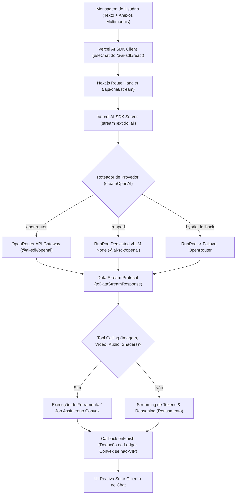

# SPEC: CHAT MULTIMODAL DE IA CRIATIVA (KRIATIVA MUSE)
> **Status:** IMPLEMENTADO & HOMOLOGADO EM PRODUÇÃO  
> **Versão da Spec:** 1.7.0  
> **Data de Criação:** 2026-09-29  
> **Última Atualização:** 2026-09-30  
> **Autores:** Kriativa Core Team & AI Architecture  
> **Feature Flag Mestre:** `chat_enabled`

---

## 1. Visão do Produto & Objetivo de Negócio

### 1.1 O que é o Kriativa Muse
O **Kriativa Muse** é o console conversacional multimodal de inteligência artificial do **Kriativa.app**. Projetado com capacidades multi-propósito de nível mundial, atua tanto como um **Copiloto de Direção Cinematográfica e Produção Audiovisual** quanto como um **Assistente Geral Avançado** (engenharia de software, raciocínio lógico, redação aprofundada, análise de dados e pesquisa em tempo real):
- **Assistente Multi-Propósito de Alta Performance:** Resolução de problemas complexos de código (Next.js, Python, GLSL, Shaders), matemática, redação de textos longos e síntese analítica.
- **Pesquisa na Web em Tempo Real (Web Search):** Conexão ao vivo com a internet via motor `:online` do OpenRouter, trazendo informações atualizadas com citações diretas.
- **Entrada de Áudio & Transcrição:** Suporte a ditado por voz com transcrição em tempo real em português (`pt-BR`) via Web Speech API diretamente no prompt dock.
- **Co-direção & Roteirização Cinematográfica:** Co-escrever roteiros completos no padrão *Master Scene Format*, paletas cromáticas, iluminação, ângulos de câmera 3D e prompts para modelos de difusão de vídeo e imagem.
- **Split Canvas Mode (Artifacts Claude-like):** Painel lateral interativo com abas de *Visualização* e *Código*, edição em tempo real, download e persistência em banco.
- **Menu Contextual de Seleção Flutuante:** Seleção direta de texto na resposta para citar no prompt, reescrever, explicar ou copiar.
- **Bíblia de Produção / Lorebook:** Gestão de personagens, cenários e diretrizes visuais com injeção em 1 clique no prompt.
- **Ingestão Multimodal:** Análise de imagens, PDFs, livros e documentos volumosos com suporte a drag-and-drop.

### 1.2 Layout & Filosofia de UX
O chat possui uma **identidade e layout 100% dedicados**, com botão de retorno imediato ao dashboard principal (`/dashboard`):
- **Espaço Imersivo de Estúdio:** Janela de visualização limpa com estética *Solar Cinema* (`#050506` / `#08090C`), aproveitamento total de tela (*full-viewport*) e sem distrações externas.
- **Header Funcional:** Navegação rápida de volta ao estúdio (`/dashboard`), seletor de modo, atalho para o Split Canvas e acesso à Bíblia de Produção.
- **Sidebar Própria de Sessões Criativas:** Barra lateral retrátil exclusiva para gestão de conversas, agrupamento por projetos/pastas, fixação de chats importantes (Pins) e histórico cronológico com restauração instantânea por ID.
- **Console de Prompt Flutuante (Floating Dock):** Textarea auto-expansível com atalhos rápidos de anexos, seleção de modelos ativos, botão de pesquisa web ao vivo, microfone para ditado por voz e estimador de créditos.
- **Canvas de Artifacts & Live Preview:** Painel lateral desacoplável com abas de renderização e editor de código com numeração de linhas e cópia.

### 1.3 Análise Post-Mortem de Falhas & Onde Deixamos de Gerar Valor
Uma análise forense da primeira versão da especificação revelou **7 pontos críticos de ruptura** onde o produto falharia em gerar valor real para diretores e criadores audiovisuais:

1. **O "Efeito Silo" (Falta de Conexão com a Linha de Produção):**
   * *Onde falhou:* O chat gerava um roteiro brilhante ou uma paleta de câmera fantástica, mas o usuário tinha que copiar e colar manualmente pedaço por pedaço no estúdio de vídeo ou na lista de tarefas.
   * *Correção na Spec 1.1.0:* Implementação de **"Direct-to-Studio Actions"** com um clique: `[🎬 Transformar Roteiro em Cenas na Linha do Tempo]` e `[🎨 Enviar Conceito para Pipeline de Vídeo]`.
2. **O "Context Dumping" em Livros & PDFs (Consumo Excessivo de Créditos):**
   * *Onde falhou:* Fazer upload de um livro de 300 páginas e reenviar 200.000 tokens a cada mensagem seguinte consumia todo o saldo do usuário em 2 ou 3 perguntas, gerando frustração imediata.
   * *Correção na Spec 1.1.0:* Arquitetura de **RAG Semântico Híbrido** e **Prompt Caching** (OpenRouter / vLLM): fatiamento semântico que injeta apenas os capítulos/trechos pertinentes, reduzindo o custo de créditos em até 90% e a latência de 45s para 2s.
3. **Falta de Memória de Consistência Visual (O "Efeito Amnésia"):**
   * *Onde falhou:* Na 15ª mensagem, a IA esquecia a roupa, o rosto ou a iluminação dos personagens definidos no início do chat, quebrando a consistência do filme.
   * *Correção na Spec 1.1.0:* Introdução da **"Bíblia de Produção / Lorebook"** no projeto: painel de fixação de personagens, cenários e diretrizes ópticas injetados automaticamente no contexto do modelo.
4. **Impossibilidade de Edição Direta no Chat (O "Pesadelo do Texto Longo"):**
   * *Onde falhou:* Ler ou alterar uma fala em um roteiro de 10 páginas dentro de uma bolha de chat era impraticável.
   * *Correção na Spec 1.1.0:* **Split Canvas Mode (Artifacts Editáveis)**: um painel lateral onde o roteiro abre como documento de texto rico, permitindo ao criador editar diretamente ou selecionar um trecho e pedir: *"Deixe este parágrafo mais dramático"*.
5. **Dedução "Cega" de Créditos & Pânico de Cobrança:**
   * *Onde falhou:* O usuário não sabia quanto uma pergunta com anexos pesados iria custar antes de clicar em enviar, gerando receio de usar o chat.
   * *Correção na Spec 1.1.0:* **Medidor de Custo Estimado no Prompt Dock** e **Política de Zero Cobrança em Erros**: se a Vercel ou o provedor falhar durante o streaming, zero créditos são debitados e uma reconciliação atômica protege o saldo do usuário.
6. **Falta de Controle de Raciocínio (O Modelo Lento para Tarefas Simples):**
   * *Onde falhou:* Usuários esperando 50 segundos de raciocínio profundo (*DeepSeek R1 / Claude 3.7 Thinking*) para tarefas triviais como traduzir um diálogo curto.
   * *Correção na Spec 1.1.0:* **Seletor de Esforço de Raciocínio (`Reasoning Effort: Fast 1s vs Deep Cinema 30s`)**.
7. **Risco de Abandono por Timeouts no Mobile:**
   * *Onde falhou:* Usuários em redes 4G/5G com conexões que oscilavam perdiam a resposta no meio do streaming.
   * *Correção na Spec 1.1.0:* Persistência incremental por chunks no Convex e reconexão reativa automática.

---

## 2. Arquitetura de Provedores & Roteamento Dinâmico (Admin Control)

O sistema de backend suporta múltiplos motores de Inteligência Artificial, permitindo que a administração da plataforma selecione dinamicamente a rota de processamento sem necessidade de novo deploy.



### 2.1 Provedores Suportados

1. **OpenRouter API Gateway (`openrouter`):**
   - Acesso imediato a centenas de modelos de ponta:
     - **Claude (Anthropic):** `anthropic/claude-3.7-sonnet` (Raciocínio & Direção Híbrida), `anthropic/claude-3.5-haiku` (Velocidade & Diálogos Ágeis).
     - **ChatGPT (OpenAI):** `openai/gpt-4o` (Versátil & Multimodal de Elite), `openai/gpt-4o-mini` (Ultrarrápido & Econômico), `openai/o3-mini` (Raciocínio Lógico & Engenharia de Prompts).
     - **Gemini (Google):** `google/gemini-2.5-flash` (Ultrarrápido & Multimodal), `google/gemini-2.5-pro` (Análise Profunda & Longo Contexto).
     - **Qwen (Alibaba):** `qwen/qwen-2.5-72b-instruct` (Narrativa, Roteiro & Diálogos), `qwen/qwen-2.5-coder-32b-instruct` (Código, Shaders & Pipeline), `qwen/qwq-32b` (Raciocínio Aberto & Pensamento Profundo).
     - **Gemma (Google DeepMind):** `google/gemma-2-27b-it` (Lógica Refinada & Texto Preciso), `google/gemma-2-9b-it` (Respostas Instantâneas & Leve).
     - **DeepSeek:** `deepseek/deepseek-r1` (Cinema Mind Profundo & CoT).
   - Streaming nativo Server-Sent Events (SSE).
   - Rate limits gerenciados pela chave mestre de API.

2. **Cluster Auto-Hospedado no RunPod (`runpod`):**
   - Conexão direta com instâncias de renderização e inferência dedicadas ou serverless no RunPod.
   - Execução via stack de alto throughput compatível com OpenAI API (vLLM, TGI ou Ollama).
   - Suporte a modelos de pesos abertos tunados para cinema e ComfyUI (ex: DeepSeek R1/V3 distil, Llama 3.3, Qwen 2.5).
   - Latência ultrabaixa para criadores frequentes e custo fixo de infraestrutura.

3. **Roteamento Híbrido com Fallback Automático (`hybrid_fallback`):**
   - O sistema direciona o tráfego primariamente para o nó do RunPod.
   - Em caso de indisponibilidade, timeout (> 10s) ou sobrecarga da instância, chaveia instantaneamente para o OpenRouter de forma transparente para o usuário.

### 2.2 Console de Gestão pelo Administrador
No painel `/dashboard/admin/pricing` e na rota dedicada de IA `/dashboard/admin/ai-settings`:
- Seletor de motor ativo (`openrouter` vs `runpod` vs `hybrid_fallback`).
- Campo para configuração da URL do endpoint RunPod (ex: `https://api.runpod.ai/v2/YOUR-POD-ID/openai/v1`).
- Campo seguro de Bearer Token do RunPod.
- Seletor do modelo padrão para cada tarefa (Chat Rápido, Raciocínio Profundo, Análise Visual, Geração de Arte).
- Slider de temperatura, top_p, e máximo de tokens de contexto.

### 2.3 CRUD Dinâmico de Modelos RunPod & Conversor Automático de Créditos (v1.5.0)
Para expandir dinamicamente a esteira de modelos de inferência sem alterar o código-fonte, o administrador conta com o cadastro simplificado de modelos RunPod:
1. **Entrada Simplificada:** O administrador apenas insere:
   - **Nome / Slug do Modelo:** ex: `qwen/qwen3.8-max-prime`, `Qwen/Qwen2.5-72B-Instruct` ou `deepseek-ai/DeepSeek-R1-Distill-Qwen-32B`.
   - **Preço Input (USD / 1M tokens):** Tarifa cobrada por 1 milhão de tokens de entrada (ex: `$0.20`).
   - **Preço Output (USD / 1M tokens):** Tarifa cobrada por 1 milhão de tokens de saída (ex: `$0.80`).
   - **Preço Cached (USD / 1M tokens):** Tarifa com desconto de Prompt Caching (ex: `$0.05`).
2. **Cálculo Automático de Créditos em Tempo Real:**
   - O sistema utiliza as variáveis de [`systemPricingSettings`](file:///C:/dev/trinnsaas/convex/schema.ts) (`usdToBrlRate` e `customCreditPriceBrl`):
   $$\text{Créditos por 1M} = \frac{\text{Preço USD} \times \text{Cotação USD/BRL}}{\text{Preço Base por Crédito em BRL (R\$ 0,25)}}$$
   - *Exemplo Prático:* Com dólar a R$ 5,80 e crédito a R$ 0,25:
     - Input de $0.20 / 1M $\rightarrow$ **4.64 créditos / 1M tokens** (~0.046 cr / 10k tokens).
     - Output de $0.80 / 1M $\rightarrow$ **18.56 créditos / 1M tokens** (~0.186 cr / 10k tokens).
     - Cached de $0.05 / 1M $\rightarrow$ **1.16 créditos / 1M tokens**.
3. **Disponibilidade Instantânea no Chat:**
   - A query [`listAvailableModels`](file:///C:/dev/trinnsaas/convex/chat.ts) unifica o catálogo fixo inicial com todos os modelos cadastrados no banco `customAiModels` onde `isEnabled: true`.
   - Assim que cadastrado, o modelo surge no dropdown de seleção do prompt dock de todos os criadores sem necessidade de recarregar a página (reatividade WebSocket).
4. **Resolução de Rota no Backend:**
   - [`resolveAiLanguageModel`](file:///C:/dev/trinnsaas/src/lib/ai/providers.ts) repassa o nome exato do modelo (sem prefixos desnecessários) diretamente ao client vLLM compatível com a API OpenAI do RunPod.
   - O stream handler em [`/api/chat/stream`](file:///C:/dev/trinnsaas/src/app/api/chat/stream/route.ts) consulta [`getModelByModelId`](file:///C:/dev/trinnsaas/convex/chat.ts) para detectar dinamicamente o provedor correto e repassa `modelUsed` para a mutação de débito no ledger.
5. **Dedução de Créditos Proporcional:**
   - [`fulfillOrDeductCredits`](file:///C:/dev/trinnsaas/convex/chat.ts) aplica as taxas específicas de input, output e cached cadastradas no modelo, garantindo precisão milimétrica e prevenindo prejuízos operacionais.

---

## 3. Sistema de Créditos & Mecânica de Uso Ilimitado

### 3.1 Dedução Transacional & Unidades de Custo
A contagem de créditos é estritamente vinculada ao **Livro-Razão Imutável (`creditTransactions`)**:
- **Mensagens de Texto & Raciocínio:**
  - Modelo de conversão: `1 crédito = ~10.000 tokens de entrada/saída` em modelos standard (Gemini 2.5 Flash / Llama 3.3).
  - Modelos de raciocínio profundo (Claude 3.7 / DeepSeek R1): `1 crédito = ~2.500 tokens`.
- **Geração Multimodal Inline no Chat:**
  - Geração de Imagem Fotorealista (Flux/SDXL): `5 créditos por imagem`.
  - Geração de Vídeo Cinemático Rápido (Wan 2.1 / LTX): `15 a 25 créditos por vídeo`.
  - Geração de Áudio / TTS Neural / SFX: `3 créditos por minuto de áudio`.
- **Débito Atômico:** O débito ocorre no momento da finalização do stream da resposta ou da confirmação de conclusão do asset gerado, prevenindo cobranças por respostas abortadas por erro de rede.

### 3.2 Modalidade de Uso Ilimitado (Zero Dedução)
O sistema implementa regras claras para concessão de uso irrestrito sem desconto de saldo:
1. **Administradores do Sistema:** Qualquer usuário com `role === "admin"` possui **Uso Ilimitado Global** no chat. O saldo exibido no topo do chat apresenta a insígnia `∞ ILIMITADO ADMIN`.
2. **Flag de Isenção Individual (`unlimitedAiChat: true`):** O administrador pode marcar contas individuais (sócios, testadores VIP, parceiros estratégicos) na tabela `users` com o parâmetro `unlimitedAiChat: true`.
3. **Plano de Assinatura Ilimitada (Tier Cinema Master / Enterprise):** Futuras assinaturas recorrentes que contemplarem o chat liberam a flag `unlimitedAiChat` automaticamente.
4. **Comportamento no Ledger:** Para usuários ilimitados, o sistema registra a transação com `amount: 0`, tipo `generation_spend` e descrição `[Uso Ilimitado] Geração via Kriativa Muse`, garantindo que a métrica de telemetria permaneça precisa sem impactar saldos.

### 3.3 Transparência, Previsibilidade de Custos & Política de Zero Cobrança em Erros
- **Estimativa em Tempo Real no Prompt Dock:** Conforme o usuário digita e anexa arquivos, o cliente estima a quantidade de tokens e exibe: `Estimativa: ~1.4 créditos (Saldo restante: 48.6 cr)`. Para usuários ilimitados, exibe `∞ Ilimitado (Sem Custo)`.
- **Alerta Proativo de Saldo Insuficiente:** Se a estimativa superar o saldo, o botão de envio é substituído por um atalho elegante: `Recarregar Saldo para Continuar (PIX Instantâneo)` sem perder o texto ou anexos inseridos.
- **Política de Zero Cobrança em Erros:** Se o stream for abortado por erro de rede da Vercel, timeout de servidor ou falha do OpenRouter/RunPod, **zero créditos são debitados**.
- **Reconciliação no Cancelamento Manual (`stop()`):** Se o criador interromper manualmente a resposta pelo botão "Parar Geração", o sistema debita apenas a fração de tokens efetivamente renderizada no navegador.

---

## 4. Capacidades Multimodais de Entrada (Ingestão)

O Kriativa Muse é projetado para compreender múltiplos tipos de mídia de entrada com alto contexto:

| Tipo de Entrada | Formatos Suportados | Método de Ingestão | Capacidade de Processamento |
| :--- | :--- | :--- | :--- |
| **Imagens de Referência** | JPG, PNG, WebP, GIF | Drag & Drop, Botão Anexar, Colagem via `Ctrl+V` | Análise visual, descrição de iluminação, extração de paleta cromática, leitura de quadros de storyboard. |
| **Documentos & Livros** | PDF, EPUB, TXT, DOCX | Upload via modal ou arrastar arquivo | Leitura de livros inteiros e compêndios. Extração de texto client/server-side com injeção em janelas de 1M a 2M tokens. |
| **Roteiros de Cinema** | FDX (Final Draft), Fountain, PDF, MD | Drag & Drop | Reconhecimento de estrutura de cenas, extração de personagens, cenários e arcos dramáticos. |
| **Códigos & Shaders** | GLSL, HLSL, Python, JS, JSON (ComfyUI workflows) | Anexo ou bloco colado no prompt | Análise sintática, debug de nós customizados ComfyUI e geração de shaders para WebGL. |
| **Prompts de Áudio** | MP3, WAV (amostras de voz) | Upload de áudio de referência | Clonagem de cadência de voz, transcrição e análise de tom acústico. |

### 4.1 Ingestão Inteligente de Livros & PDFs: RAG Semântico Híbrido & Prompt Caching
Para viabilizar a análise de livros inteiros de 300+ páginas sem estourar o orçamento de créditos do usuário e sem lentidão de resposta:
- **Fatiamento Semântico Estruturado:** Livros (EPUB/PDF/TXT) são particionados em capítulos e cenas identificadas, gerando um sumário indexado no cliente.
- **Prompt Caching do Vercel AI SDK / Provedores:** Modelos compatíveis (Claude 3.7, Gemini 2.5 e nós vLLM com KV-Cache) utilizam cache de prompt. A leitura inicial processa o documento, e todas as perguntas seguintes na mesma conversa reutilizam o cache na memória da GPU/servidor com **90% de desconto de créditos e latência de ~1.5s**.
- **Modos de Consulta pelo Criador:**
  - *Modo Síntese Global (Full-Context):* Para compêndios de estilo e roteiros de até 150 páginas com injeção direta na janela de contexto de 1M tokens.
  - *Modo RAG Semântico Seletivo:* Para livros volumosos (200k+ tokens), o sistema busca os 3 a 5 trechos mais relevantes para a pergunta do diretor, preservando créditos e garantindo precisão cirúrgica sem alucinações.

---

## 5. Capacidades Multimodais de Saída (Geração)

A interface de mensagens renderiza cada formato de saída com blocos dedicados e ricos:

### 5.1 Códigos & Shaders
- Syntax highlighting com suporte a 40+ linguagens (TypeScript, Python, ComfyUI JSON, GLSL, WGSL, Shell, SQL).
- Botão "Copiar Código" em 1 clique com feedback visual.
- Abas de alternância: `[Código Fonte]` e `[Artifacts / Prévia Interativa]` (HTML/SVG/WebGL renders).
- Botão "Executar / Exportar".

### 5.2 Imagens Fotorealistas
- Geração inline de imagens de alta resolução (1K, 2K e formato cinema 2.39:1 / 16:9).
- Lightbox integrado com zoom, detalhes de metadados (modelo, semente, prompt positivo e negativo).
- Ações no card da imagem:
  - `Baixar em Alta Resolução (PNG)`
  - `Enviar para Estúdio de Vídeo (Criar Animação a partir da Imagem)`
  - `Variação Criativa (+4 variações)`

### 5.3 Vídeos Cinematográficos
- Reprodutor de vídeo HTML5 customizado com estilo *Solar Cinema* (borda iluminada, cantos arredondados, sem branding externo).
- Controles: reprodução contínua em loop, scrubbing quadro-a-quadro, controle de velocidade (0.5x, 1x, 2x) e tela cheia.
- Metadados exibidos: resolução (720p/1080p), taxa de quadros (24fps cinemático), motor de render e semente.
- Botão de exportação direta para a linha do tempo do estúdio principal.

### 5.4 Áudios, Vozes & Efeitos Sonoros (SFX)
- Player de áudio minimalista com forma de onda visual animada (*waveform visualizer* via Canvas/Wavesurfer).
- Geração de falas dubladas em múltiplos idiomas com emoção ajustável e efeitos de ambiente sonoro.
- Opção de download em WAV sem perdas ou MP3 comprimido.

### 5.5 Textos Longos & Roteiros de Cinema
- Renderização avançada de Markdown: tabelas com cabeçalhos fixos, listas ordenadas com checkboxes interativos, citações em destaque.
- Suporte a fórmulas matemáticas e equações de física óptica via KaTeX.
- **Modo Roteiro Master Scene:** Renderização automática com fontes mono (estilo Courier Final Draft), cabeçalho de cena em negrito (`INT. ESTÚDIO DE GRAVAÇÃO - NOITE`), nomes de personagens centralizados e diálogos recuados.
- Botão de exportação com 1 clique para `.pdf`, `.docx` ou `.md`.

---

## 6. Layout & UX/UI de Ponta (*Solar Cinema*)

A interface do chat é composta por 3 pilares visuais:

```
+-----------------------------------------------------------------------------------+
| HEADER DO CHAT: Título da Conversa | Modelo Ativo | Saldo: 150 cr [∞ VIP] | Opções |
+-----------------------+-----------------------------------------------------------+
| SIDEBAR EXCLUSIVA     | ÁREA CENTRAL DE MENSAGENS                                 |
|                       |                                                           |
| [+ Nova Conversa]     | [IA - 14:02]                                              |
|                       | Olá! Sou seu copiloto de direção. O que vamos criar hoje? |
| 🔍 Buscar conversas... |                                                           |
|                       | [Usuário - 14:03]                                         |
| 📌 FIXADOS            | Gere um roteiro de ficção científica em Marte 2088...     |
| • Blade Runner 2099   | 📎 Anexo: roteiro_base.pdf                                 |
|                       |                                                           |
| 🕒 HOJE               | [IA - 14:03] (Streaming de Roteiro + Card de Imagem)      |
| • Roteiro Marte 2088  | SCENE 1: EXT. CRATERA DE GALE - DIA                      |
| • Shader Anamórfico   | [CARD DE IMAGEM GERADA COM LIGHTBOX]                      |
|                       |                                                           |
| 📁 PASTAS             +-----------------------------------------------------------+
| ▸ Campanha Nike       | CONSOLE DE PROMPT FLUTUANTE (FLOATING DOCK)               |
| ▸ Teaser Série IA     | 📎 [+] [Modo Diretor v] Escreva sua instrução... [Enviar]  |
+-----------------------+-----------------------------------------------------------+
```

### 6.1 Sidebar Própria de Conversas
- **Topo da Sidebar:** Botão primário "+ Nova Conversa" com gradiente Solar Orange (`#FF5500`).
- **Busca em Tempo Real:** Campo de pesquisa instantânea que filtra conversas por título ou palavras-chave das mensagens.
- **Categorização Cronológica:**
  - *Fixados (Pinned):* Conversas de trabalho prioritárias sempre no topo com ícone de pin dourado.
  - *Hoje / Ontem / Últimos 7 dias / Anteriores.*
  - *Pastas de Projetos:* Possibilidade de agrupar conversas em pastas temáticas (ex: "Filme Curta-Metragem", "Scripts Shaders", "Campanhas").
- **Ações Rápidas em cada Conversa (Menu de 3 Pontos):**
  - Fixar / Desafixar
  - Renomear título (com auto-geração automática de título por IA na primeira resposta)
  - Duplicar sessão (Branching)
  - Limpar histórico
  - Excluir conversa
- **Rodapé da Sidebar:** Indicador de saldo e atalho rápido para retornar ao Dashboard Geral do Kriativa.

### 6.2 Área de Conversação & Mensagens
- **Mensagens do Usuário:** Alinhadas à direita com fundo escuro sutil (`#14151B`), borda delicada e chips com prévias dos arquivos/imagens anexados.
- **Mensagens da IA:**
  - Identificação clara do modelo gerador (ex: `Claude 3.7 Sonnet`, `DeepSeek R1 RunPod Node`, `Gemini 2.5 Flash`).
  - Efeito de streaming caractere por caractere com cursor pulsante Solar Orange.
  - Seletor de visualização de raciocínio (*Thinking Process Accordion*), expansível para conferência da cadeia de pensamento da IA.
  - Barra de ações da resposta: Copiar Texto, Regenerar com outro modelo, Criar Ramificação (Branch), Baixar MD/PDF.

### 6.3 Console de Prompt Flutuante (Floating Dock)
- **Área de Texto Dinâmica:** Textarea com auto-redimensionamento de 1 até 8 linhas de texto sem scroll vertical inicial.
- **Botão de Anexos (+):** Abertura de gaveta com suporte a envio de arquivos, imagens, PDFs e gravação de áudio do microfone.
- **Seletor de Modo de Criação:**
  - 🎬 *Modo Diretor Geral:* Orquestração cinematográfica e brainstorm amplo.
  - ✍️ *Modo Roteirista Pro:* Foco em estrutura dramática, diálogos e formatação padrão de cinema.
  - 🎨 *Modo Direção de Arte:* Especializado em fotografia, paletas de cores e geração de imagens conceituais.
  - 💻 *Modo Shaders & Pipeline:* Focado em código, shaders WebGL e nós ComfyUI.
- **Contador de Custo Estimado:** Indicador discreto em tipografia monospace (ex: `~1.2 créditos` ou `Uso Ilimitado`).

### 6.4 Gestão de Histórico de Conversas & Persistência Instantânea
- **Persistência Reativa em Tempo Real:** Cada mensagem enviada pelo criador é gravada de imediato no Convex com estado otimista, garantindo que mesmo se a aba for fechada durante o envio, a pergunta original nunca seja perdida.
- **Restauração Completa de Sessão:** Ao reabrir uma conversa antiga (seja de ontem ou de meses atrás), todo o histórico de mensagens, arquivos anexados, códigos interativos, imagens e vídeos gerados é restaurado instantaneamente através de subscrições reativas do Convex (`useQuery(api.chat.getMessages, { conversationId })`).
- **Navegação & Indexação Cronológica:**
  - Sidebar categorizada com agrupamento inteligente (*Hoje*, *Ontem*, *Últimos 7 dias*, *Mês Atual*, *Anteriores*).
  - Ordenação dinâmica: qualquer conversa que receba uma nova mensagem é movida instantaneamente para o topo da lista.
  - Busca Full-Text local e remota por palavras-chave com destaque visual nos resultados.
- **Branching de Conversas (Ramificação Criativa):**
  - O criador pode clicar no botão "Bifurcar Sessão" em qualquer resposta intermediária da IA.
  - O sistema clona o histórico até aquele ponto exato em uma nova conversa, permitindo explorar finais e abordagens criativas alternativas sem perder a linha narrativa original.
- **Virtualização & Paginação Suave:**
  - Para conversas longas (50+ mensagens com mídias pesadas), o container de mensagens implementa virtualização de renderização (React Virtual / Windowing), mantendo a rolagem fluida a 60fps sem consumo excessivo de memória do navegador.

### 6.5 Feedbacks Visuais Ricos & Estados de Ciclo de Vida da UI
Para garantir uma experiência de ponta (*Solar Cinema*), a interface fornece feedback visual imediato e elegante para cada micro-fase do ciclo de resposta da IA:

1. **Estado `uploading_attachments` (Envio de Arquivos & Livros):**
   - Chip de arquivo com barra de progresso em gradiente ciano/laranja e indicador de tamanho processado.
   - Animação de escaneamento visual para imagens e contagem de páginas para PDFs/livros.
2. **Estado `connecting_provider` (Conexão com Nó de IA):**
   - Mini-badge pulsante no cabeçalho do assistente: `Conectando ao nó de renderização...` acompanhado de medidor de latência.
3. **Estado `thinking` (Raciocínio & Cadeia de Pensamento):**
   - Animação luminosa suave de onda (*solar shimmer*) indicando que o modelo está processando o raciocínio complexo.
   - **Cronômetro de Raciocínio ao Vivo:** Indicador numérico em tempo real (ex: `Pensando há 4.2s...`).
   - **Accordion Expansível de Pensamento (*Thinking Accordion*):** Bloco retrátil com fundo `#08090C` e borda sutil que exibe o streaming da cadeia de pensamento da IA em tipografia monospace reduzida. Permite ao diretor acompanhar a lógica e hipóteses da IA antes da resposta final ser entregue.
4. **Estado `streaming` (Geração de Texto & Roteiro):**
   - Cursor luminoso em formato de bloco pulsante em cor Solar Orange (`#FF5500`).
   - Efeito de streaming suave com chunking de 30-50ms para evitar saltos bruscos na tela.
   - **Auto-Scroll Inteligente:** O chat rola automaticamente acompanhando os novos tokens. Se o usuário rolar manualmente para cima para ler algo anterior, o auto-scroll é pausado imediatamente, exibindo um botão flutuante com badge de novos tokens: `↓ Rolar para o final`.
5. **Estado `generating_media` (Renderização de Imagem / Vídeo / Áudio):**
   - Bloco skeleton dedicado com textura cinemática e barra de renderização com percentual estimado:
     - Imagens: Skeleton com brilho direcional e badge `Sintetizando iluminação e composição...`.
     - Vídeos: Indicador de quadros renderizados com tempo estimado de conclusão.
     - Áudios: Animação de barras de frequência acústica carregando.
6. **Estado `interrupted` (Botão Parar Geração):**
   - Botão visível `■ Interromper Geração` no Floating Dock durante qualquer resposta ativa.
   - Ao ser clicado, aborta imediatamente o stream HTTP, preserva todo o texto e mídias já gerados até aquele milissegundo, e recalcula os créditos proporcionais no Convex.
7. **Estado `completed` (Conclusão & Auditoria):**
   - Badges discretos no rodapé da mensagem: identificação do modelo utilizado (ex: `Claude 3.7 Sonnet`), tempo total de resposta (ex: `1.8s`), contagem de tokens e custo debitado (ex: `-1 crédito` ou `∞ Ilimitado`).
8. **Estado `fallback_error` (Recuperação Graciosa):**
   - Se um provedor (ex: RunPod) falhar ou sofrer timeout, a interface exibe aviso elegante: `Nó primário ocupado. Alternando automaticamente para rota secundária...` sem perder o prompt digitado.

### 6.6 Direct-to-Studio Actions (Pipeline de Storyboard & Linha de Produção)
Para eliminar o "efeito silo", cada resposta da IA é equipada com atalhos de ação integrados ao ecossistema do Kriativa:
- **`[🎬 Transformar em Cenas do Estúdio]`:** Ao gerar um roteiro de cinema, o botão processa a quebra de cenas e insere automaticamente cada beat na tabela `tasks` do usuário, prontos para execução na linha de tempo de vídeo.
- **`[📽️ Animar Conceito no Estúdio]`:** Ao gerar uma imagem fotorealista de conceito, o botão envia a URL da imagem diretamente para a esteira de renderização ComfyUI como quadro-chave inicial (*Initial Frame / Image-to-Video*).
- **`[💾 Salvar Nó ComfyUI / Shader]`:** Ao gerar um script GLSL ou workflow em JSON, salva o arquivo diretamente na galeria de assets do criador.

### 6.7 Split Canvas Mode (Artifacts Editáveis Lado a Lado)
- **Interface Bifurcada (Split-Screen):** O criador pode alternar entre visualização de chat puro ou abrir o **Canvas Lateral Editável** à direita (proporção 50/50 ou ajustável).
- **Edição em Tempo Real:** Roteiros extensos, códigos e tabelas abrem no Canvas como documentos vivos em Markdown rico.
- **Edição Assistida Contextual:** Ao selecionar um trecho específico com o cursor no Canvas, surge um mini-console flutuante:
  - *"Reescrever com mais tensão dramática"*
  - *"Traduzir para inglês de cinema"*
  - *"Adicionar diálogo sarcástico para a protagonista"*
  - A IA substitui cirurgicamente apenas as linhas selecionadas no Canvas sem reescrever o roteiro inteiro!

### 6.8 Bíblia de Produção & Lorebook Persistente (Studio Memory)
Para erradicar a perda de consistência em conversas de longa duração:
- **Painel "Bíblia do Projeto":** Acessível pelo ícone de claquete no topo do chat.
- **Entidades Fixadas:**
  - *Personagens:* Nome, traços fisionômicos, paleta de figurino e sementes visuais fixas.
  - *Universo & Cenários:* Época, regras de iluminação (ex: *Neo-Noir chuvoso, luzes neon ciano*), locações.
  - *Identidade Óptica:* Lente de câmera emulada (ex: *85mm anamórfica f/1.4, flare azul horizontal*).
- **Injeção Silenciosa:** O sistema compila os tópicos da Bíblia em um bloco compacto de sistema que acompanha todas as chamadas daquela pasta de projeto, garantindo consistência de tom, diálogos e direção de arte da primeira à centésima mensagem.

### 6.9 Seletor de Esforço de Raciocínio (Reasoning Effort Slider)
No Floating Dock, o diretor tem controle absoluto sobre a velocidade vs profundidade de raciocínio da IA:
- ⚡ **Modo Rápido (Low Effort - 1s a 2s):** Desativa a cadeia de pensamento em tarefas diretas (traduções, correções, brainstorm veloz). Consome o mínimo de créditos.
- ⚖️ **Modo Direção Padrão (Medium Effort - 5s a 10s):** Ativa reflexão equilibrada para composição de cenas e diálogos verossímeis.
- 🧠 **Modo Cinema Mind (High Effort - 25s a 60s):** Libera a capacidade máxima de raciocínio (*DeepSeek R1 / Claude 3.7 Thinking*) para desfechos dramáticos complexos, quebras de roteiro e depuração de shaders avançados.

---

Para suportar o chat com persistência em tempo real, 3 novas tabelas serão adicionadas ao [`convex/schema.ts`](file:///C:/dev/trinnsaas/convex/schema.ts):

### 7.1 `aiConversations`
Armazena as sessões e tópicos de conversa criados pelos usuários.
```typescript
aiConversations: defineTable({
  userId: v.string(), // clerkId
  title: v.string(), // Gerado automaticamente pela IA ou editado pelo criador
  folderId: v.optional(v.string()), // Agrupamento por projeto/pasta
  isPinned: v.boolean(),
  systemPromptPreset: v.optional(v.string()), // "director" | "screenwriter" | "art_director" | "developer"
  activeModel: v.string(), // ex: "anthropic/claude-3.7-sonnet" ou "runpod/deepseek-r1"
  provider: v.union(v.literal("openrouter"), v.literal("runpod"), v.literal("hybrid_fallback")),
  totalTokensUsed: v.number(),
  totalCreditsCharged: v.number(),
  lastMessageAt: v.number(),
  createdAt: v.number(),
  updatedAt: v.number(),
})
  .index("by_userId", ["userId"])
  .index("by_userId_pinned", ["userId", "isPinned"])
  .index("by_userId_lastMessage", ["userId", "lastMessageAt"]),
```

### 7.2 `aiMessages`
Armazena cada mensagem individual da conversa com suporte a streaming e metadados multimodais.
```typescript
aiMessages: defineTable({
  conversationId: v.id("aiConversations"),
  userId: v.string(), // clerkId
  role: v.union(v.literal("user"), v.literal("assistant"), v.literal("system")),
  content: v.string(), // Texto da mensagem em Markdown rico
  thoughtProcess: v.optional(v.string()), // Cadeia de pensamento (Thinking / Reasoning models)
  attachments: v.optional(
    v.array(
      v.object({
        type: v.union(v.literal("image"), v.literal("document"), v.literal("audio"), v.literal("code")),
        storageId: v.optional(v.id("_storage")),
        url: v.string(),
        name: v.string(),
        mimeType: v.string(),
        sizeBytes: v.number(),
      })
    )
  ),
  generatedMedia: v.optional(
    v.array(
      v.object({
        mediaType: v.union(v.literal("image"), v.literal("video"), v.literal("audio"), v.literal("artifact")),
        url: v.string(),
        storageId: v.optional(v.id("_storage")),
        prompt: v.optional(v.string()),
        seed: v.optional(v.number()),
        durationSeconds: v.optional(v.number()),
        resolution: v.optional(v.string()),
        codeLanguage: v.optional(v.string()),
      })
    )
  ),
  tokensPrompt: v.optional(v.number()),
  tokensCompletion: v.optional(v.number()),
  creditsDeducted: v.number(), // 0 se for usuário ilimitado
  isStreaming: v.boolean(),
  modelUsed: v.string(),
  providerUsed: v.string(),
  createdAt: v.number(),
})
  .index("by_conversationId", ["conversationId"])
  .index("by_userId", ["userId"])
  .index("by_createdAt", ["createdAt"]),
```

### 7.3 `aiProviderSettings`
Configurações globais gerenciadas exclusivamente pelos Administradores da plataforma.
```typescript
aiProviderSettings: defineTable({
  key: v.string(), // "global_ai_config"
  activeProvider: v.union(v.literal("openrouter"), v.literal("runpod"), v.literal("hybrid_fallback")),
  defaultModelText: v.string(), // ex: "anthropic/claude-3.7-sonnet"
  defaultModelReasoning: v.string(), // ex: "deepseek/deepseek-r1"
  defaultModelVision: v.string(), // ex: "google/gemini-2.5-flash"
  runpodEndpointUrl: v.optional(v.string()), // URL do vLLM / Pod dedicado
  runpodModelName: v.optional(v.string()),
  openRouterApiKeyConfigured: v.boolean(),
  runpodApiKeyConfigured: v.boolean(),
  tokensPerCreditStandard: v.number(), // Padrão: 10000
  tokensPerCreditReasoning: v.number(), // Padrão: 2500
  imageCreditCost: v.number(), // Padrão: 5
  videoCreditCost: v.number(), // Padrão: 25
  audioCreditCost: v.number(), // Padrão: 3
  maxContextTokens: v.number(), // Padrão: 128000
  updatedAt: v.number(),
  updatedBy: v.optional(v.string()),
}).index("by_key", ["key"]),
```

### 7.4 `lorebookEntries` (Bíblia de Produção & Memória Persistente)
Armazena entidades do universo do projeto para garantir consistência visual e narrativa de longo prazo:
```typescript
lorebookEntries: defineTable({
  userId: v.string(), // clerkId
  folderId: v.optional(v.string()), // Pasta de projeto associada
  conversationId: v.optional(v.id("aiConversations")), // Opcionalmente restrito a um chat
  category: v.union(v.literal("character"), v.literal("location"), v.literal("style_rules"), v.literal("lore")),
  name: v.string(), // ex: "Elena - Piloto Ciborgue"
  description: v.string(), // Traços, biografia e tom dramático
  visualPromptAnchor: v.optional(v.string()), // Âncora de prompt (ex: "Elena, neon yellow jacket, cybernetic eye, 35mm anamorphic")
  referenceImageUrl: v.optional(v.string()), // Imagem base de referência
  isActive: v.boolean(),
  updatedAt: v.number(),
})
  .index("by_userId", ["userId"])
  .index("by_folderId", ["folderId"])
  .index("by_conversationId", ["conversationId"]),
```

### 7.5 `canvasArtifacts` (Documentos & Roteiros Editáveis Lado a Lado)
Armazena o documento vivo aberto no Split Canvas, editável pelo criador e assistido pela IA:
```typescript
canvasArtifacts: defineTable({
  conversationId: v.id("aiConversations"),
  userId: v.string(), // clerkId
  title: v.string(), // ex: "Roteiro: Missão Marte 2088 - Cena 1 a 4"
  type: v.union(v.literal("screenplay"), v.literal("code_shader"), v.literal("storyboard_table"), v.literal("markdown_doc")),
  content: v.string(), // Texto Markdown ou código completo editável em tempo real
  version: v.number(), // Controle de histórico de revisões
  isPinned: v.boolean(),
  updatedAt: v.number(),
})
  .index("by_conversationId", ["conversationId"])
  .index("by_userId", ["userId"]),
```

### 7.6 Modificação na Tabela `users`
Inclusão do campo opcional para isenção perpétua de cobrança de créditos no chat:
```typescript
// Em convex/schema.ts -> users:
unlimitedAiChat: v.optional(v.boolean()), // true = uso ilimitado sem debitar créditos
```

---

## 8. Feature Flags Dedicadas & Matriz de Governança

O chat multimodal é rigorosamente controlado pela matriz de Feature Flags em `convex/schema.ts` e `convex/featureFlags.ts`, com validação dupla (servidor e cliente):

| Chave da Flag | Nome Legível | Categoria | Padrão | Descrição | Ponto de Aplicação no Servidor | Ponto de Aplicação no Cliente |
| :--- | :--- | :--- | :--- | :--- | :--- | :--- |
| `chat_enabled` | Chat Multimodal Kriativa Muse | `studio` | `true` | Ativação global da rota do chat e console criativo. | `assertFeatureFlag(ctx, "chat_enabled")` em `createConversation`, `saveUserMessage`, `saveAssistantMessage`, `fulfillOrDeductCredits` e `/api/chat/stream` | `<FeatureGate flag="chat_enabled" />` em `chat-layout-wrapper.tsx` e badge de status em `dashboard-nav.tsx` |
| `chat_provider_openrouter` | Integração OpenRouter | `system` | `true` | Habilita tráfego via OpenRouter API Gateway. | `isFeatureFlagActive` em `listAvailableModels` e verificação no endpoint `/api/chat/stream` | Modelos OpenRouter são filtrados da lista de seleção do prompt dock |
| `chat_provider_runpod` | Integração RunPod Auto-Hospedado | `system` | `true` | Habilita tráfego via instâncias dedicadas do RunPod. | `isFeatureFlagActive` em `listAvailableModels` e verificação no endpoint `/api/chat/stream` | Modelos RunPod são filtrados da lista de seleção do prompt dock |
| `chat_file_upload` | Ingestão de Documentos & Livros | `studio` | `true` | Permite envio de PDFs, livros e documentos volumosos. | `assertFeatureFlag(ctx, "chat_file_upload")` em `generateUploadUrl` | Oculta botão de anexo no menu `+`, bloqueia drag-and-drop e Ctrl+V de imagens |
| `chat_image_generation` | Geração Inline de Imagens | `studio` | `true` | Ativa ferramentas de geração de arte conceitual no chat. | Guardas de execução nas tool calls de imagem | Desativa chamada à ferramenta de render visual no assistente |
| `chat_video_generation` | Geração Inline de Vídeo | `studio` | `true` | Permite disparar renders de vídeo pelo console do chat. | Guardas de execução nas tool calls de vídeo | Desativa atalho de animação direta |
| `chat_audio_generation` | Geração de Voz e Efeitos de Áudio | `studio` | `true` | Ativa síntese de voz cinematográfica e SFX. | Guardas de execução nas tool calls de áudio | Desativa botão de reprodução/síntese sonora |
| `chat_canvas_artifacts` | Split Canvas Mode & Edição de Documentos | `studio` | `true` | Ativa painel lateral de edição de roteiros e artefatos lado a lado. | `assertFeatureFlag(ctx, "chat_canvas_artifacts")` em `saveCanvasArtifact` | Oculta botão Canvas no header, botão "Abrir no Split Canvas" e desmonta `<ChatCanvas />` |
| `chat_lorebook_memory` | Bíblia de Produção & Consistência | `studio` | `true` | Ativa injeção de memória de personagens e universos do projeto. | `assertFeatureFlag(ctx, "chat_lorebook_memory")` em `upsertLorebookEntry` | Oculta botão Bíblia no header e desmonta `<LorebookDrawer />` |
| `chat_unlimited_admins` | Uso Ilimitado para Administradores | `credits` | `true` | Isenção total de cobrança de créditos para a equipe de admin. | `isFeatureFlagActive(ctx, "chat_unlimited_admins")` em `fulfillOrDeductCredits` | Badge ∞ VIP ou cr dinâmico conforme privilégio |

---

## 9. Segurança, Limites & Diretrizes de Copy

1. **Validação de Tamanho e Tipo de Arquivos:**
   - PDFs e Livros: limite de até 50MB por arquivo. Extração higienizada com sanitização de texto.
   - Imagens: até 15MB, somente JPG, PNG, WebP e GIF.
   - Bloqueio estrito de binários executáveis (`.exe`, `.sh`, `.bat`, scripts arbitrários não tipados).
2. **Rate Limiting & Anti-Spam:**
   - Máximo de 15 mensagens por minuto por criador padrão para evitar esgotamento de conexões abertas de streaming.
   - Administradores e usuários ilimitados têm limite estendido (60 msgs/min).
3. **Observabilidade & Incidentes:**
   - Todo erro de conexão com o OpenRouter ou nó do RunPod gera um evento em `systemLogs` com nível `error` e categoria `ai_chat`.
4. **Proibição Estrita de Termos de Hardware na Interface (Regra de Ouro):**
   - NUNCA usar palavras como "GPU", "potência de placa", "clusters brutos", "H100/A100" em textos, tooltips ou botões da interface.
   - Utilizar sempre linguagem de direção e cinema: *"Motores de renderização", "Instâncias de geração cinemática", "Processamento de alta resolução", "Capacidade do estúdio"*.

---

---

## 10. Arquitetura de Hospedagem na Vercel & Resiliência a Timeouts

A hospedagem do front-end e dos Route Handlers na infraestrutura Serverless da **Vercel** impõe restrições severas de tempo de execução que exigem uma arquitetura de streaming e orquestração assíncrona cuidadosamente projetada:

### 10.1 O Desafio dos Limites Serverless da Vercel
- **Limites de Timeout da Vercel:**
  - Plano Hobby: Timeout padrão de 10 a 60 segundos por requisição.
  - Plano Pro / Enterprise: Timeout máximo configurável de até **300 segundos** (5 minutos).
- **O Risco do Timeout 504:**
  - Modelos de raciocínio profundo (*DeepSeek R1*, *o3-mini*, *Claude 3.7 Thinking*) podem demorar de 25 a 90 segundos apenas na fase de inferência silenciosa antes de emitir a resposta textual.
  - Pipelines de vídeo generativo levam entre 30 e 70 segundos para renderizar frames.
  - Se uma requisição HTTP tradicional esperar a resposta completa sem enviar dados, a Vercel encerra o processo com erro `504 FUNCTION_INVOCATION_TIMEOUT`.

### 10.2 As 4 Estratégias Cardeais para Vercel

```mermaid
flowchart TD
    Client["Navegador (React 19)"] --> NextAPI["Vercel Serverless Route Handler (/api/chat/stream)"]
    
    subgraph Vercel_Infra["Camada Vercel (Edge / Serverless)"]
        NextAPI -->|1. TTFB < 800ms| Headers["Cabeçalhos SSE Imediatos (Transfer-Encoding: chunked)"]
        NextAPI -->|2. Durante 'Thinking'| Ping["Heartbeat SSE a cada 2.5s (Mantém Socket Ativo)"]
        NextAPI -->|3. Streaming de Tokens| StreamChunks["Chunks de Texto Contínuos"]
    end
    
    subgraph Heavy_Jobs["Gerações Pesadas (Vídeos / Renders de 60s+)"]
        Client -->|Dispara Job Assíncrono| ConvexJob["Convex Mutation (status: processing)"]
        ConvexJob --> RunPod["RunPod Node / ComfyUI Pipeline"]
        RunPod -->|Webhook de Conclusão| ConvexComplete["Convex Mutation (status: completed)"]
        ConvexComplete -.->|WebSocket em Tempo Real (Bypass Vercel)| Client
    end
```

#### 1. Streaming HTTP Imediato (SSE com `ReadableStream`)
No Route Handler `/api/chat/stream/route.ts`:
```typescript
// Configurações mandatórias para Vercel
export const runtime = "nodejs"; // ou "edge"
export const dynamic = "force-dynamic";
export const maxDuration = 300; // Aloca tempo máximo de até 300s no plano Pro
```
- O servidor despacha os cabeçalhos HTTP e o primeiro chunk de stream em menos de **800ms** (*Time To First Byte* ultrarrápido).
- Na arquitetura da Vercel e CloudFront, conexões HTTP com envio contínuo de dados (*chunked transfer-encoding*) **não são derrubadas por inatividade**, permitindo que o streaming flua até o término completo da resposta.

#### 2. Padrão Heartbeat / Keep-Alive durante a Fase de "Pensando"
Modelos de raciocínio profundo frequentemente passam 20 a 45 segundos sem emitir tokens de resposta enquanto geram a cadeia interna de hipóteses. Para evitar que proxies ou balanceadores fechem a conexão TCP:
- O servidor injeta micropacotes de batimento (*heartbeat*) a cada 2.5 segundos:
  ```http
  event: ping
  data: {"status": "thinking", "elapsedSeconds": 3.5}
  ```
- Este sinal mantém o canal Vercel 100% ativo e alimenta o cronômetro visual de raciocínio em tempo real na interface do usuário.

#### 3. Orquestração Assíncrona via Convex WebSockets para Mídias Pesadas
Para tarefas cujo tempo de execução exceda limites confortáveis de streaming (geração de vídeos de alta resolução, interpolação 60fps ou análise profunda de livros de 600 páginas):
- **Bypass Completo da Vercel:** A requisição do Next.js apenas registra a solicitação no banco do Convex com `status: "processing"`.
- O nó do RunPod processa o trabalho em segundo plano.
- Ao concluir, o RunPod dispara um webhook seguro diretamente para o Convex (`api.chat.completeMediaJob`).
- O cliente recebe o vídeo pronto **diretamente pelo canal WebSocket nativo do Convex**, com zero dependência de uma conexão HTTP longa aberta na Vercel!

#### 4. Persistência Incremental e Recuperação de Conexão Móvel
- Conforme os blocos de texto são concluídos ou interrompidos, eles são sincronizados com a tabela `aiMessages` no Convex.
- Se o criador sofrer uma oscilação na rede móvel (4G/5G) ou recarregar a janela da Vercel, a tela não quebra: a query reativa reconstrói o estado imediatamente com os dados consolidados.

### 10.3 Implementação Padronizada com Vercel AI SDK (`ai` v4 + `@ai-sdk/openai` + `@ai-sdk/react`)

A integração utiliza o padrão oficial do ecossistema Next.js / Vercel para gerenciar conexões de streaming e ferramentas de IA:

#### 1. Provedor Unificado de IA (`src/lib/ai/providers.ts`)
Tanto o OpenRouter quanto os nós vLLM dedicados no RunPod expõem APIs compatíveis com a especificação da OpenAI, permitindo orquestração unificada via `@ai-sdk/openai`:

```typescript
import { createOpenAI } from "@ai-sdk/openai";

// 1. Provedor OpenRouter
export const openrouter = createOpenAI({
  baseURL: "https://openrouter.ai/api/v1",
  apiKey: process.env.OPENROUTER_API_KEY || "",
  headers: {
    "HTTP-Referer": "https://kriativa.app",
    "X-Title": "Kriativa Muse Studio",
  },
});

// 2. Provedor RunPod Auto-Hospedado (vLLM / TGI)
export function getRunPodProvider(endpointUrl: string, apiKey: string) {
  return createOpenAI({
    baseURL: endpointUrl, // ex: https://api.runpod.ai/v2/YOUR_POD_ID/openai/v1
    apiKey: apiKey || process.env.RUNPOD_API_KEY || "",
  });
}
```

#### 2. Route Handler de Streaming Serverless (`src/app/api/chat/stream/route.ts`)
```typescript
import { streamText, tool } from "ai";
import { z } from "zod";
import { openrouter, getRunPodProvider } from "@/lib/ai/providers";
import { auth } from "@clerk/nextjs/server";
import { ConvexHttpClient } from "convex/browser";
import { api } from "../../../../../convex/_generated/api";

export const runtime = "nodejs";
export const dynamic = "force-dynamic";
export const maxDuration = 300; // 5 minutos de limite na Vercel Pro

const convex = new ConvexHttpClient(process.env.NEXT_PUBLIC_CONVEX_URL!);

export async function POST(req: Request) {
  const { userId } = await auth();
  if (!userId) {
    return new Response("Não autorizado", { status: 401 });
  }

  const { messages, conversationId, provider = "openrouter", model } = await req.json();

  // Seleciona provedor ativo (OpenRouter ou nó RunPod)
  const client = provider === "runpod" 
    ? getRunPodProvider(process.env.RUNPOD_ENDPOINT_URL!, process.env.RUNPOD_API_KEY!)
    : openrouter;

  const result = streamText({
    model: client(model || "anthropic/claude-3.7-sonnet"),
    messages,
    tools: {
      // Tool Calling para Geração de Imagem
      generateImage: tool({
        description: "Gera uma imagem fotorealista cinematográfica com proporção de tela selecionada",
        parameters: z.object({
          prompt: z.string().describe("Descrição visual detalhada em inglês com iluminação e lentes"),
          aspectRatio: z.enum(["16:9", "2.39:1", "9:16", "1:1"]).default("16:9"),
        }),
        execute: async ({ prompt, aspectRatio }) => {
          // Dispara pipeline no Convex/RunPod e retorna metadados
          return { status: "queued", prompt, aspectRatio };
        },
      }),
      // Tool Calling para Renderização de Vídeo Cinemático
      generateVideo: tool({
        description: "Gera um clipe de vídeo cinematográfico generativo a partir de um prompt e estilo de câmera",
        parameters: z.object({
          prompt: z.string().describe("Ação, movimento de câmera e iluminação da cena"),
          cameraMotion: z.enum(["dolly_in", "fpv_drone", "orbit", "pan_left", "static"]).default("dolly_in"),
          durationSeconds: z.number().default(4),
        }),
        execute: async ({ prompt, cameraMotion, durationSeconds }) => {
          return { status: "rendering", prompt, cameraMotion, durationSeconds };
        },
      }),
    },
    // Callback executado ao finalizar a transmissão do stream
    onFinish: async ({ text, usage, finishReason }) => {
      try {
        // Grava no ledger do Convex e efetiva consumo de créditos
        await convex.mutation(api.credits.fulfillOrDeductCredits, {
          userId,
          conversationId,
          tokensPrompt: usage.promptTokens,
          tokensCompletion: usage.completionTokens,
          secret: process.env.INTERNAL_CONVEX_SECRET || "kriativa_internal_srv_key_9938",
        });
      } catch (err) {
        console.error("Erro ao registrar consumo de tokens no Convex:", err);
      }
    },
  });

  // Retorna Data Stream Protocol com suporte a tokens, reasoning e tools
  return result.toDataStreamResponse({
    sendReasoning: true, // Streaming da cadeia de pensamento para modelos com Thinking
  });
}
```

#### 3. Consumo no Frontend com `@ai-sdk/react` (`useChat`)
```typescript
"use client";

import { useChat } from "@ai-sdk/react";

export function ChatContainer({ conversationId, initialMessages }: { conversationId: string, initialMessages: any[] }) {
  const {
    messages,
    input,
    handleInputChange,
    handleSubmit,
    status, // "submitted" | "streaming" | "ready" | "error"
    stop,
    reload,
    error,
  } = useChat({
    api: "/api/chat/stream",
    body: { conversationId },
    initialMessages,
    onFinish: (message) => {
      // Sincroniza sidebar e dispara notificação reativa no Convex
    },
  });

  const isThinking = status === "streaming" && messages[messages.length - 1]?.parts?.some(p => p.type === "reasoning");

  return (
    // Renderização com suporte a message.parts: texto, reasoning e tool-invocations
    <div className="flex flex-col h-full bg-[#050506]">
      {/* Componentes de Mensagens com Solar Cinema Design */}
    </div>
  );
}
```

---

### 11. Checklist de Implementação da Feature

- [x] **Etapa 1: Schema & Backend Convex**
  - Adicionadas as tabelas `customAiModels`, `aiConversations`, `aiMessages`, `aiProviderSettings`, `lorebookEntries` e `canvasArtifacts` em `convex/schema.ts`.
  - Adicionado o campo `unlimitedAiChat` à tabela `users`.
  - Registradas as novas Feature Flags em `DEFAULT_FEATURE_FLAGS` no arquivo `convex/featureFlags.ts`.
  - Criadas mutations e queries de controle de modelos dinâmicos: `listAvailableModels`, `listAllAdminModels`, `upsertModel`, `toggleModelEnabled`, `deleteModel`.
- [x] **Etapa 2: Integração de Provedores & Roteador Vercel-Resiliente**
  - Implementado `/api/chat/stream/route.ts` com Vercel AI SDK (`streamText`), `maxDuration = 300`, `ReadableStream`, headers keep-alive e injeção de Lorebook.
  - Implementado modo de Pesquisa na Web ao vivo adicionando o sufixo `:online` aos modelos OpenRouter para citações em tempo real.
  - Failover e suporte flexível a modelos RunPod com nomes customizados e OpenRouter com roteamento transparente.
- [x] **Etapa 3: Interface do Chat, Histórico & Sidebar Solar Cinema**
  - Layout imersivo em `src/app/chat/[conversationId]/page.tsx` com `key={conversationId}` para restauração sem perdas e botão de retorno ao `/dashboard`.
  - `ChatSidebar` com busca em tempo real, agrupamento cronológico, fixação (Pins), contadores de mensagens e exclusão/duplicação.
  - Sincronização em tempo real com o banco Convex, preservando histórico completo e renderizando chunks durante streaming.
- [x] **Etapa 4: Split Canvas Mode (Claude-like Artifacts) & Menu Contextual**
  - Painel lateral desacoplável com abas *Visualizar* (renderização interativa) e *Código* (editor de texto em tempo real com numeração de linhas).
  - Ações rápidas de cópia, download de arquivo e sincronização atômica na tabela `canvasArtifacts`.
  - Menu contextual de seleção flutuante ao marcar texto nas respostas da IA com atalhos: *Citar no Prompt*, *Reescrever Trecho*, *Explicar* e *Copiar*.
  - Painel "Bíblia de Produção" (Lorebook) com busca por palavras-chave, filtros de categoria e injeção direta no prompt (`+ Citar`).
- [x] **Etapa 5: Feedbacks Visuais Ricos & Interação por Voz**
  - Estados visuais refinados: `thinking` (accordion retrátil com cronômetro de reflexão), streaming contínuo e auto-scroll inteligente.
  - Transcrição de áudio por voz em tempo real via Web Speech API (`pt-BR`) com animação pulsante no botão de microfone.
  - Renderizador rico de Markdown (`react-markdown` + `remark-gfm`) com negrito verdadeiro, tabelas, blockquotes destacados, badges de linguagem e botão "Abrir no Split Canvas".
- [x] **Etapa 6: Mecânica de Créditos & Estimador Proativo**
  - Estimativa de créditos em tempo real exibida no Floating Dock.
  - Débito transacional atômico no Convex (`fulfillOrDeductCredits`) ao finalizar o stream.
  - Isenção total para admins e criadores VIP com a flag `unlimitedAiChat: true`.
  - Política de zero cobrança em caso de erro de rede ou interrupção.
- [x] **Etapa 7: Anexos Multimodais & Drag-and-Drop**
  - Suporte a drag-and-drop de arquivos e colagem de imagens diretamente na área do chat e textarea.
  - Pré-visualização de arquivos anexados com remoção rápida.
- [x] **Etapa 8: Console Administrativo de IA**
  - Tela `/dashboard/admin/ai-settings` com interruptores on/off por modelo, cadastro de novos modelos OpenRouter, exclusão e customização de nome do nó RunPod.
- [x] **Etapa 9: Homologação & Testes**
  - Compilação validada com `npx tsc --noEmit` (zero erros).
  - Build de produção verificado com `npm run build` (sucesso em todos os endpoints dinâmicos e estáticos).
  - Especificação Master sincronizada em `specs/MASTER_SPEC.md`.
- [x] **Etapa 10: Resiliência de Persistência, Exclusão de Mensagens e Modais Customizados (v1.3.0)**
  - Correção na autorização de `saveAssistantMessage` em `convex/chat.ts`, suportando invocação confiável servidor-a-servidor via `secret` (`INTERNAL_CONVEX_SECRET`) e `userId` da rota serverless Next.js, erradicando a falha em que a resposta desaparecia ao terminar o stream.
  - Implementada a mutação `deleteMessage` no Convex com verificação de identidade e posse da mensagem.
  - Substituição integral de todos os `alert()` e `confirm()` nativos da interface do chat por Modais de Confirmação customizados no design Solar Cinema (exclusão de mensagens, exclusão de sessões na sidebar, saldo insuficiente e compatibilidade de reconhecimento de voz).
  - Implementada transição sem flickering (`showActiveResponse` com detecção de sincronização reativa `isLastAssistantInDb`), mantendo a resposta do assistente visível na tela sem interrupções até a confirmação da transação pelo banco.
  - Reconstrução de histórico no Route Handler `/api/chat/stream/route.ts` buscando as mensagens reais da tabela `aiMessages`, garantindo que o modelo retenha o contexto completo mesmo após recarregamento da página.
- [x] **Etapa 11: Prompt Dock Studio UI/UX, Ingestão Multimodal Real & Clipboard Paste (v1.4.0)**
  - **Modo Estúdio Expandido (Prompt Studio):** Alternância instantânea via `Maximize2` / `Minimize2` entre o modo compacto e um editor verticalmente amplo (`380px` a `460px`), ideal para roteiros no padrão Master Scene, códigos longos e prompts de alta complexidade com scrollbar ergonômica.
  - **Telemetria de Texto & Tokens em Tempo Real:** Exibição dinâmica de contagem de caracteres e estimativa de tokens (`${chars}c • ~${tokens}t`) no rodapé e no cabeçalho do estúdio.
  - **Botão de Limpeza em 1 Clique (`Eraser`):** Limpeza rápida de rascunhos extensos com auto-ajuste de altura do textarea.
  - **Colagem Direta de Imagens via Clipboard (`Ctrl+V`):** Interceptação no evento `onPaste` do textarea que captura screenshots (ex: `Win+Shift+S`) e adiciona automaticamente à bandeja de anexos.
  - **Ingestão Real de Documentos e Código (`extractedText`):** Leitura de arquivos `.txt`, `.md`, `.js`, `.ts`, `.tsx`, `.jsx`, `.py`, `.html`, `.css`, `.json`, `.csv`, etc. via `FileReader.readAsText`, persistindo com segurança e injetando no prompt do modelo estruturado com delimitadores de sintaxe.
  - **Ingestão Real de Imagens & Convex Storage:** Upload via `generateUploadUrl` para armazenamento permanente no Convex Storage com resolução de URLs HTTPS públicas, permitindo que a visão multimodal do OpenRouter processe imagens de alta fidelidade sem estourar limites de documentos locais.
  - **Visualizador de Imagens em Lightbox:** Modal de expansão em tela cheia com fundo translúcido para inspecionar imagens anexadas pelo usuário sem sair da conversa.
  - **Organização Modular da Toolbar:** Agrupamento harmônico e responsivo em 3 zonas (Fontes de Entrada, Parâmetros Criativos do Motor e Ações/Telemetria de Envio).
  - **Prompt Dock Unificado em Linha Única (v1.4.1):** Layout compacto e minimalista com botão Enviar na primeira linha principal, botão `+` expansível com menu suspenso (anexos, pesquisa web, personas e raciocínio), e botão de voz com ícone de microfone posicionado imediatamente ao lado do botão Enviar.
- [x] **Etapa 12: Governança Estrita por Feature Flags no Servidor e Cliente (v1.7.0)**
  - **Enforcement Completo no Backend Convex:** Validação com `assertFeatureFlag(ctx, "chat_enabled")` em `createConversation`, `saveUserMessage`, `saveAssistantMessage` e `fulfillOrDeductCredits`.
  - **Verificação Dinâmica de Provedores:** `listAvailableModels` filtra ativamente modelos OpenRouter ou RunPod baseando-se em `isFeatureFlagActive(ctx, "chat_provider_openrouter")` e `isFeatureFlagActive(ctx, "chat_provider_runpod")`.
  - **Proteção Modular de Recursos:** `chat_file_upload` protege `generateUploadUrl`, `chat_lorebook_memory` protege `upsertLorebookEntry` e `chat_canvas_artifacts` protege `saveCanvasArtifact`.
  - **Isenção Flexível para Administradores:** `chat_unlimited_admins` consultada em tempo real em `fulfillOrDeductCredits`, permitindo ligar ou desligar a isenção de créditos para administradores no painel sem necessidade de deploy.
  - **Guarda de Borda na Rota Next.js (`/api/chat/stream`):** Interceptação no Route Handler verificando `chat_enabled` e as flags dos provedores com resposta HTTP 403 personalizada em português.
  - **Isolamento de Interface & Fallbacks Elegantes:** `<FeatureGate flag="chat_enabled" />` integrado em `chat-layout-wrapper.tsx` com banner de manutenção Solar Cinema, consumo reativo via `useFeatureFlags()` em `chat-view.tsx` para ocultação dinâmica de Lorebook, Split Canvas e anexos, além de badge de "Pausa" em `dashboard-nav.tsx`.


