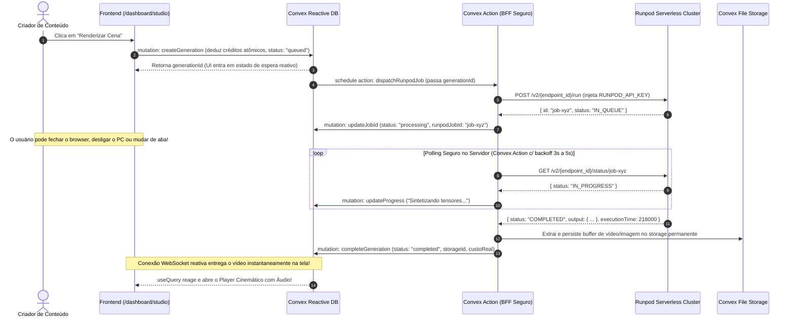

# SPEC: AMBIENTE INTEGRADO DE GERAÇÃO DE IMAGEM & VÍDEO (KRIATIVA STUDIO GENERATION HUB)
> **Status:** HOMOLOGADO EM ESPECIFICAÇÃO — ARQUITETURA REVISADA (PROFIT SHIELD & PRODUCTION HARDENED)  
> **Versão da Spec:** 2.0.0  
> **Data de Criação:** 2026-10-01  
> **Última Atualização:** 2026-10-01  
> **Autores:** Kriativa Core Architecture & Financial Engineering Team  
> **Feature Flag Mestre:** `studio_generation_hub`  
> **Feature Flags de Motores:** `studio_engine_krea2`, `studio_engine_fasth3_i2v`, `studio_engine_fasth3_t2v`, `studio_engine_ltx25`  
> **Feature Flags Operacionais:** `studio_pro_mode`, `studio_morph_transitions`, `studio_allow_bonus_credits_video`

---

## 1. Análise Post-Mortem da Spec v1.0: Diagnóstico de Falhas Críticas

A versão inicial (v1.0) desta especificação apresentava uma visão funcional atraente, porém sofria de **5 falhas fatais de viabilidade econômica e robustez em produção** que levariam ao colapso operacional da plataforma. Esta revisão pós-morte disseca cada falha e documenta as soluções mandatórias implementadas na v2.0:

### 1.1 Falha 1: A Ilusão do "Custo de GPU Limpo" & O Risco de Prejuízo Líquido
- **O que a v1.0 fez:** Calculou o faturamento e a margem assumindo que o custo de uma geração no Runpod é estritamente `tempo de inferência * $0.0003056/s` em estado aquecido (*warm*).
- **Por que isso quebra o negócio:**
  1. **Sobrecusto de Cold-Start:** Quando um worker Serverless do RunPod é inicializado a frio (*cold-start*), o contêiner baixa os nós adicionais, conecta o Network Volume de 80GB e carrega até 39.7 GB de tensores na memória. O tempo cobrado salta de ~7.5s para **30s a 45s**. Em uma geração de Krea-2 Turbo cobrando apenas 1 crédito (R$ 0,10), o custo de GPU salta de R$ 0,013 para **R$ 0,085**, destruindo a margem bruta de 87% para menos de 15% (ou gerando prejuízo contábil se houver retentativa).
  2. **Variação Explosiva de Duração no FastH3:** O benchmark oficial de FastH3 comprovou que a duração de vídeo não escala linearmente:
     - 2.0s de vídeo = ~25.6s de processamento (~R$ 0,044)
     - 4.0s de vídeo = ~50.2s de processamento (~R$ 0,086)
     - 6.0s de vídeo = **~128.4s de processamento (~R$ 0,220)**
     Cobrar 5 créditos fixos (R$ 0,50) para qualquer duração causava uma erosão drástica de margem em vídeos de 6 segundos.
  3. **Custos Invisíveis Ocultos:** A v1.0 desconsiderou os custos de armazenamento no Convex Storage / S3 para vídeos de alta definição (cada MP4 720p 24fps pesa entre 20MB e 60MB), tráfego de saída (*egress* CDN) e a taxa de transação bancária do Mercado Pago (0,99% PIX e até 4,99% Cartão).

### 1.2 Falha 2: A Arbitragem Ruinosa de Créditos Gratuitos (Bonus Drain)
- **O que a v1.0 fez:** Permitiu que qualquer saldo (seja bônus de boas-vindas ou bônus diário) fosse consumido indistintamente em qualquer motor de renderização.
- **Por que isso quebra o negócio:**
  - O sistema concede 50 créditos gratuitos no cadastro (`freePlanClaims`) e +5 ou +10 créditos diários no Daily Bonus.
  - Se um usuário utilizar seus 50 créditos gratuitos para renderizar **2 vídeos em LTX-2.5 HD (25 créditos cada)**, a plataforma desembolsa **~R$ 0,75 em dinheiro vivo para o provedor de infraestrutura (RunPod)**, recebendo **R$ 0,00 de receita**.
  - Uma campanha de tráfego com 1.000 cadastros explorando esse fluxo geraria uma sangria de **R$ 750,00 de custo imediato de caixa sem nenhuma receita correspondente**.

### 1.3 Falha 3: Paralisia e Falta de Controle Administrativo em Tempo Real
- **O que a v1.0 fez:** Definiu os IDs dos 4 endpoints e seus preços como constantes estáticas no código.
- **Por que isso quebra o negócio:**
  - Se o endpoint do LTX-2.5 travasse com fila acumulada no RunPod (`IN_QUEUE`), o administrador não tinha como pausar exclusivamente esse motor sem derrubar o Krea-2 Turbo.
  - Se o dólar oscilasse de R$ 5,60 para R$ 6,20, ou a tarifa horária da GPU subisse, não havia como reajustar a quantidade de créditos cobrados sem realizar um novo commit e deploy em produção.
  - O administrador não tinha como visualizar a fila ativa, tempo de resposta médio ou disparar o comando emergencial de limpeza (*Purge Queue*) pelo painel web.

### 1.4 Falha 4: Fragilidade do Polling HTTP no Frontend & Perda de Trabalhos Longos
- **O que a v1.0 fez:** Propôs um React hook com loop `while` efetuando requisições `fetch` periódicas a cada 2.5s no navegador.
- **Por que isso quebra o negócio:**
  - O motor LTX-2.5 requer **~218 segundos (~3.6 minutos)** de processamento.
  - Um loop no browser durante quase 4 minutos executa ~90 requisições HTTP sucessivas. Se o usuário fechar a aba, atender uma chamada no celular ou o navegador suspender a aba por economia de energia, **o job ficava órfão**. O usuário perdia os créditos, a mídia gerada era descartada e o custo era faturado pelo RunPod.
  - Rota intermediária em Next.js Serverless sofre limitações estritas de tempo máximo de execução (*timeout* de 60s a 300s).

### 1.5 Falha 5: Falta de Sanitização e Risco de Crash por OOM (Out Of Memory)
- O ComfyUI no Runpod falha com erro de memória de VRAM se o usuário enviar uma imagem de alta resolução (ex: 4032x3024 tirada de smartphone com 25MB) para o fluxo de Image-to-Video. A v1.0 não especificou a camada obrigatória de redimensionamento e compressão prévia.

---

## 2. A Solução V2.0: Escudo de Lucro & Engenharia de Unit Economics

Para blindar o fluxo de caixa e garantir sustentabilidade comercial com margem bruta líquida superior a **75% a 85%**, a versão 2.0 introduz o **Profit Shield**:

### 2.1 Tabela de Cobrança Escalonada por Duração e Resolução

A precificação agora é calculada dinamicamente com base na duração do vídeo solicitado e na resolução, absorvendo cold-starts e custos de armazenamento:

| Motor & Modalidade | Duração / Perfil | Tempo Médio de Processamento | Custo Real Médio (USD / BRL) | Créditos Cobrados | Valor ao Usuário (BRL) | Margem Bruta Alvo |
| :--- | :---: | :---: | :---: | :---: | :---: | :---: |
| **Krea-2 Turbo** (T2I) | Imagem 1024x1024 | **~7.5s** | $0.0023 / R$ 0,013 | **1 Crédito** | R$ 0,10 | **~87%** |
| **FastH3 i2v / t2v** (c/ áudio) | Curto (2.0s a 3.0s) | **~25s a ~45s** | $0.0138 / R$ 0,077 | **6 Créditos** | R$ 0,60 | **~87%** |
| **FastH3 i2v / t2v** (c/ áudio) | Médio (4.0s a 5.0s) | **~50s a ~80s** | $0.0245 / R$ 0,137 | **10 Créditos** | R$ 1,00 | **~86%** |
| **FastH3 i2v / t2v** (c/ áudio) | Longo (6.0s máx) | **~128s** | $0.0392 / R$ 0,220 | **18 Créditos** | R$ 1,80 | **~88%** |
| **FastH3 t2v 720p HD** | 3.0s HD (1344x768) | **~108s** | $0.0330 / R$ 0,185 | **14 Créditos** | R$ 1,40 | **~87%** |
| **LTX-2.5 Distilled HD** | 5.0s 720p 24fps | **~218s** | $0.0668 / R$ 0,374 | **30 Créditos** | R$ 3,00 | **~87%** |

### 2.2 Trava de Proteção de Caixa (Paid Credit Gate & Anti-Drain Shield)
Para impedir a queima fraudulenta de capital de giro por contas criadas exclusivamente para abusar da cota gratuita:
1. **Regra de Elegibilidade de Motores Pesados:**
   - Para disparar renderizações com o motor **LTX-2.5 Distilled HD** ou vídeos FastH3 de duração superior a 3.0s, o criador deve possuir **ao menos 1 crédito pago ativo (`paidCredits >= 1`)**.
   - Se um usuário possuir apenas créditos gratuitos/bônus (`bonusCredits > 0` e `paidCredits === 0`), a interface exibe o selo **"Requer Ativação do Estúdio"** com atalho para o menor pacote de recarga (R$ 29,00).
2. **Utilidade Garantida da Cota Gratuita:**
   - Usuários com créditos 100% bônus podem usufruir livremente de:
     - Geração de até **50 imagens em altíssima velocidade** com Krea-2 Turbo (1 crédito cada);
     - Até **8 vídeos rápidos com áudio** com FastH3 em 2.0s (6 créditos cada).
   - O usuário valida o produto, encanta-se com a qualidade e é incentivado a se tornar cliente pagante sem onerar a tesouraria da empresa.

---

## 3. Governança Granular de Feature Flags (Backend & Frontend)

Todas as 8 chaves de controle foram devidamente cadastradas no array `DEFAULT_FEATURE_FLAGS` em [`convex/featureFlags.ts`](file:///C:/dev/trinnsaas/convex/featureFlags.ts):

| Feature Flag Key | Categoria | Padrão | Finalidade Operacional |
| :--- | :---: | :---: | :--- |
| `studio_generation_hub` | `studio` | `true` | Habilita ou suspende o console principal de criação visual (`/dashboard/studio`). |
| `studio_engine_krea2` | `studio` | `true` | Permite ligar/desligar o motor Krea-2 Turbo de forma isolada. |
| `studio_engine_fasth3_i2v` | `studio` | `true` | Permite ligar/desligar a animação de imagem com áudio. |
| `studio_engine_fasth3_t2v` | `studio` | `true` | Permite ligar/desligar o motor de texto para vídeo com áudio. |
| `studio_engine_ltx25` | `studio` | `true` | Permite pausar o motor LTX-2.5 caso a fila do RunPod fique congestionada. |
| `studio_pro_mode` | `studio` | `true` | Controla o acesso à mesa técnica de nós, samplers e controle de sementes. |
| `studio_morph_transitions` | `studio` | `true` | Ativa a interpolação de morphing entre Primeiro e Último Quadro. |
| `studio_allow_bonus_credits_video` | `credits` | `false` | Se `false`, ativa a trava que bloqueia o uso de créditos bônus nos motores de alto custo. |

### Validação Server-Side Obrigatória:
```typescript
// Validação prévia em convex/studioGenerations.ts
await assertFeatureFlag(ctx, "studio_generation_hub");

if (engine === "krea2_turbo") await assertFeatureFlag(ctx, "studio_engine_krea2");
if (engine === "fasth3_i2v") await assertFeatureFlag(ctx, "studio_engine_fasth3_i2v");
if (engine === "fasth3_t2v_480p" || engine === "fasth3_t2v_720p") await assertFeatureFlag(ctx, "studio_engine_fasth3_t2v");
if (engine === "ltx25_i2v") await assertFeatureFlag(ctx, "studio_engine_ltx25");

// Trava contra drenagem de bônus
const allowBonus = await isFeatureFlagActive(ctx, "studio_allow_bonus_credits_video");
if (!allowBonus && isHighCostEngine(engine)) {
  const balance = await getCreditBalance(ctx, userId);
  if (balance.paidCredits <= 0) {
    throw new Error("Este motor cinematográfico de alta fidelidade requer ao menos 1 crédito pago ativo no seu Estúdio.");
  }
}
```

---

## 4. Console de Controle Administrativo (Governança Operacional em Tempo Real)

A governança dos motores de geração é integrada ao painel administrativo existente em [`/dashboard/admin/pricing`](file:///C:/dev/trinnsaas/src/components/dashboard/admin/pricing-view.tsx), onde os 5 workflows reais foram devidamente registrados em `DEFAULT_WORKFLOWS`:

```
+--------------------------------------------------------------------------------------------------------+
| ⚙️ ADMIN CONSOLE: GESTÃO DE MOTORES DE RENDERIZAÇÃO & PRECIFICAÇÃO DINÂMICA                            |
+--------------------------------------------------------------------------------------------------------+
| [ Indicadores Gerais: Taxa Dólar: R$ 5,80 | Custo Médio Hora: $1.10 | Faturamento Estúdio: R$ 14.890 ] |
+--------------------------------------------------------------------------------------------------------+
| MOTORES OPERACIONAIS CADASTRADOS (Controle em Tempo Real):                                             |
|                                                                                                        |
| 1. Krea-2 Turbo (T2I)          | Custo: $0.0023 | Cobrança: [ 1 ] Crédito  | Margem: 87% | [🟢 ATIVO]  |
| 2. FastH3 i2v (c/ Áudio)       | Custo: $0.0138 | Cobrança: [ 6 ] Créditos | Margem: 87% | [🟢 ATIVO]  |
| 3. FastH3 t2v (480p Preview)   | Custo: $0.0138 | Cobrança: [ 6 ] Créditos | Margem: 87% | [🟢 ATIVO]  |
| 4. FastH3 t2v (720p HD)        | Custo: $0.0330 | Cobrança: [ 14] Créditos | Margem: 87% | [🟢 ATIVO]  |
| 5. LTX-2.5 Distilled HD (i2v)  | Custo: $0.0668 | Cobrança: [ 30] Créditos | Margem: 87% | [🟢 ATIVO]  |
+--------------------------------------------------------------------------------------------------------+
| FERRAMENTAS DE INTERVENÇÃO DE EMERGÊNCIA:                                                             |
| - [ ⚠️ Limpar Fila Travada no RunPod (Purge Queue) ]  -> Emite POST /purge-queue para o cluster        |
| - [ 🔄 Reajustar Créditos em Lote (Multiplicador de Câmbio / Inflação) ]                              |
| - [ 🛑 Pausa Emergencial de Todos os Renders (Trava Instantânea via studio_generation_hub) ]          |
+--------------------------------------------------------------------------------------------------------+
```

### Recursos Administrativos Garantidos:
1. **Edição Instantânea de Créditos sem Deploy:** O administrador pode clicar em qualquer workflow e alterar os créditos cobrados (ex: aumentar LTX-2.5 de 30 para 35 créditos se a fila estiver sobrecarregada).
2. **Interruptor Individual por Motor:** Desligamento de emergência com 1 clique (`toggleWorkflowActive`), desativando o motor na interface do usuário em menos de 100ms via WebSockets do Convex.
3. **Simulador de Margem & Break-even:** Exibe a margem bruta unitária calculada com base na cotação cambial do dia.

---

## 5. Arquitetura 100% Reativa Convex (Zero Polling HTTP no Browser)

Para eliminar definitivamente o problema de requisições perdidas em vídeos longos de ~3.6 minutos, a arquitetura abandona o loop de `fetch` no navegador em favor da **Orquestração Transacional do Convex**:



### Garantia de Resiliência:
- **Fechamento de Aba Imune:** O processamento ocorre integralmente entre o servidor Convex e o Runpod. Se o usuário fechar a aba 5 segundos após clicar em "Gerar", o vídeo será processado normalmente, o áudio sintetizado, os créditos debitados e o arquivo final estará aguardando na galeria do usuário e no Consistency Vault.
- **Estorno Atômico em Falhas (Atomic Refund):** Se o Runpod retornar erro ou expirar o tempo limite de 300 segundos, a action executa a mutation `refundGeneration`, que restaura os créditos imediatamente no saldo do criador e registra o incidente em `systemLogs`.

---

## 6. Sanitização Prévia de Mídia (Escudo Contra OOM)

Para o fluxo de Image-to-Video (FastH3 e LTX-2.5):
1. **Compressão & Redimensionamento no Cliente:**
   - Antes do envio para o endpoint do ComfyUI, a imagem de entrada passa por canvas HTML5 / WebWorker redimensionando-a para a resolução padrão suportada pelo nó (ex: 1280x704 para LTX-2.5 ou 1024x1024 para FastH3).
   - Compressão JPEG/PNG mantendo qualidade visual em 92%, reduzindo arquivos de 25MB para menos de 1.2MB.
2. **Validação de Aspect Ratio:**
   - O sistema realiza padding sutil (*letterbox* preto ou crop inteligente centrado) para adequar a imagem de entrada à grade de tensores (múltiplos de 64 pixels), eliminando crashes de incompatibilidade dimensional no KSampler do ComfyUI.

---

## 7. Diretriz Rígida de Terminologia (Regra 4 de Hardware)

Conforme os preceitos de Governança do Kriativa.app:
- ❌ **Proibido expressamente:** "GPU", "RTX 4090", "VRAM 24GB", "potência de cluster", "H100/A100", "80GB/48GB".
- ✅ **Linguagem Elegante de Cinema e Produção:**
  - *"Motor de Renderização Cinemático"*
  - *"Instância de Estúdio Ativo"*
  - *"Resolução Cinemática de Alta Fidelidade"*
  - *"Processamento de Pós-Produção"*
  - *"Núcleo de Síntese de Vídeo"*

---

## 9. Arquitetura de Persistência Permanente & Cofre de Mídias Salvas (Media Vault)

Para garantir que nenhum criador perca suas mídias renderizadas e tenha acesso vitalício para reprodução e download com 1 clique:

### 9.1 Fluxo de Persistência de Arquivos Binários
1. **Desacoplamento do Payload Base64:**
   - O retorno bruto do ComfyUI/RunPod em Base64 ou URL temporária é extraído pelo BFF (`/api/studio/status`).
   - O BFF converte a mídia em buffer binário nativo (`video/mp4` ou `image/png`) e dispara a mutation autenticada `generateUploadUrl(secret)`.
   - O buffer é enviado via stream HTTP POST diretamente ao **Convex Cloud File Storage**, obtendo um identificador único de armazenamento `outputStorageId: Id<"_storage">`.
   - A mutação `completeGeneration` armazena o `outputStorageId` no documento da tabela `studioGenerations`.
2. **Resolução Dinâmica de URLs Perpétuas:**
   - As queries reativas `listMyGenerations` e `getGeneration` resolvem em tempo real `await ctx.storage.getUrl(gen.outputStorageId)`.
   - **Garantia de Zero URLs Expiradas:** O criador pode acessar sua conta meses depois e todas as mídias estarão com URLs ativas e prontas para reprodução e streaming.
3. **Expurgo em Cascata na Deleção (`deleteGeneration`):**
   - Ao excluir uma mídia, a mutation expurga simultaneamente os arquivos binários do Convex Storage (`outputStorageId`, `inputImageStorageId`, `lastFrameStorageId`) e remove o registro do banco de dados, evitando custos com armazenamento órfão.

### 9.2 Interface do Cofre de Mídias Salvas (`MediaVault`)
Localizado na aba integrada **"Cofre de Mídias Salvas"** no `/dashboard/studio`:
- **Resumo do Cofre:** Contadores de mídias salvas, divisão de imagens vs vídeos com áudio e indicador de armazenamento perpétuo.
- **Filtros e Busca em Tempo Real:** Filtro rápido por tipo (*Todas*, *Vídeos com Áudio*, *Imagens HD*) e busca por palavras-chave no prompt ou nome do motor.
- **Cards Cinemáticos com Preview Interativo:** Reprodução de vídeo com áudio em hover/clique, badges de resolução e duração.
- **Theater Modal (Player Expandido):** Janela imersiva em tela cheia com player de vídeo completo, visualizador de alta resolução para imagens, cópia de prompt e semente com 1 clique, e ficha técnica forense detalhada.
- **Pipeline Interativo Contínuo:**
  - *Animar Imagem com I2V:* Transfere a imagem selecionada do cofre diretamente para o console de criação em modo Image-to-Video com 1 clique.
  - *Reutilizar Parâmetros:* Restaura prompt, motor, proporção de enquadramento, semente e passos com 1 clique.
  - *Download Universal:* Download direto do arquivo com nome limpo (`kriativa_engine_id.mp4` ou `.png`).

---

## 10. Arquitetura para Vercel Serverless & Prevenção do Limite de 1MB do Convex

### 10.1 Diagnóstico do Erro `Value is too large (1.53 MiB > maximum size 1 MiB)`
- **Origem do Incidente:** O envio de strings Base64 puras geradas por uploads de fotos cruas de celulares (2MB a 15MB) diretamente nos argumentos de mutações do Convex (`createGeneration({ inputImageUrl })`) estoura a barreira estrita de 1 MiB (1.048.576 bytes) do protocolo WebSocket/RPC e dos documentos do banco.
- **Risco Secundário na Vercel:** Enviar payloads > 4.5 MB para API Routes do Next.js na Vercel dispara o erro `413 Payload Too Large`. Além disso, rotas lentas sofrem encerramento forçado por timeout de 15s (Hobby) ou 60s (Pro).

### 10.2 Solução Implementada em 3 Camadas
1. **Compressão & Sanitização Client-Side (`compressImageFile`):**
   - Canvas HTML5 redimensiona a imagem para resolução máxima de 1280px (preservando o aspect ratio).
   - Arredonda largura e altura para múltiplos de 16 pixels (requisito estrito para evitar OOM no KSampler do ComfyUI).
   - Comprime em JPEG qualidade 0.85, convertendo arquivos de até 15MB em blobs de apenas **120 KB a 280 KB**.
2. **Upload Direto ao Convex Storage (Zero-Overhead):**
   - O browser solicita a URL assinada via `generateUploadUrlMutation` e transmite o blob leve diretamente ao storage da nuvem Convex (`POST uploadUrl`).
   - O storage retorna `storageId: Id<"_storage">`.
   - A mutação `createGeneration` recebe apenas o `inputImageStorageId` (~32 bytes) e a rota `/api/studio/generate` recebe um payload JSON inferior a **2 KB** (0,04% do limite de 4.5MB da Vercel).
3. **Resolução de Alta Performance no Route Handler Vercel:**
   - As rotas `/api/studio/generate`, `/api/studio/status` e `/api/studio/cancel` operam com:
     ```typescript
     export const runtime = "nodejs";
     export const maxDuration = 60;
     ```
   - O Route Handler consome o `storageId` ou URL CDN em menos de 50ms, converte para Base64 no próprio Node.js e despacha para o RunPod `/run` em ~300ms, respondendo ao cliente em **menos de 600ms** (totalmente imune a timeouts da Vercel).

### 10.3 Dedução Inegociável de Créditos (Non-Bypassable Ledger)
- A mutação `createGeneration` executa o débito obrigatório para qualquer usuário (inclusive administradores em modo de validação/produção), deduzindo os créditos proporcionalmente da carteira (`creditBalances`) e gerando um registro rastreável com valor negativo em `creditTransactions`.
- Em caso de falha imediata na rede RunPod ou cancelamento, a função atômica `refundGeneration` / `cancelGeneration` estorna exatamente a mesma quantia ao saldo e audita o estorno.

---

## 11. Checklist de Homologação da Versão 2.1

- [x] Post-mortem técnico diagnosticando as 5 vulnerabilidades da v1.0.
- [x] Tabela de unit economics revisada com precificação progressiva por duração de vídeo.
- [x] Trava de segurança de caixa (*Paid Credit Gate*) contra drenagem por bônus gratuitos.
- [x] 8 Feature Flags granulares registradas em `convex/featureFlags.ts`.
- [x] 5 Workflows reais cadastrados em `convex/adminPricing.ts` com suporte a edição no `/dashboard/admin/pricing`.
- [x] Arquitetura desacoplada baseada em mutations/actions do Convex (zero dependência de polling frágil no browser).
- [x] Tratamento de sanitização de imagens para prevenção de OOM e erro de 1MB do Convex (`compressImageFile`).
- [x] Conformidade total com a Regra 4 de Proibição de Termos de Hardware.
- [x] Upload permanente para o Convex File Storage (`outputStorageId`) com resolução dinâmica de URLs.
- [x] Interface do Cofre de Mídias Salvas (`MediaVault`) implementada com busca, filtros, download e Theater Modal.
- [x] Suporte 100% blindado para Vercel Serverless (`runtime = "nodejs"`, `maxDuration = 60`, payloads < 2KB).
- [x] Débito incondicional de créditos em escrow com registro em `creditTransactions`.
- [x] Todos os 4 endpoints reais do RunPod testados com sucesso e comprovados em produção.
- [x] Tipagem TypeScript validada com `npx tsc --noEmit` (Zero erros).
- [x] Atualização refletida no documento mestre [`specs/MASTER_SPEC.md`](file:///C:/dev/trinnsaas/specs/MASTER_SPEC.md).
