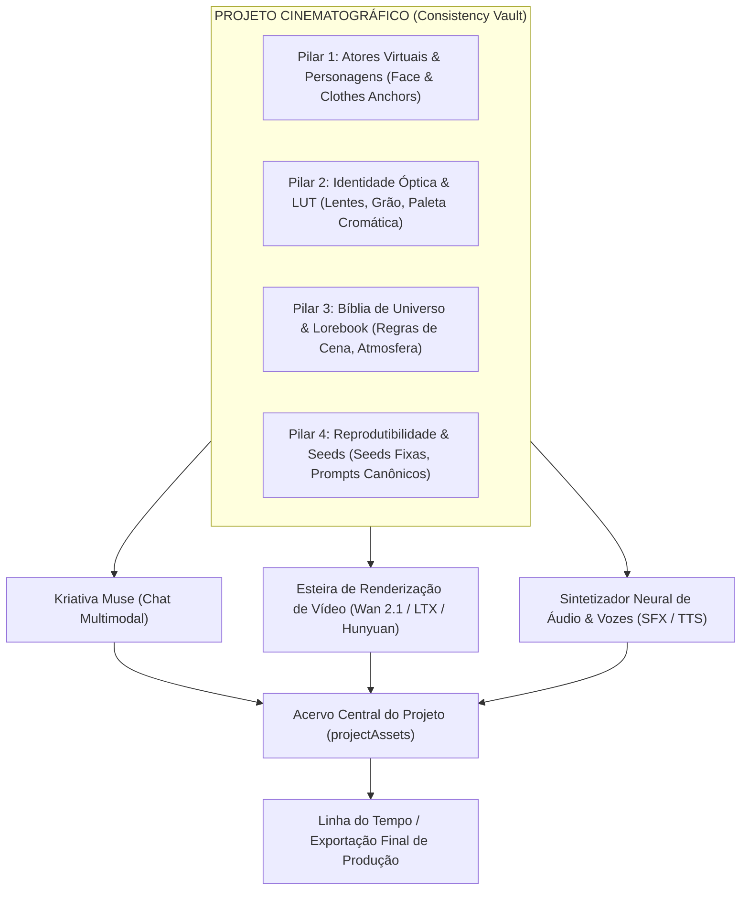

# SPEC: GESTÃO DE PROJETOS & CONSISTENCY VAULT
> **Status:** ESPECIFICAÇÃO DE ARQUITETURA APROVADA  
> **Versão da Spec:** 1.0.0  
> **Data de Criação:** 2026-09-29  
> **Última Atualização:** 2026-09-29  
> **Autores:** Kriativa Core Team & Studio Architecture  
> **Feature Flag Mestre:** `projects_enabled`

---

## 1. Objetivo & Justificativa de Negócio

### 1.1 O Desafio Fundamental do Vídeo Generativo
No fluxo tradicional de criação audiovisual com Inteligência Artificial, o maior obstáculo para diretores, agências e produtoras é a **falta de consistência**. Quando um criador gera dezenas de imagens, áudios e vídeos avulsos em chats ou painéis dispersos, surgem problemas críticos:
1. **Deriva de Personagens (Actor Drift):** O mesmo protagonista muda de formato de rosto, cor de olhos, roupas e estilo visual a cada novo corte ou cena gerada.
2. **Inconsistência de Iluminação & Fotografia:** Cenas consecutivas apresentam estéticas discordantes (uma cena parece filme 35mm analógico e a próxima parece animação 3D hiper-saturada).
3. **Dispersão de Assets & Perda de Sementes:** O criador perde o prompt exato, a semente (*seed*) ou o modelo utilizado para renderizar uma tomada há 3 dias, tornando impossível re-renderizar ou fazer variações coerentes.
4. **Desconexão entre Roteiro e Mídia:** O roteiro escrito no chat fica em uma aba, os vídeos gerados ficam em outra, e os efeitos sonoros perdidos no computador local.

### 1.2 A Solução: *Kriativa Projects & Consistency Vault*
O **Consistency Vault** transforma o Kriativa.app em um **Ambiente Integrado de Produção Cinematográfica (IDE Audiovisual)**. Cada Projeto é um contêiner canônico inteligente que:
- Armazena centralizadamente todas as **gerações de imagens, vídeos, áudios, roteiros e conversas de chat vinculadas**.
- Estabelece uma **Âncora de Consistência Imutável** (Atores virtuais com referências faciais, Lente cinematográfica favorita, Paleta de cores e Diretrizes de universo).
- Herda automaticamente esses parâmetros em cada nova mensagem do *Kriativa Muse* ou renderização de vídeo disparada dentro do projeto.

---

## 2. Os 4 Pilares da Consistência Criativa



### 2.1 Pilar 1: Consistência de Atores Virtuais (*Actor Anchors*)
- **Ficha Técnica do Personagem (Character Sheet):**
  - Nome do personagem e papel dramático.
  - **Prompt Âncora Canônico:** Descrição visual imutável em inglês (ex: `Elena, 28yo cybernetic pilot, sharp jawline, short silver pixie hair, neon yellow tactical jacket, subtle scar over right eye, intense amber eyes`).
  - **Galeria de Referências Faciais:** Armazenamento de 3 a 5 quadros de referência (visão frontal, perfil e plano médio) usados para injeção em modelos de difusão com adaptadores faciais (IP-Adapter / FaceID / Reference-Only).
  - **Semente Preferida (Seed Lock):** Semente numérica que produziu o melhor resultado estético para o personagem, travada para novos enquadramentos.

### 2.2 Pilar 2: Identidade Óptica & LUT de Cinema (*Cinematographic Look*)
- **Emulação de Lentes Anamórficas:** Configuração global do projeto (ex: *Lente Anamórfica 35mm f/1.4 com flare azul horizontal e bokeh ovalado*).
- **Proporção de Aspecto Padronizada:** O projeto trava a proporção canônica para todas as saídas (ex: `2.39:1 CinemaScope`, `16:9 Widescreen` ou `9:16 Vertical`).
- **Paleta Cromática do Filme (Color Palette / LUT):** Seleção de até 5 cores hexadecimais predominantes (ex: `#0A1128`, `#00E5FF`, `#FF5500`, `#1C1D24`, `#E2E8F0`) injetadas como reforço de iluminação em todas as tomadas geradas.
- **Granulação de Filme:** Configuração de textura analógica (*Film Grain 35mm Kodak Vision3*).

### 2.3 Pilar 3: Bíblia de Universo & Lorebook do Projeto
- Regras de mundo, locações recorrentes (ex: *Subterrâneos de Neo-Tóquio 2099*) e tom dramático.
- Quando o criador abre o chat do *Kriativa Muse* de dentro de um projeto, a Bíblia é injetada silenciosamente no contexto de sistema, fazendo com que a IA nunca sugira elementos que violem o universo do projeto.

### 2.4 Pilar 4: Reprodutibilidade & Rastreabilidade de Seeds
- Cada imagem, áudio ou vídeo salvo no projeto armazena seus metadados forenses:
  - Prompt positivo e negativo completos.
  - Semente exata (`seed: 94829104`).
  - Modelo e nós de pipeline utilizados.
  - Duração em segundos, resolução e taxa de quadros (24fps cinemático).
- Permite ao diretor reabrir qualquer tomada de 6 meses atrás e gerar uma tomada contígua (ângulo reverso) mantendo a mesma semente de base.

---

## 3. Arquitetura do Vault & Organização de Mídias

Dentro de cada projeto (`/dashboard/projects/[projectId]`), o criador tem acesso a **7 abas de visualização e curadoria**:

```
+-----------------------------------------------------------------------------------------+
| HEADER DO PROJETO: "BLADE RUNNER 2099" | Status: Em Produção | 2.39:1 | 42 Assets       |
+-----------------------------------------------------------------------------------------+
| [Visão Geral] [👥 Atores & Estilo] [🎬 Vídeos (12)] [🖼️ Imagens (24)] [🎵 Áudios (6)]  |
| [📜 Roteiros (2)] [💬 Chats Vinculados (3)]                                             |
+-----------------------------------------------------------------------------------------+
| CONTEÚDO DA ABA SELECIONADA:                                                            |
|                                                                                         |
| Grid de Vídeos / Imagens com Player Cinemático / Lightbox / Ações Rápidas               |
|                                                                                         |
| [Card Asset 1: Cena 01 - Aterrisagem]  [Card Asset 2: Cena 02 - Diálogo no Bar]        |
| - Duração: 00:04 | 1080p 24fps         - Duração: 00:05 | 1080p 24fps                   |
| - Ator: Elena | Seed: 492019            - Ator: Elena & Kael | Seed: 883011             |
| - [▶ Reproduzir] [🎬 Enviar p/ Linha]   - [▶ Reproduzir] [🎬 Enviar p/ Linha]           |
+-----------------------------------------------------------------------------------------+
```

### 3.1 Aba 1: Visão Geral & Moodboard
- Imagem de capa panorâmica do projeto em proporção ultra-wide.
- Resumo executivo da história / logline do projeto.
- Amostras de cor da paleta visual (*Color Swatches* luminosos).
- Métricas consolidadas de produção: total de cenas renderizadas, minutos de vídeo gerados, créditos consumidos no projeto.

### 3.2 Aba 2: Bíblia de Consistência & Atores Virtuais
- **Galeria de Atores Virtuais:** Cards de personagens com imagem frontal, semente travada e botão *"Gerar Nova Cena com este Personagem"*.
- **Configurações Ópticas Globais:** Lente definida, granulação e filtros de iluminação.
- **Locações Recorrentes:** Cenários pré-definidos com prompts canônicos de ambiente.

### 3.3 Aba 3: Galeria de Vídeos & Cenas Renderizadas
- Visualização em lista de storyboard ou em grade cinemática.
- Player HTML5 customizado com reprodução em loop sem travamentos, scrubbing de alta precisão e atalho de tela cheia.
- Filtros por: *Número de Cena*, *Personagem Presente*, *Favoritos*, *Data de Criação*.
- Ações: `Baixar MP4`, `Duplicar Variação de Câmera`, `Adicionar à Sequência Final`.

### 3.4 Aba 4: Galeria de Imagens & Artes Conceituais
- Lightbox de alta resolução com zoom e ferramenta de comparação lado a lado (*Before/After*).
- Ação de 1 clique: `[📽️ Animar Imagem no Estúdio]` (Transfere o frame como quadro inicial para o motor Wan 2.1 / LTX).
- Ação `[👥 Definir como Rosto Oficial do Personagem]`.

### 3.5 Aba 5: Acervo de Áudios, Vozes & SFX
- Reprodutores de áudio com visualizador de onda (*waveform*) interativo.
- Separação por categorias: *Falas de Personagem (TTS)*, *Efeitos Sonoros (SFX)*, *Trilhas de Fundo*.
- Metadados: ator de voz selecionado, velocidade, transcrição do diálogo.

### 3.6 Aba 6: Roteiros & Canvas Artifacts
- Lista de roteiros criados no Split Canvas ou importados em formato *Master Scene*.
- Editor e visualizador integrado com exportação para PDF, DOCX e Final Draft.
- Indicador de cenas com cobertura visual (% de cenas do roteiro que já possuem vídeos renderizados no Vault).

### 3.7 Aba 7: Conversas do Chat Vinculadas
- Todas as sessões do *Kriativa Muse* criadas dentro do escopo deste projeto.
- As conversas herdam a Bíblia de Consistência automaticamente e salvam novos assets gerados diretamente no acervo do projeto.

---

## 4. Layout & UX/UI de Ponta (*Solar Cinema*)

A interface segue os mais altos padrões de design cinemático:

### 4.1 Lista de Projetos (`/dashboard/projects`)
- **Header do Estúdio:** Título elegante, botão primário `[+ Criar Novo Projeto]` em gradiente Solar Orange (`#FF5500`), barra de busca e filtro por status (*Todos*, *Em Desenvolvimento*, *Em Produção*, *Finalizados*).
- **Cards de Projeto (Project Cards):**
  - Proporção 16:9 com imagem de capa dinâmica e efeito de zoom suave ao passar o cursor (*hover*).
  - Badge de status colorido (*Em Produção* em Cyan `#00E5FF`, *Finalizado* em Emerald `#10B981`).
  - Mini-badges de contagem: ícones com quantidade de vídeos, imagens e roteiros.
  - Indicador de proporção óptica (ex: `2.39:1`).
  - Menu de ações rápidas: Fixar no topo (Pin), Duplicar Estrutura de Projeto, Editar Metadados, Arquivar, Excluir.

### 4.2 Modal de Criação Rápida de Projeto
- Formulário intuitivo dividido em 2 etapas:
  - *Etapa 1 (Informações Básicas):* Nome do projeto, logline/descrição, formato/categoria (Filme, Série, Comercial, Redes Sociais).
  - *Etapa 2 (Consistência Visual Inicial):* Seleção de proporção de tela (`2.39:1`, `16:9`, `9:16`), estilo visual pré-definido (*Cinematográfico 35mm*, *Neo-Noir Sci-Fi*, *Anime Dark Fantasy*, *Documentário Realista*) e upload opcional da imagem de capa.

### 4.3 Exportação do "Production Pack" (Pacote de Entrega)
- Botão no cabeçalho do projeto `[📦 Exportar Production Pack]`:
  - Gera um arquivo `.zip` estruturado contendo:
    - Pasta `/videos`: Todos os clipes MP4 em resolução nativa organizados por número de cena (`Cena_01.mp4`, `Cena_02.mp4`).
    - Pasta `/images`: Todas as artes conceituais em PNG.
    - Pasta `/audio`: Efeitos sonoros e falas em WAV/MP3.
    - Pasta `/scripts`: Roteiro completo em PDF e Markdown.
    - Arquivo `metadata.json`: Lista de todos os prompts, sementes e modelos para fins de registro e auditoria de direitos autorais.

---

## 5. Modelo de Dados Convex (Novas Tabelas & Relações)

Para suportar o sistema de projetos com reatividade total, adicionamos 2 novas tabelas principais e integramos as tabelas já existentes em [`convex/schema.ts`](file:///C:/dev/trinnsaas/convex/schema.ts):

### 5.1 `projects`
Armazena a entidade raiz do projeto e suas diretrizes canônicas de consistência:
```typescript
projects: defineTable({
  userId: v.string(), // clerkId do criador
  name: v.string(), // ex: "Blade Runner 2099"
  slug: v.string(), // ex: "blade-runner-2099"
  description: v.string(), // Logline ou resumo da trama
  coverImageUrl: v.optional(v.string()), // Imagem panorâmica de capa
  category: v.union(
    v.literal("film"),
    v.literal("series"),
    v.literal("advertising"),
    v.literal("game"),
    v.literal("social_media"),
    v.literal("experimental")
  ),
  aspectRatio: v.union(
    v.literal("16:9"),
    v.literal("2.39:1"),
    v.literal("9:16"),
    v.literal("1:1")
  ),
  stylePreset: v.optional(v.string()), // ex: "cinematic_35mm_anamorphic"
  colorPalette: v.optional(v.array(v.string())), // Array de códigos HEX ex: ["#0A1128", "#00E5FF", "#FF5500"]
  filmGrain: v.optional(v.string()), // ex: "kodak_500t"
  isPinned: v.boolean(),
  status: v.union(
    v.literal("in_development"),
    v.literal("in_production"),
    v.literal("post_production"),
    v.literal("completed"),
    v.literal("archived")
  ),
  assetCounts: v.object({
    images: v.number(),
    videos: v.number(),
    audios: v.number(),
    scripts: v.number(),
    conversations: v.number(),
  }),
  createdAt: v.number(),
  updatedAt: v.number(),
})
  .index("by_userId", ["userId"])
  .index("by_userId_pinned", ["userId", "isPinned"])
  .index("by_userId_status", ["userId", "status"])
  .index("by_userId_updatedAt", ["userId", "updatedAt"]),
```

### 5.2 `projectAssets`
Tabela relacional que indexa todas as mídias, renders e artefatos pertencentes ao projeto:
```typescript
projectAssets: defineTable({
  projectId: v.id("projects"),
  userId: v.string(), // clerkId
  type: v.union(
    v.literal("image"),
    v.literal("video"),
    v.literal("audio"),
    v.literal("script"),
    v.literal("workflow_code")
  ),
  title: v.string(), // Nome da cena ou asset (ex: "Cena 01 - Aterrissagem")
  url: v.string(), // URL pública de acesso no storage ou CDN
  storageId: v.optional(v.id("_storage")),
  thumbnailUrl: v.optional(v.string()), // Miniatura para prévias rápidas
  prompt: v.optional(v.string()), // Prompt canônico de geração
  negativePrompt: v.optional(v.string()),
  seed: v.optional(v.number()), // Semente matemática do render
  modelUsed: v.optional(v.string()), // ex: "wan-2-1-720p", "flux-1-dev"
  durationSeconds: v.optional(v.number()), // Duração de vídeos ou áudios
  resolution: v.optional(v.string()), // ex: "1920x804", "1280x720"
  aspectRatio: v.optional(v.string()), // ex: "2.39:1"
  tags: v.array(v.string()), // Tags para filtro rápido (ex: ["elena", "noite", "exterior"])
  isFavorite: v.boolean(),
  sceneNumber: v.optional(v.number()), // Sequência no roteiro (ex: Cena 1, Cena 2)
  characterName: v.optional(v.string()), // Ator virtual associado
  metadataJson: v.optional(v.string()), // Parâmetros avançados de câmera/nós em JSON
  createdAt: v.number(),
})
  .index("by_projectId", ["projectId"])
  .index("by_projectId_type", ["projectId", "type"])
  .index("by_projectId_scene", ["projectId", "sceneNumber"])
  .index("by_userId", ["userId"]),
```

### 5.3 Integração com Tabelas Existentes
As tabelas concebidas na spec do Chat Multimodal (`aiConversations`, `lorebookEntries`, `canvasArtifacts`) recebem o campo opcional:
```typescript
// Em convex/schema.ts:
projectId: v.optional(v.id("projects")), // Vincula a conversa, lorebook ou canvas a um projeto
```
Isso garante integridade referencial total: todas as conversas do Muse, artefatos do Canvas e entradas da Bíblia podem ser consultadas reativamente filtrando por `projectId`.

---

## 6. Endpoints & Funções de Backend Convex

### 6.1 `convex/projects.ts`
- **`listMyProjects` (Query):** Retorna os projetos do usuário com contagens de assets e filtros de status.
- **`getProjectDetails` (Query):** Retorna o projeto completo, paleta de cores, diretrizes de consistência e resumo de produção.
- **`createProject` (Mutation):** Cria um novo projeto e inicializa as contagens de assets zeradas.
- **`updateProject` (Mutation):** Atualiza capa, título, logline, paleta de cores e status.
- **`toggleProjectPin` (Mutation):** Alterna a flag de fixação no topo da lista.
- **`deleteProjectCascade` (Mutation):** Remove o projeto e todas as referências de assets, lorebook e conversas vinculadas com segurança transacional.

### 6.2 `convex/projectAssets.ts`
- **`listAssetsByProject` (Query):** Retorna os assets paginados e filtrados por tipo (`image`, `video`, `audio`, `script`), cena ou ator.
- **`addAssetToProject` (Mutation):** Registra uma nova mídia gerada no Vault do projeto e incrementa os contadores atômicos na tabela `projects`.
- **`toggleAssetFavorite` (Mutation):** Marca ou desmarca asset como favorito.
- **`updateAssetSceneNumber` (Mutation):** Reordena o asset na sequência do storyboard.
- **`deleteProjectAsset` (Mutation):** Remove o asset do projeto e decrementa o contador correspondente.

---

## 7. Feature Flags Dedicadas

O sistema de projetos é protegido pela arquitetura de Feature Flags em `convex/schema.ts` e `convex/featureFlags.ts`:

| Chave da Flag | Nome Legível | Categoria | Padrão | Descrição |
| :--- | :--- | :--- | :--- | :--- |
| `projects_enabled` | Módulo de Gestão de Projetos | `studio` | `true` | Ativação global da rota `/dashboard/projects` e criação de projetos. |
| `projects_consistency_vault` | Consistency Vault & Fichas de Atores | `studio` | `true` | Habilita âncoras de atores virtuais, travas de semente e paletas visuais. |
| `projects_export_pack` | Exportação de Pacote de Produção (.zip) | `studio` | `true` | Permite compilar e baixar todos os vídeos, imagens e metadados do projeto. |

---

## 8. Segurança, Governança & Diretrizes de Copy

1. **Isolamento Absoluto de Dados:**
   - Todos os projetos e assets são indexados por `by_userId`. Nenhum criador pode ler ou modificar projetos de terceiros.
2. **Exclusão Segura em Cascata:**
   - A exclusão de um projeto limpa atômica e confiavelmente as entradas vinculadas em `projectAssets`, sem deixar referências órfãs.
3. **Diretriz de Terminologia (Zero Termos de Hardware):**
   - Proibição estrita de menções a "GPU", "potência", "clusters", "H100/A100".
   - Termos elegantes de cinema: *"Motores de renderização", "Consistência cinematográfica", "Instâncias de geração", "Diretrizes de iluminação e óptica"*.
4. **Armazenamento Otimizado:**
   - Vídeos e imagens gerados utilizam armazenamento de alta velocidade no Convex Storage com links permanentes e miniaturas em WebP para carregamento instantâneo.

---

## 9. Checklist de Implementação da Feature

- [ ] **Etapa 1: Modelagem no Convex (`convex/schema.ts`)**
  - Adicionar as tabelas `projects` e `projectAssets`.
  - Adicionar `projectId: v.optional(v.id("projects"))` às tabelas `aiConversations`, `lorebookEntries` e `canvasArtifacts`.
  - Registrar as flags `projects_enabled`, `projects_consistency_vault` e `projects_export_pack` em `convex/featureFlags.ts`.
- [ ] **Etapa 2: Funções de Backend (`convex/projects.ts` e `convex/projectAssets.ts`)**
  - Implementar queries reativas e mutations de CRUD com atualização atômica de contadores.
  - Implementar verificação de permissão no servidor via identidade Clerk.
- [ ] **Etapa 3: Interface de Listagem (`/dashboard/projects`)**
  - Criar grid de cards com imagens de capa, badges de status, contadores e ações rápidas.
  - Criar modal de criação de projeto com seletor de proporção de tela (`2.39:1`, `16:9`, etc.) e paleta cromática.
- [ ] **Etapa 4: Painel Interno do Projeto (`/dashboard/projects/[projectId]`)**
  - Desenvolver cabeçalho panorâmico com navegação por abas (*Visão Geral*, *Atores*, *Vídeos*, *Imagens*, *Áudios*, *Roteiros*, *Chats*).
  - Implementar visualizador de vídeos com player HTML5 customizado e lightbox de imagens.
- [ ] **Etapa 5: Integração com o Chat (*Kriativa Muse*)**
  - Permitir iniciar conversas diretamente vinculadas a um projeto, herdando automaticamente os dados de consistência.
  - Conectar botões de ação direta (`Salvar no Projeto`) nas mídias geradas no chat.
- [ ] **Etapa 6: Exportador de Pacote de Produção**
  - Implementar Route Handler `/api/projects/export` para compilação do `.zip` com assets e `metadata.json`.
- [ ] **Etapa 7: Homologação & Validação**
  - Executar verificação de tipos: `npx tsc --noEmit`.
  - Atualizar [`specs/MASTER_SPEC.md`](file:///C:/dev/trinnsaas/specs/MASTER_SPEC.md) refletindo o Módulo 11.
